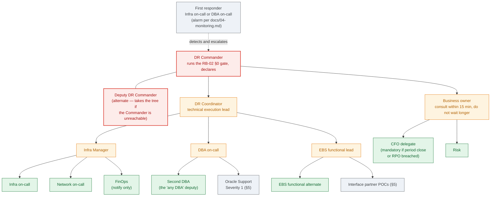

# Contact Roster and Call Tree

Who is notified, in what order, and how each person is reached once `runbooks/RB-02-failover.md`
§0 says declare. `checklists/dr-authority-matrix.md` records who *may* decide; this file records
how the people holding those positions are found at 03:00. It is the appendix NIST SP 800-34
Rev. 1 expects every contingency plan to carry: "Personnel to be notified should be clearly
identified in the contact lists appended to the plan. This list should identify personnel by
their team position, name, and contact information (e.g., home, work, cell phone, email
addresses, and home addresses)" (§4.2.2, p. 37) [1].

> ### ⚠️ Every entry in this file is a placeholder
>
> This is a public example repository (root `README.md`). Every name, number, address and email
> domain below is fictitious and exists only to show the *shape* of a compliant roster.
>
> **Never populate this file in a public repository.** A filled-in roster is the single most
> sensitive artefact in the plan — more so than anything under `evidence/` — because it is a list
> of named individuals with their home phone numbers and home addresses. NIST's own plan template
> says so of its personnel contact list: "Information may contain personally identifiable
> information and should be protected" (Appendix A, p. A.1-11) [1]. `evidence/README.md` already
> tells you where real operational detail belongs — a private fork, or a separate private
> repository. The same applies here, with less room for argument. See §6 before populating.

Position labels are the ones already used in `dr-authority-matrix.md` and the runbooks. Do not
introduce a second vocabulary: if a position is renamed, rename it there first. This file
replaces the skeleton `Contact roster` table that `dr-authority-matrix.md` used to carry, which
now points here; that table's "Windows / infra on-call" and "Finance representative" rows are
the **Infra on-call** and **CFO delegate** positions here.

---

## 1. Call tree

NIST's sample call tree (Figure 4-2, p. 37) has a coordinator at the top with an alternate
beside them, team leaders on the next tier, and each leader responsible for notifying their own
team members [1]. This plan's tree keeps that shape and puts the authority matrix's roles into it.
The rule is the same as NIST's: **each box calls the boxes below it, and only those.** Nobody
telephones the whole roster.

Why the tree is shaped this way:

- **Only one person declares, and their successor is named.** NIST: the individual with authority
  to activate the plan "should be designated clearly in the plan. Only one individual should have
  this authority, and a successor should be clearly identified" (§4.2.1, footnote 31, p. 36) [1].
  That is the DR Commander and the Deputy DR Commander, exactly as the authority matrix already
  has it. The Deputy is not a second decision-maker; they are the same box when the first is
  silent.
- **The Business owner is consulted, not waited for.** The authority matrix gives the Commander
  15 minutes to reach them. The tree puts the Business owner on the Commander's own call list so
  that the attempt is made immediately and the clock is honest.
- **The DR Coordinator owns the technical fan-out.** Three leaders — Infra Manager, DBA on-call,
  EBS functional lead — mirror NIST's four recovery team leaders. Each then notifies their own
  people. The Commander is kept free to run the gate and the bridge.
- **Finance is reached through the Business owner, not through IT.** The CFO delegate decides
  two things nobody in IT may (`dr-authority-matrix.md`: RPO exceeded, failover during period
  close), so their notification travels with the business decision, not the technical one.
- **FinOps is notified, not consulted.** The WARM → HOT posture move requires only a
  notification (`dr-authority-matrix.md`). It sits on the Infra Manager's list because posture
  changes are executed by the infrastructure team.

---

## 2. Roster

NIST's three required fields are **team position, name, and contact information**; its sample
entry lists home, work and cell phone, work and personal email, and home address (§4.2.2,
p. 37–38) [1]. The plan template adds that "at least one office and one non-office contact
number is recommended" for every person (Appendix A, p. A.1-11) [1]. Every row below has both.

For on-call positions the **pager alias is the stable contact** and the name is whoever held the
rota when the roster was last verified. Fill in the name anyway: NIST asks for it, and "call the
pager" is not a plan when the paging service is hosted in the region you have just lost.

`Verified` is the date someone last *rang the number and got the person*, not the date the row
was edited. See §6.

### 2a. Command

| Team position | Name | Work | Cell | Home | Email (work · personal) | Home address | Verified |
|---|---|---|---|---|---|---|---|
| DR Commander | Morgan Ashby | (555) 010-0001 | (555) 010-0002 | (555) 010-0003 | m.ashby@org.example · mashby@home.example | 1234 Any Street, Town, ST 00000 | ____ |
| Deputy DR Commander (alternate for DR Commander) | Riley Okafor | (555) 010-0011 | (555) 010-0012 | (555) 010-0013 | r.okafor@org.example · rokafor@home.example | 1235 Any Street, Town, ST 00000 | ____ |
| DR Coordinator | Jordan Marsh | (555) 010-0021 | (555) 010-0022 | (555) 010-0023 | j.marsh@org.example · jmarsh@home.example | 1236 Any Street, Town, ST 00000 | ____ |
| DR Coordinator — alternate | Infra Manager (below) for drill and posture actions, per `dr-authority-matrix.md`; *no deputy is named there for RB-01 switchover or RB-03 failback — designate one* | | | | | | |

### 2b. Technical recovery

| Team position | Name | Work | Cell | Home | Email (work · personal) | Home address | Verified |
|---|---|---|---|---|---|---|---|
| Infra Manager | Taylor Brennan | (555) 010-0031 | (555) 010-0032 | (555) 010-0033 | t.brennan@org.example · tbrennan@home.example | 1237 Any Street, Town, ST 00000 | ____ |
| Infra on-call | Rota — current holder: Casey Lindqvist | (555) 010-0100 (pager) | (555) 010-0042 | (555) 010-0043 | infra-oncall@org.example · clindqvist@home.example | 1238 Any Street, Town, ST 00000 | ____ |
| Network on-call | Rota — current holder: Sam Delacroix | (555) 010-0101 (pager) | (555) 010-0052 | (555) 010-0053 | net-oncall@org.example · sdelacroix@home.example | 1239 Any Street, Town, ST 00000 | ____ |
| DBA on-call | Rota — current holder: Priya Venkataraman | (555) 010-0102 (pager) | (555) 010-0062 | (555) 010-0063 | dba-oncall@org.example · pvenkataraman@home.example | 1240 Any Street, Town, ST 00000 | ____ |
| Second DBA (the "any DBA" deputy) | Lee Hartigan | (555) 010-0071 | (555) 010-0072 | (555) 010-0073 | l.hartigan@org.example · lhartigan@home.example | 1241 Any Street, Town, ST 00000 | ____ |
| EBS functional lead | Alex Fontaine | (555) 010-0081 | (555) 010-0082 | (555) 010-0083 | a.fontaine@org.example · afontaine@home.example | 1242 Any Street, Town, ST 00000 | ____ |
| EBS functional lead — alternate | Robin Achebe | (555) 010-0091 | (555) 010-0092 | (555) 010-0093 | r.achebe@org.example · rachebe@home.example | 1243 Any Street, Town, ST 00000 | ____ |

### 2c. Business, finance and risk

| Team position | Name | Work | Cell | Home | Email (work · personal) | Home address | Verified |
|---|---|---|---|---|---|---|---|
| Business owner | Dana Whitfield | (555) 010-0111 | (555) 010-0112 | (555) 010-0113 | d.whitfield@org.example · dwhitfield@home.example | 1244 Any Street, Town, ST 00000 | ____ |
| Business owner — alternate | *None designated in `dr-authority-matrix.md`. Designate one: the 15-minute consultation window needs a second number to ring.* | | | | | | |
| CFO delegate (the "Finance representative" of RB-04 and the precheck) | Sasha Moreau | (555) 010-0121 | (555) 010-0122 | (555) 010-0123 | s.moreau@org.example · smoreau@home.example | 1245 Any Street, Town, ST 00000 | ____ |
| CFO delegate — alternate | The CFO (`dr-authority-matrix.md`: "CFO or delegate") | (555) 010-0131 | (555) 010-0132 | (555) 010-0133 | cfo@org.example · ____ | ____ | ____ |
| Risk | Kim Solberg | (555) 010-0141 | (555) 010-0142 | (555) 010-0143 | k.solberg@org.example · ksolberg@home.example | 1246 Any Street, Town, ST 00000 | ____ |
| FinOps (notify only) | Shared mailbox; no individual required | — | — | — | finops@org.example | — | ____ |

---

## 3. When someone cannot be reached

NIST requires this to be written down, not improvised: "The call tree should account for primary
and alternate contact methods and should discuss procedures to be followed if an individual
cannot be contacted" (§4.2.2, p. 37) [1].

1. **Order of attempts:** cell, then work, then home. Leave a voicemail at each that states the
   bridge details (§4) and that this is a DR notification — nothing more.
2. **Move on after 5 minutes** without a spoken or typed acknowledgement. Ring the alternate for
   that position. The alternate now holds the position for the duration; the primary joins the
   bridge as a participant when they surface, they do not take the position back mid-runbook.
3. **If both primary and alternate are silent after 10 minutes, the branch collapses upward.**
   The person doing the calling takes over that box's call list and continues down the tree
   themselves, and tells the DR Commander which position is unfilled. A gap in the tree is a
   fact the Commander needs; an unfilled box that nobody mentioned is how a whole team goes
   un-notified.
4. **The Business owner consultation is bounded at 15 minutes** by `dr-authority-matrix.md`.
   If the primary and alternate are both unreachable inside that window, the DR Commander
   declares without them and records that they were not reachable. The gate does not wait.
5. **Email and chat do not count as reached.** NIST: "there is no way to ensure receipt and
   acknowledgement" (§4.2.2, p. 37) [1]. Send them as well, by all means, but a notification is
   complete only when the person has answered.
6. **Log every attempt** — time, number tried, outcome — on the incident bridge as you go. The
   log lands in `evidence/` with the rest of the incident record and is what proves, afterwards,
   that the tree was executed.

---

## 4. What to say

NIST lists what a notification should carry (§4.2.2, p. 38) [1]. Mapped to this plan:

| NIST item | What you say |
|---|---|
| Nature of the outage or disruption | Which RB-02 §0 branch you are on: *troubleshooting in place*, *local FSFO handled it*, *bringing the AD-2 app tier up*, *re-evaluating at T+30*, or **declared** |
| Any known outage estimates | Estimated repair time versus remaining MTD budget, in minutes, as used at the Q4 gate |
| Response and recovery details | Which runbook is being executed (RB-02) and which step it is at |
| Where and when to convene | Bridge number and link: `{bridge — must not be hosted in us-ashburn-1}` — and the time of the next status call |
| Instructions to prepare for relocation | Not applicable — recovery is to Phoenix, not to a physical alternate site |
| Instructions to complete notifications using the call tree | "Now call your own list in §1 and report back to the bridge when it is done" |

Keep it to that. The person you are calling has to make the next calls; every extra sentence
delays them.

---

## 5. External and interconnected-system POCs

NIST: "Notifications also should be sent to POCs of external organizations or interconnected
system partners that may be adversely affected if they are unaware of the situation … For each
system interconnection with an external organization, a POC should be identified" (§4.2.2,
p. 38), and the plan template keeps vendors in their own appendix (Appendix B, p. A.1-11) [1].
One row per interconnection — RB-02 §6 is where inbound interface files are replayed from the
replicated Object Storage bucket and untransmitted outbound files are re-sent, so every partner
named there needs a row here.

| Organization / interconnection | Contact | How | Reference to quote | Verified |
|---|---|---|---|---|
| Oracle Support — Severity 1 | Support hotline | (555) 010-0200 · My Oracle Support portal | CSI `00000000` · SR template pre-registered for `EBSPROD_IAD`/`EBSPROD_PHX` | ____ |
| Oracle Cloud Infrastructure account team | Named TAM: Placeholder Name | (555) 010-0201 · tam@vendor.example | Tenancy `{tenancy name}` | ____ |
| Bank payment-file interchange | Partner operations desk | (555) 010-0210 · ops@bank-partner.example | Interface ID `{id}` — outbound files re-sent from the ledger per RB-02 §6 | ____ |
| `{Interface partner N}` | | | | |

---

## 6. Maintenance and sensitivity

**Review cadence.** NIST is explicit that this file decays faster than the plan it belongs to:
"Certain elements, such as contact lists, will require more frequent reviews", and "Names and
contact information of team members" is one of the minimum items a plan review must cover
(§3.6, p. 31) [1]. Concretely:

| Trigger | Action |
|---|---|
| Monthly, with the pre-failover precheck (`checklists/pre-failover-precheck.md` §E) | Ring every number in §2 and §5. Update `Verified`. A row that has not been *answered* in 90 days is treated as unreachable. |
| Any personnel change, rota change, or reorganisation | Update the row the same day. Do not wait for the monthly pass. |
| At least every 90 days (precheck §E: "escalation tree tested within the last 90 days") | Execute §1 end to end as a drill and time it. NIST suggests exactly this: "test call tree lists to determine if calling can be executed within prescribed time limits" (§3.5.1, p. 28) [1]. Record the timing in `evidence/`. |
| Every RB-04 drill | Use the real tree to convene the drill. A drill notified by calendar invite has not tested the tree. |

Record each review in the plan's change record, as for any other plan change.

**Where the populated copy lives.** In this repository, nowhere — see the warning at the top.
In your private fork:

- Keep it under the same protection as `evidence/` at minimum, and prefer `evidence/README.md`
  Option B (a separate private repository) — a roster is read by fewer people than the plan.
  `.gitignore` here does **not** exclude Markdown under `checklists/`, so a populated
  `contact-roster.md` will be committed unless you act first.
- Hold at least one copy **outside Ashburn**: printed, with the DR Commander and Deputy, and in
  the Phoenix-side runbook store. NIST: copies of the notification procedures "can be made and
  located securely at alternate locations" (§4.2.2, p. 37) [1], and `pre-failover-precheck.md`
  §E already makes the same point about runbooks — a roster that lives on the wiki in the region
  you have just lost is not a roster.
- Personal numbers and home addresses are collected with the person's knowledge and used only
  for this purpose. Confirm the retention and access rules with your Risk function alongside the
  `evidence/` retention decision.

Roster verified by: DR Coordinator __________  Date __________  Next review due __________

---

## References

This document is a synthesis: every statement about product behavior or a standard is derived
from the sources below, and any statement that could not be traced to a source is marked as
unverified. Numbers restart per document. The consolidated index is `docs/references.md`.

1. *Contingency Planning Guide for Federal Information Systems.* NIST Special Publication 800-34 Rev. 1, May 2010 (errata 2010-11-11), accessed 2026-09-02.
   <https://nvlpubs.nist.gov/nistpubs/Legacy/SP/nistspecialpublication800-34r1.pdf> — Supports: "Personnel to be notified should be clearly identified in the contact lists appended to the plan. This list should identify personnel by their team position, name, and contact information (e.g., home, work, cell phone, email addresses, and home addresses)" (§4.2.2, p. 37) (intro, §2); Figure 4-2 *Sample Call Tree* — a coordinator with an alternate beside them, four recovery team leaders beneath, and each leader's team members beneath them (p. 37) (§1); "The call tree should account for primary and alternate contact methods and should discuss procedures to be followed if an individual cannot be contacted", and email gives "no way to ensure receipt and acknowledgement" (§4.2.2, p. 37) (§3); copies of notification procedures "can be made and located securely at alternate locations" (§4.2.2, p. 37) (§6); the sample contact entry listing home, work and cell numbers, work and personal email, and street address, and the list of notification content — nature of the outage, outage estimates, response and recovery details, where and when to convene, relocation instructions, instructions to complete the call tree (§4.2.2, p. 38) (§2, §4); "Notifications also should be sent to POCs of external organizations or interconnected system partners … For each system interconnection with an external organization, a POC should be identified" (§4.2.2, p. 38) (§5); "Certain elements, such as contact lists, will require more frequent reviews" and "Names and contact information of team members" as a minimum plan-review element (§3.6, p. 31) (§6); "test call tree lists to determine if calling can be executed within prescribed time limits" as a component test (§3.5.1, p. 28) (§6); the activation authority "should be designated clearly in the plan. Only one individual should have this authority, and a successor should be clearly identified" (§4.2.1, footnote 31, p. 36) (§1); NIST's ISCP template's Personnel Contact List appendix — "at least one office and one non-office contact number is recommended" and "Information may contain personally identifiable information and should be protected" — and its separate Vendor Contact List appendix (Appendix A, p. A.1-11) (warning, §2, §5).

[1]: https://nvlpubs.nist.gov/nistpubs/Legacy/SP/nistspecialpublication800-34r1.pdf "NIST SP 800-34 Rev. 1 — Contingency Planning Guide for Federal Information Systems"
