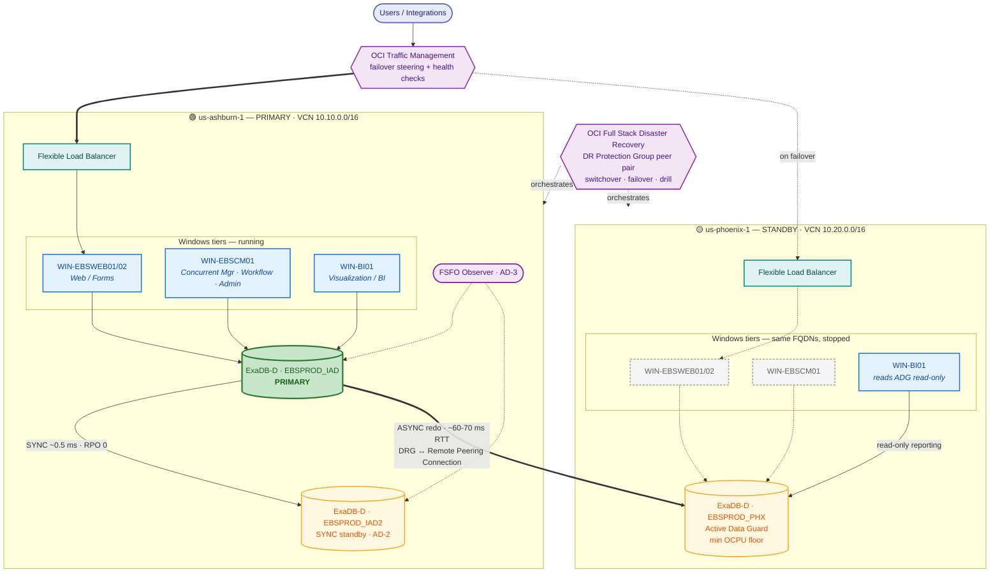

# 01 — Target DR Architecture

**Primary:** `us-ashburn-1` (IAD)  ·  **Secondary:** `us-phoenix-1` (PHX)
**Workload:** Oracle E-Business Suite on Exadata Database Service, Windows application/presentation tiers.

---

## 1. Stated assumptions

These drive the design. Confirm or correct before build — items marked **[MATERIAL]** change the design if wrong.

| # | Assumption | Impact if wrong |
|---|---|---|
| A1 | EBS **12.2.x** (dual filesystem fs1/fs2, WebLogic-based) | **[MATERIAL]** 12.1 removes the online-patching FS split; simplifies §4.3 |
| A2 | Database is **19c** on **ExaDB-D** (Exadata Database Service on Dedicated Infrastructure), not Cloud@Customer | **[MATERIAL]** ExaCC changes networking, Data Guard setup, and Full Stack DR member support |
| A3 | EBS app tier runs on **Windows Server x64** (Cygwin-based, per Doc ID 1330701.1) | Affects script language (PowerShell/Cygwin bash) and FSS mount strategy (§4.4) |
| A4 | "Visualization tier" = BI / reporting presentation layer (OBIEE, Discoverer, Power BI gateway, or similar) | **[MATERIAL]** If it means *virtualization* (Hyper-V / VMware / OCVS), §4.5 is replaced by an OCVS-based design |
| A5 | Database does **not** use Hybrid Columnar Compression (HCC) | If HCC is used, the standby **must** be Exadata — no downgrade path to Base DB Service |
| A6 | Cross-region traffic rides **DRG + Remote Peering Connection** over the OCI backbone (not FastConnect / Internet) | Changes bandwidth guarantee and redo transport tuning (§5.3) |
| A7 | Single production EBS instance (no multi-org split across regions) | Multi-instance changes the tiering map |

---

## 2. Architecture in one picture



**Reading the diagram:** solid heavy edges are the live production path; dashed edges activate only on failover. The BI tier is the exception — it reads the Phoenix standby *during normal operations*, which is what keeps the standby continuously proven (§4.5).

---

## 3. Why three Data Guard members, not two

**IAD↔PHX round-trip is roughly 60–70 ms.** Synchronous redo transport at that latency adds the full RTT to every commit — it will not survive an EBS period close or a large Order Management batch. Measure and record your actual RTT in `evidence/latency-baseline.md` before committing to any RPO number.

So the design splits the two jobs:

| Member | Region | Mode | Purpose | RPO |
|---|---|---|---|---|
| `EBSPROD_IAD` | Ashburn AD-1 | Primary | Production | — |
| `EBSPROD_IAD2` | Ashburn AD-2 | **SYNC** (Max Availability) + FSFO | Local HA — AD or rack failure. Automatic. | **0** |
| `EBSPROD_PHX` | Phoenix | **ASYNC** (Max Performance), Active Data Guard | Regional DR. Orchestrated, never automatic. | seconds |

An **Oracle Data Guard Far Sync instance** in Ashburn AD-3 is a valid alternative to `EBSPROD_IAD2` if you want zero-data-loss *to Phoenix* without a full second standby — Far Sync receives SYNC redo locally and forwards ASYNC to PHX. It costs less (no Exadata storage) but gives no local failover target. Choose `EBSPROD_IAD2` if local HA matters; choose Far Sync if only cross-region RPO=0 matters.

**Automatic failover is deliberately scoped to Ashburn only.** Cross-region FSFO invites split-brain and, more practically, promotes a database whose Windows app tier is not yet running — which buys nothing. Cross-region promotion is always an orchestrated Full Stack DR plan execution.

---

## 4. Per-tier replication design

### 4.1 Database — Exadata

- **Transport:** **Oracle Data Guard** redo transport with redo transport compression enabled on the PHX leg, `RedoRoutes` cascading from `EBSPROD_IAD`.
- **Apply:** **Oracle Active Data Guard** real-time apply in PHX. This buys two things beyond DR — automatic block repair, and a read-only reporting source for the visualization tier (§4.5).
- **Broker:** **Oracle Data Guard Broker** (`dgmgrl`) manages the whole configuration. The **Fast-Start Failover (FSFO) Observer** runs in Ashburn AD-3 on a small always-on VM and targets `EBSPROD_IAD2` **only**.
- **Backups (independent failure domain):** **Oracle Database Autonomous Recovery Service** with **real-time redo transport** and **cross-region backup copy** to PHX. This is the ransomware / logical-corruption answer that Data Guard alone does not give you — Data Guard faithfully replicates a `DELETE`. Enable retention lock (immutability).
- **Oracle Flashback Database ON** on all three members. Non-negotiable — it is what makes failback fast (RB-03) and what makes snapshot-standby drills possible (RB-04).

> **HCC check.** Run `scripts/dataguard/check-hcc.sql` before sizing the standby. If any EBS or custom segment uses HCC, the PHX standby must be Exadata — a Base Database Service standby cannot query those segments.

### 4.2 Windows EBS application tier — Block Volumes

Two mechanisms, used for different things:

| What | Mechanism | Why |
|---|---|---|
| OS + EBS binaries (`$APPL_TOP`, fs1/fs2, WebLogic domain, Cygwin) | **OCI Block Volume — Volume Group Replication** (cross-region) | Crash-consistent point-in-time across boot + all data volumes *as a group*. Individually-replicated volumes are **not** mutually consistent — always use a volume group. |
| Rebuild-from-scratch path | **OCI Compute Custom Images** — *Copy Image to Another Region* — plus **Instance Configurations** | Faster and cleaner for a Tier-2 cold rebuild; also your drift-recovery path if a replica is corrupt |
| Inbound/outbound interface landing directories | Volume group replication **and** Object Storage staging (§4.4) | Interface files are the most common source of Work Recovery Time — see `docs/02-mtd-tiers.md` |

**Operational note.** A volume group replica in PHX is not directly attachable. Failover requires *activating* the replica into a real volume group first, which takes minutes and is a scripted step (`scripts/oci/activate-volume-group.sh`). Budget for it in RTO.

### 4.3 EBS 12.2 dual filesystem

EBS 12.2 online patching keeps two filesystems (`fs1`, `fs2`) — a run edition and a patch edition — plus `fs_ne` (non-editioned). **All three must be replicated.** A standby that has only the run edition will come up, but the next `adop` cycle will fail and you will have no patching capability in DR.

**Freeze rule: do not fail over mid-`adop` cycle.** If an online patching cycle is open when disaster strikes, the failover runbook has an `adop -abort` + `fs_clone` recovery branch (RB-02 §7). Track cycle state on the health dashboard.

### 4.4 Shared file systems — FSS vs Windows-native

A genuine decision point, because **OCI File Storage is NFSv3 only** and Windows NFS client support (Client for Services for NFS) is workable but has AUTH_SYS UID-mapping friction and no NFSv4 semantics.

| Option | Use when | Cross-region mechanism | RPO |
|---|---|---|---|
| **A. OCI File Storage (FSS) — File System Replication**, mounted by the Windows *Client for NFS* | Shared EBS directories that are read-mostly; any Linux-side consumers | **FSS File System Replication** (cross-region, snapshot-delta based) | Interval-driven — commonly 30–60 min. Verify the current minimum interval in the console for your tenancy. |
| **B. Windows File Server + Windows Server Storage Replica** | Heavy SMB write workloads, ACL-sensitive shares | **Windows Server Storage Replica**, asynchronous, cross-region | seconds–minutes |
| **C. Object Storage as the interchange** | Batch interface files, EDI drops, archive | **OCI Object Storage — Replication Policy** | minutes |

**Recommendation: A for EBS shared directories, C for all batch interchange, B only where an application genuinely demands SMB semantics.** Option B is powerful but adds a Windows cluster you must patch, license, and DR-test independently — the highest-maintenance choice on this page.

> **FSS replication targets are read-only** while the replication resource exists. Making one writable at failover means deleting the replication resource — and re-establishing it later triggers a **full re-baseline**, not an incremental. This is a one-way door per failover event. Script it (`scripts/oci/fss-failover.sh`) and account for the re-baseline window in the failback plan.

### 4.5 Visualization / BI tier

Point it at the **Active Data Guard standby in PHX for read-only reporting during normal operations.** This turns a cold asset into a working one and continuously proves the standby is healthy and queryable — the best DR test is the one that runs every day.

EBS caveat: EBS reporting against ADG requires the documented read-only configuration (EBS 12.2 supports ADG reporting with restrictions — no DML, dedicated read-only access path). Do not simply repoint the standard EBS reporting stack at the standby and expect it to work; validate against the My Oracle Support ADG-with-EBS note for your exact 12.2 patch level.

---

## 5. Network and naming — the single biggest RTO lever

### 5.1 Identical hostnames across regions

**Design decision: the PHX app tier uses the same FQDNs and hostnames as IAD, resolved to region-local IPs by split-horizon private DNS.**

This matters more than any other choice in this document. EBS bakes hostnames into context files, `FND_NODES`, WebLogic configs, and profile options. If hostnames change at failover you must run:

```sql
EXEC FND_CONC_CLONE.SETUP_CLEAN;   -- purge FND_NODES
-- then AutoConfig on the DB tier, then AutoConfig on every app tier node
```

That path is **~3–5 hours**. Keeping hostnames stable reduces app-tier recovery to *starting the services* — **~20–40 minutes**. The design therefore uses:

- Different VCN CIDRs (10.10/16 vs 10.20/16) — **required**, because both must be routable simultaneously for Data Guard
- **Identical hostnames** via OCI Private DNS zones with region-scoped views
- TNS aliases that resolve region-locally, so context files never change

### 5.2 External entry point

**OCI Traffic Management Steering Policies** — **Failover** policy type — with **OCI Health Checks** against a lightweight EBS liveness endpoint. Keep TTL low (30–60 s) — but remember client and corporate resolver caching means real-world DNS cutover is often 5–15 minutes regardless of TTL. Budget that into RTO; do not assume TTL is the whole story.

### 5.3 Redo transport tuning

Size TCP buffers from the bandwidth-delay product:

```
BDP (bytes) = bandwidth (bits/s) / 8 * RTT (s)
Example: 1 Gbps * 0.065 s = 8.1 MB  ->  SEND_BUF_SIZE / RECV_BUF_SIZE ~= 3 * BDP ~= 24 MB
```

Also set `SDU=65535` on both ends, enable redo transport compression on the PHX leg, and size standby redo logs identical to online redo logs with one extra group per thread. See `scripts/dataguard/tnsnames-tuning.md`.

---

## 6. Orchestration — OCI Full Stack Disaster Recovery

Full Stack DR (FSDR) is the native orchestrator, and it is how the "spin up and tear down" requirement is answered.

- **DR Protection Group (DRPG)** in each region, associated as a peer pair.
- **Members:** the ExaDB-D database (with its Data Guard association), Windows compute instances, volume groups, file systems, load balancers, and **user-defined steps**.
- **Plans:** Switchover, Failover, **Start Drill**, **Stop Drill**. The drill plans are the tear-down-able DR environment.
- **User-defined steps** run your EBS logic — stop/start services, `cmclean.sql`, AutoConfig where needed — via the **Oracle Cloud Agent Run Command plugin**. On Windows this executes PowerShell. **The Run Command plugin must be enabled and healthy on every Windows instance, or plan execution fails at that step.** Verify it in prechecks, every time.
- Grant FSDR access via dynamic groups + policies; send plan execution logs to a dedicated Object Storage bucket for audit evidence.

See `docs/03-replication-matrix.md` for the full member-to-mechanism mapping, and `runbooks/` for executable procedures.
