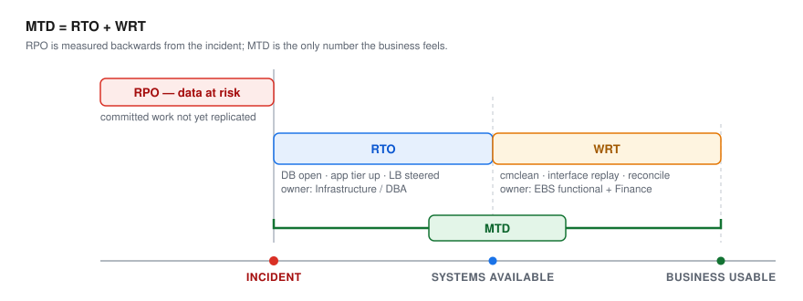
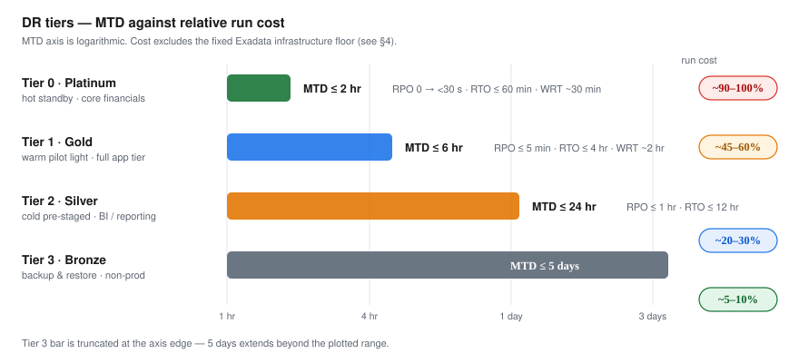

# 02 — Maximum Tolerable Downtime (MTD) Tiers

## 1. Getting the vocabulary right

Most DR plans quote RTO and stop. That under-states EBS recovery badly, because an ERP is not "recovered" when the database opens — it is recovered when Finance trusts the numbers.

| Term | Definition | Who owns it |
|---|---|---|
| **RPO** | Recovery Point Objective — how much committed data you accept losing. NIST SP 800-34 Rev. 1: "The RPO represents the point in time, prior to a disruption or system outage, to which mission/business process data can be recovered... Unlike RTO, RPO is not considered as part of MTD." [1] ITIL 4's equivalent definition: "the point to which information used by an activity must be restored to enable the activity to operate on resumption" [2] | Infrastructure / DBA |
| **RTO** | Recovery Time Objective — incident to *technically available*. NIST SP 800-34 Rev. 1: "RTO defines the maximum amount of time that a system resource can remain unavailable before there is an unacceptable impact on other system resources, supported mission/business processes, and the MTD." [1] ITIL 4's equivalent definition: "the maximum acceptable period of time following a service disruption that can elapse before the lack of business functionality severely impacts the organization" [2] | Infrastructure / DBA |
| **WRT** | Work Recovery Time — technically available to *business-usable*: concurrent request re-submission, interface replay, reconciliation, period-close validation | EBS functional + Finance |
| **MTD** | **RTO + WRT** — the number the business actually feels, and the only one to put in front of an executive | Business owner |

NIST SP 800-34 Rev. 1 defines MTD as "the total amount of time the system owner/authorizing official is willing to accept for a mission/business process outage or disruption" (§3.2.1, p. 17) [1], and states that "the RTO must normally be shorter than the MTD" because "additional processing time must be added to the RTO to stay within the time limit established by the MTD" [1]. **NIST does not use the term Work Recovery Time, and it does not state that MTD = RTO + WRT** — the document's own wording is "additional processing time" added to RTO, with no name given to that additional time [1]. **WRT is this plan's name for that additional processing time, and MTD = RTO + WRT is this plan's own decomposition of the NIST relationship, not a definition NIST states.** It is used here because, for an ERP, that additional processing time is substantial and needs its own owner and its own line in the table.

**Everything below is expressed as MTD.** WRT is called out separately because for EBS it is frequently *larger* than RTO, and it is the part no infrastructure investment can shrink *(unverified: engineering judgement; no documentation found in this revision)* — it shrinks only through interface design and rehearsal.

---

## 2. The four tiers

> ### ⚠️ These tier names are not Oracle MAA reference architecture tiers
>
> Platinum / Gold / Silver / Bronze here are **this plan's own MTD tiers**, named for the
> business conversation in `checklists/tier-assignment-workshop.md`. They are **not** the
> Oracle Maximum Availability Architecture (MAA) reference architectures of the same names.
> The two scales measure different things: MAA tiers classify a *database platform's*
> availability capabilities; these tiers classify *which EBS components* the business needs
> back, and by when.
>
> In particular, **MAA Platinum builds on Gold with Oracle GoldenGate replication** (and
> Edition-Based Redefinition for zero-downtime application upgrades) [3][4], which this plan
> does not use; Application Continuity, often assumed to be a Platinum feature, is in fact
> introduced at **MAA Silver**: "Application Continuity provides a reliable replay of
> in-flight transactions" is part of Oracle's Silver reference architecture, not Platinum
> [3]. In MAA terms the database design here (Data Guard with a local SYNC standby, an
> Active Data Guard cross-region standby, Fast-Start Failover, and Flashback Database) sits
> at **MAA Gold** — "the Gold reference architecture adds database-aware replication
> technologies, Oracle Data Guard and Oracle Active Data Guard" [3] — regardless of which of
> *these* tiers a workload is assigned to. An Oracle-literate reader who assumes "Tier 0
> Platinum" means MAA Platinum will expect GoldenGate-based zero-downtime failover that is
> not here.

| | **Tier 0 — Platinum** | **Tier 1 — Gold** | **Tier 2 — Silver** | **Tier 3 — Bronze** |
|---|---|---|---|---|
| **Posture** | Hot standby | Warm / pilot light | Cold, pre-staged | Backup & restore |
| **RPO** | **0** intra-region **< 30 s** cross-region | **≤ 5 min** | **≤ 1 hr** | **≤ 24 hr** |
| **RTO** | ≤ 15 min local ≤ 60 min cross-region | ≤ 4 hr | ≤ 12 hr | ≤ 72 hr |
| **WRT** | ~30 min | ~2 hr | ~4 hr | ~8 hr |
| **MTD** | **≤ 2 hr** | **≤ 6 hr** | **≤ 24 hr** | **≤ 5 days** |
| **Database** | **Oracle Active Data Guard** — SYNC intra-region + ASYNC to PHX under Maximum Availability / Maximum Performance protection modes [5], real-time apply [6]; **FSFO + Observer** on the local leg [7] | **Oracle Active Data Guard**, ASYNC, real-time apply [5][6] | **Oracle Data Guard** managed recovery, ExaDB-D VM Cluster at OCPU floor — online scaling [8] | **Oracle Database Autonomous Recovery Service** — in-region backup, restorable "to any availability domain, zone, or region" [10]; no documented cross-region backup-copy feature exists, so a regional loss is covered by Data Guard, not by this service [11]; `RMAN RESTORE` |
| **Windows app tier** | Running; EBS services stopped, drained from **OCI Flexible Load Balancer** | Instances exist, **STOPPED** via **OCI Resource Scheduler**, which stops billed OCPUs on a schedule [9] | **OCI Compute Custom Images** + volume group replicas only | Rebuild from **Custom Image** + backup |
| **Block storage** | **OCI Block Volume — Volume Group Replication**, continuous | **Volume Group Replication**, continuous | **Volume Group Replication** | **OCI Block Volume Backup Policy** — scheduled cross-region backup copy [12] |
| **File storage** | **OCI File Storage — File System Replication**, shortest supported interval (15 min minimum) [13] | **FSS File System Replication** [13] | **FSS File System Replication**, long interval | FSS snapshot exported to Object Storage |
| **Object storage** | **OCI Object Storage — Replication Policy** [14] | **Object Storage Replication Policy** [14] | **Object Storage Replication Policy** [14] | Lifecycle-managed cross-region copy *(unverified: engineering judgement; no documentation found in this revision — no Object Storage Lifecycle Management cross-region copy feature was found in the sources for this revision)* |
| **Failover trigger** | **Full Stack DR — Failover plan**, pre-approved [15][16] | **Full Stack DR** plan + change approval [15][16] | **Full Stack DR** plan + manual staging [15][16] | Manual rebuild |
| **Relative run cost** | ~90–100% of prod | ~45–60% | ~20–30% | ~5–10% |

> Cost percentages are **shape-of-the-answer, not a quote** *(unverified: engineering judgement; no documentation found in this revision)*. They exclude the Exadata infrastructure floor discussed in §4. Model your own in `docs/05-cost-and-teardown.md`.

---

## 3. Which EBS component lands in which tier

This is the part to negotiate with the business. A defensible split:

| Scope | Tier | Rationale |
|---|---|---|
| Core financials — GL, AP, AR, FA; Order Management, Inventory transactions; the EBS database itself | **0** | Revenue-recognition and cash-application paths. Data loss is not recoverable by re-keying. |
| Full production app tier — Concurrent Managers, Workflow, Workflow Mailer, iProcurement, self-service HR, integration endpoints (SOA/ISG) | **1** | Business can absorb a few hours; most work re-queues rather than being lost. |
| Visualization / BI / reporting tier, ad-hoc analytics, data extracts, non-critical inbound integrations | **2** | Reporting can wait a day. **Note:** if the BI tier reads the ADG standby, it is effectively *available first* — a pleasant inversion (see §5). |
| Non-production — Dev, Test, UAT, sandbox clones; archive and long-tail file shares | **3** | Rebuild from backup. Do not pay for warm capacity here. |

**Tier assignment is a business decision, not an IT one.** Use `checklists/tier-assignment-workshop.md` to run that conversation and capture sign-off — you will need the signature at audit time.

---

## 4. The Exadata cost floor — read before promising Tier 2 or 3 for the database

Tiering compute is easy: stop the instance, stop paying for OCPUs. **Tiering Exadata is not.** ExaDB-D bills as *infrastructure* (fixed, by rack configuration) plus *OCPUs*. That means:

- There is **no zero-cost standby Exadata** *(unverified: engineering judgement; no documentation found in this revision — the fetched OCI documentation confirms VM-cluster OCPU billing behaviour below but does not address whether the underlying Exadata infrastructure charge continues at zero OCPUs)*.
- What you *can* do is run the PHX VM cluster at a **minimum OCPU floor** and scale up during failover. OCPU (ECPU on X11M) scaling on ExaDB-D is online, is rolled out to VMs incrementally rather than in parallel, and completes in minutes [8] — this is a real and meaningful lever, and it is the recommended Tier-1 posture.
- Scaling the standby to **zero** OCPUs "will shut down the VM Cluster and eliminate any billing for that VM Cluster", though the hypervisor still reserves the minimum 2 OCPUs per VM (8 ECPUs per VM on X11M) even while shut down [8]. Zero OCPU also stops redo apply, which converts your Tier 1 into a Tier 3 the moment you do it. Do not do this to save money and then report the old RPO.

**Consequence:** the "database is Tier 3 / restore-from-backup" option only genuinely saves money if you provision **no standby Exadata at all** and accept provisioning one during the disaster — which realistically adds hours and carries capacity risk in a regional event, exactly when Phoenix is busiest. The plan therefore recommends: **keep a standing PHX Exadata standby at minimum OCPU, and tier the *application* stack instead.** That is where the elastic money actually is.

If budget forces a non-Exadata standby, re-check assumption A5 (HCC) first — it may be a hard blocker.

---

## 5. Two honest caveats about these numbers

**Tier 0's 15-minute local RTO is real; the 60-minute cross-region figure is conditional.** It holds only if hostnames are preserved (`docs/01-architecture.md` §5.1). Without that, add **~3–5 hours** for `FND_CONC_CLONE.SETUP_CLEAN` plus AutoConfig across all tiers *(unverified: engineering judgement; no documentation found in this revision — see `docs/01-architecture.md` §5.1 for the documented Oracle sequence this estimate is built on)*, and Tier 0 becomes a Tier 1 in practice.

**WRT estimates are the least reliable figures on this page** *(unverified: engineering judgement; no documentation found in this revision)* until you have run a full drill with the functional team. They are seeded from typical EBS recovery patterns, not from your instance. After the first drill (RB-04), replace them with measured values and re-derive MTD. Treat the current MTD column as a *design target*, not a commitment to the business, until that measurement exists.

---

## 6. What actually drives WRT (and how to shrink it)

Infrastructure gets you to "database open." These are what stand between that and "Finance signs off":

| WRT driver | Mitigation | Owner |
|---|---|---|
| Concurrent requests in-flight at failure — orphaned, part-complete, or duplicated on resubmit | `cmclean.sql` (My Oracle Support Doc ID 134007.1 [17][18]) in the failover runbook — **note:** a public source states this note "is valid for Applications versions 10.7 to 12.1.3" [18], and the publicly available copy of the EBS 12.2 business-continuity note contains no cmclean step, so confirm its applicability to your 12.2 patch level with Oracle Support before relying on it (see `README.md`); make critical concurrent programs **idempotent and restartable**; capture the running-request list on a schedule | EBS DBA + Dev |
| Inbound interface files consumed but not committed | Land **all** inbound files in Object Storage with bucket replication *before* processing; process from the replicated copy, never from an unreplicated local path | Integration |
| Outbound files generated but not transmitted | Write outbound to a replicated bucket; make transmission a separate, replayable step with a transmitted/not-transmitted ledger | Integration |
| Workflow Mailer duplicate or lost notifications | Document the accepted duplicate-send window; pre-brief users that some notifications may repeat after DR | EBS functional |
| Period-close in progress at failure | Freeze rule: **no cross-region failover during close** unless the business explicitly accepts it; if forced, follow the close-reconciliation checklist | Finance |
| Reconciliation and sign-off | Pre-built reconciliation report pack, rehearsed in every drill so it is routine rather than improvised | Finance |

The single highest-leverage change on this table is the interface pattern: **files land in replicated Object Storage before processing.** It converts an unbounded manual reconstruction into a bounded, scripted replay.

## References

This document is a synthesis: every statement about product behaviour or a standard is derived
from the sources below, and any statement that could not be traced to a source is marked as
unverified. Numbers restart per document. The consolidated index is `docs/references.md`.

1. *Contingency Planning Guide for Federal Information Systems.* NIST Special Publication 800-34 Rev. 1, May 2010 (errata 2010-11-11), accessed 2026-09-01.
   <https://nvlpubs.nist.gov/nistpubs/Legacy/SP/nistspecialpublication800-34r1.pdf> — Supports: MTD, RTO and RPO definitions (§3.2.1, p. 17); "the RTO must normally be shorter than the MTD"; "additional processing time must be added to the RTO"; "RPO is not considered as part of MTD"; the term Work Recovery Time does not occur in the document (§1).
2. *Glossary, ITIL 4 Foundation Official Training Materials*, PeopleCert (copy hosted by igen.nl), accessed 2026-09-01.
   <https://igen.nl/wp-content/uploads/2024/10/ITIL-4-Foundation_Glossary_Digital.pdf> — Supports: ITIL 4 definitions of recovery point objective and recovery time objective (§1).
3. *High Availability Overview and Best Practices*, Oracle Database 19c (F23691-56, July 2026), Oracle, accessed 2026-09-01.
   <https://docs.oracle.com/en/database/oracle/oracle-database/19/haovw/high-availability-overview-and-best-practices.pdf> — Supports: MAA Bronze/Silver/Gold/Platinum reference-architecture definitions, chapter 2; Application Continuity introduced at Silver, not Platinum; Gold adds Data Guard and Active Data Guard; Platinum adds Oracle GoldenGate and Edition-Based Redefinition (§2).
4. *Oracle MAA Blueprints for OCI Deployments*, Oracle white paper, December 2018, accessed 2026-09-01.
   <https://www.oracle.com/technetwork/database/availability/oci-maa-reference-architectures-5228897.pdf> — Supports: "Platinum Reference Architecture builds on the existing Gold architecture with Oracle GoldenGate for zero downtime upgrades and migrations, and Edition-Based Redefinition for zero downtime application upgrades" (§2).
5. *Oracle Data Guard Protection Modes*, Data Guard Concepts and Administration 19c, Oracle, accessed 2026-09-01.
   <https://docs.oracle.com/en/database/oracle/oracle-database/19/sbydb/oracle-data-guard-protection-modes.html> — Supports: Maximum Availability (SYNC) / Maximum Performance (ASYNC) protection-mode mechanics (§2).
6. *Managing Physical and Snapshot Standby Databases*, Data Guard Concepts and Administration 19c, Oracle, accessed 2026-09-01.
   <https://docs.oracle.com/en/database/oracle/oracle-database/19/sbydb/managing-oracle-data-guard-physical-standby-databases.html> — Supports: Active Data Guard real-time query / real-time apply (§2).
7. *Switchover and Failover Operations*, Oracle Data Guard Broker 19c (E96245-04), Oracle, accessed 2026-09-01.
   <https://docs.oracle.com/en/database/oracle/oracle-database/19/dgbkr/using-data-guard-broker-to-manage-switchovers-failovers.html> — Supports: Fast-Start Failover with a separate-host observer (§2).
8. *Manage VM Clusters*, Exadata Database Service on Dedicated Infrastructure documentation, Oracle, accessed 2026-09-01.
   <https://docs.oracle.com/en-us/iaas/exadatacloud/doc/manage-vm-clusters.html> — Supports: OCPU/ECPU scaling is online and rolled out incrementally; setting OCPUs to zero "will shut down the VM Cluster and eliminate any billing for that VM Cluster", while the hypervisor still reserves a minimum of 2 OCPUs per VM (8 ECPUs per VM on X11M) (§2, §4).
9. *About Resource Scheduler*, Oracle Cloud Infrastructure Documentation, Oracle, accessed 2026-09-01.
   <https://docs.oracle.com/en-us/iaas/Content/resource-scheduler/concepts/resourcescheduleroverview-about.htm> — Supports: Resource Scheduler stops billed resources on a schedule and restarts them later (§2).
10. *Recovery Service Technical Architecture*, Oracle Database Autonomous Recovery Service documentation, Oracle, accessed 2026-09-01.
    <https://docs.oracle.com/en-us/iaas/recovery-service/doc/recovery-service-architecture.html> — Supports: "Auto-backup replication is used for backup high-availability within a region. You can restore to any availability domain, zone, or region." (§2).
11. *Implement Oracle Database Autonomous Recovery Service with Oracle Database@Azure*, Oracle Solutions playbook (G24007-01, January 2025), accessed 2026-09-01.
    <https://docs.oracle.com/en/solutions/implement-recovery-service-db-at-azure/index.html> — Supports: "For cross region backups, use Oracle Data Guard to replicate databases from primary to standby region and backup each region with local recovery service" — i.e. no documented cross-region backup-copy feature (§2).
12. *Backup Policies*, Oracle Cloud Infrastructure Documentation, Oracle, accessed 2026-09-01.
    <https://docs.oracle.com/en-us/iaas/Content/Block/Tasks/schedulingvolumebackups.htm> — Supports: user-defined backup policies can copy volume backups to another region on a schedule (§2).
13. *File System Replication*, Oracle Cloud Infrastructure Documentation, Oracle, accessed 2026-09-01.
    <https://docs.oracle.com/en-us/iaas/Content/File/Tasks/FSreplication.htm> — Supports: cross-region, snapshot-delta FSS File System Replication; minimum replication interval of 15 minutes (§2).
14. *Object Storage Replication*, Oracle Cloud Infrastructure Documentation, Oracle, accessed 2026-09-01.
    <https://docs.oracle.com/en-us/iaas/Content/Object/Tasks/usingreplication.htm> — Supports: Object Storage Replication Policy mechanism (§2).
15. *Types of Disaster Recovery Plans*, OCI Full Stack Disaster Recovery documentation, Oracle, accessed 2026-09-01.
    <https://docs.oracle.com/en-us/iaas/disaster-recovery/doc/dr-plans-type.html> — Supports: Switchover, Failover, Start Drill, Stop Drill plan types (§2).
16. *Prechecks Performed by Full Stack Disaster Recovery*, OCI Full Stack Disaster Recovery documentation, Oracle, accessed 2026-09-01.
    <https://docs.oracle.com/en-us/iaas/disaster-recovery/doc/prechecks-disaster-recovery.html> — Supports: plan prechecks validate that a plan is compliant with its protection groups before execution (§2).
17. *Concurrent Processing - CMCLEAN.SQL - Non Destructive Script to Clean Concurrent Manager Tables.* My Oracle Support Doc ID 134007.1, Oracle. Unverifiable by URL: login-gated (My Oracle Support). Title corroborated only by [18].
18. *Be Warned: cmclean.sql Is Dangerous!* Maris Elsins, Pythian blog, 2013-07-18, accessed 2026-09-01.
    <https://www.pythian.com/blog/be-warned-cmclean-sql-is-dangerous/> — Supports: corroborates the title of Doc ID 134007.1 only; states the note "is valid for Applications versions 10.7 to 12.1.3" (§6).

### Unverified statements

The following statements are engineering judgement with no supporting documentation found in this revision:

- WRT is often larger than RTO for an ERP and no infrastructure spend shrinks it (§1).
- Cost percentages describe the shape of the answer, not a quote (§2).
- No documented Object Storage Lifecycle Management cross-region copy feature was found; the Tier 3 Object Storage cell names a pattern, not a verified mechanism (§2).
- There is no zero-cost standby Exadata: whether the Exadata infrastructure charge continues at zero OCPUs is not addressed by the fetched OCI documentation (§4).
- The SETUP_CLEAN + AutoConfig path adds ~3–5 hours (§5).
- WRT estimates are the least reliable figures on this page, pending a measured drill (§5).

[1]: https://nvlpubs.nist.gov/nistpubs/Legacy/SP/nistspecialpublication800-34r1.pdf "NIST SP 800-34 Rev. 1 — Contingency Planning Guide for Federal Information Systems"
[2]: https://igen.nl/wp-content/uploads/2024/10/ITIL-4-Foundation_Glossary_Digital.pdf "Glossary, ITIL 4 Foundation Official Training Materials — PeopleCert"
[3]: https://docs.oracle.com/en/database/oracle/oracle-database/19/haovw/high-availability-overview-and-best-practices.pdf "High Availability Overview and Best Practices — Oracle Database 19c"
[4]: https://www.oracle.com/technetwork/database/availability/oci-maa-reference-architectures-5228897.pdf "Oracle MAA Blueprints for OCI Deployments — Oracle White Paper"
[5]: https://docs.oracle.com/en/database/oracle/oracle-database/19/sbydb/oracle-data-guard-protection-modes.html "Oracle Data Guard Protection Modes — Oracle"
[6]: https://docs.oracle.com/en/database/oracle/oracle-database/19/sbydb/managing-oracle-data-guard-physical-standby-databases.html "Managing Physical and Snapshot Standby Databases — Oracle"
[7]: https://docs.oracle.com/en/database/oracle/oracle-database/19/dgbkr/using-data-guard-broker-to-manage-switchovers-failovers.html "Switchover and Failover Operations — Oracle Data Guard Broker 19c"
[8]: https://docs.oracle.com/en-us/iaas/exadatacloud/doc/manage-vm-clusters.html "Manage VM Clusters — Oracle"
[9]: https://docs.oracle.com/en-us/iaas/Content/resource-scheduler/concepts/resourcescheduleroverview-about.htm "About Resource Scheduler — Oracle"
[10]: https://docs.oracle.com/en-us/iaas/recovery-service/doc/recovery-service-architecture.html "Recovery Service Technical Architecture — Oracle"
[11]: https://docs.oracle.com/en/solutions/implement-recovery-service-db-at-azure/index.html "Implement Oracle Database Autonomous Recovery Service with Oracle Database@Azure — Oracle"
[12]: https://docs.oracle.com/en-us/iaas/Content/Block/Tasks/schedulingvolumebackups.htm "Backup Policies — Oracle"
[13]: https://docs.oracle.com/en-us/iaas/Content/File/Tasks/FSreplication.htm "File System Replication — Oracle"
[14]: https://docs.oracle.com/en-us/iaas/Content/Object/Tasks/usingreplication.htm "Object Storage Replication — Oracle"
[15]: https://docs.oracle.com/en-us/iaas/disaster-recovery/doc/dr-plans-type.html "Types of Disaster Recovery Plans — OCI Full Stack DR"
[16]: https://docs.oracle.com/en-us/iaas/disaster-recovery/doc/prechecks-disaster-recovery.html "Prechecks Performed by Full Stack Disaster Recovery — Oracle"
[17]: #references "MOS Doc ID 134007.1 — unverifiable by URL (login-gated)"
[18]: https://www.pythian.com/blog/be-warned-cmclean-sql-is-dangerous/ "Be Warned: cmclean.sql Is Dangerous! — Pythian"
