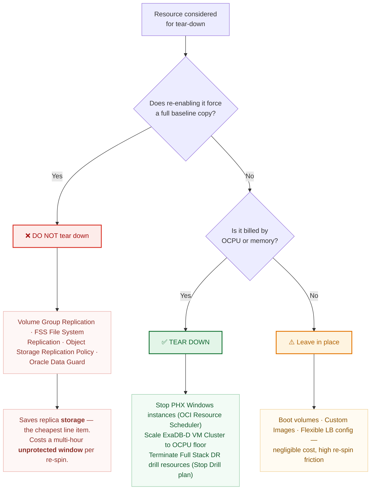

# 03 — Replication Matrix

Every protected resource mapped to its **exact Oracle product / feature name**, its failover action, and its failback cost.

> Naming convention: this document uses the vendor's own product and feature names verbatim so that every row is directly searchable in Oracle documentation and My Oracle Support. Where a feature has both a marketing name and a CLI/API name, both are given.

---

## 1. Master matrix

| # | Resource | Oracle / OCI mechanism (exact name) | CLI / API surface | Typical RPO | Failover action | Reversible without full re-baseline? |
|---|---|---|---|---|---|---|
| R1 | EBS database on Exadata | **Oracle Active Data Guard** (physical standby), managed by **Oracle Data Guard Broker**; **Oracle Data Guard Fast-Start Failover (FSFO)** with **Observer** for the intra-region leg | `dgmgrl`; `oci db data-guard-association` | 0 (SYNC leg) / seconds (ASYNC leg) | `SWITCHOVER TO` / `FAILOVER TO` via Broker | **Yes** — **Oracle Flashback Database** reinstates the former primary |
| R1a | Zero-data-loss option without a second full standby | **Oracle Data Guard Far Sync** instance | `dgmgrl` (`ADD FAR_SYNC`) | 0 to the Far Sync | Redo already at Far Sync; failover proceeds | Yes |
| R2 | Database backup, immutable copy | **Oracle Database Autonomous Recovery Service** (Zero Data Loss Autonomous Recovery Service) with **real-time redo transport** and **cross-region backup copy**; **retention lock** for immutability | `oci recovery protected-database` | ~1 min (real-time redo) | `RMAN RESTORE` from the Phoenix copy | Yes |
| R3 | Windows app-tier storage (boot + block) | **OCI Block Volume — Volume Group Replication** (cross-region), producing a **volume group replica** | `oci bv volume-group-replica` | minutes | **Activate** the volume group replica, then attach | **No** — reversing direction performs a full baseline |
| R3a | Scheduled point-in-time copies | **OCI Block Volume Backup Policy** with **cross-region backup copy** | `oci bv volume-backup copy` | hours | `oci bv volume create --volume-backup-id` | Yes |
| R4 | Windows golden images | **OCI Compute Custom Images** with **Copy Image to Another Region**; launched via **Instance Configurations** / **Instance Pools** | `oci compute image export` / `instance-configuration` | on publish | Launch instance from image | Yes |
| R5 | EBS shared directories | **OCI File Storage service (FSS)** — **File System Replication** (cross-region), snapshot-delta based | `oci fs replication` | interval-driven, commonly 30–60 min | **Delete the replication resource** to unlock the target file system for write | **No** — re-establishing performs a full baseline |
| R6 | SMB shares (Option B only) | **Windows Server Storage Replica** (Microsoft feature, asynchronous replication) | `Set-SRPartnership` | seconds–minutes | Role reversal via `Set-SRPartnership` | Yes — supports reversal with delta resync |
| R7 | Interface / batch / archive object data | **OCI Object Storage — Replication Policy** (cross-region bucket replication) | `oci os replication` | minutes | **Delete the replication policy** to make the destination bucket writable | **No** — re-establishing re-scans the bucket |
| R8 | External entry point | **OCI Traffic Management Steering Policies** — **Failover** policy type, with **OCI Health Checks** | `oci dns steering-policy` | n/a | Automatic on health-check failure, or forced | Yes |
| R9 | Load balancing | **OCI Flexible Load Balancer**, pre-provisioned per region | `oci lb load-balancer` | n/a | Backend set already populated; nothing to move | Yes |
| R10 | TDE keys, wallets, secrets | **OCI Vault** (Key Management / Secrets), **cross-region key replication** | `oci kms` / `oci vault` | near-real-time | None — keys already present in Phoenix | Yes |
| R11 | Orchestration | **OCI Full Stack Disaster Recovery** — **DR Protection Group (DRPG)** peer pair, **DR Plans** (Switchover, Failover, Start Drill, Stop Drill) | `oci disaster-recovery` | n/a | **DR Plan Execution** | Yes |
| R12 | In-guest execution of EBS logic | **Oracle Cloud Agent — Run Command plugin**, invoked from an FSDR **user-defined step** | `oci instance-agent command` | n/a | Runs PowerShell on the Windows nodes | Yes |
| R13 | Scheduled start/stop of standby compute | **OCI Resource Scheduler** | `oci resource-scheduler schedule` | n/a | n/a (cost control, not DR) | Yes |
| R14 | Exadata elasticity | **ExaDB-D VM Cluster OCPU scaling** (online) | `oci db vm-cluster update --cpu-core-count` | n/a | Scale up during failover | Yes |

**Product names in full, for procurement and documentation searches:**
- *Oracle Exadata Database Service on Dedicated Infrastructure* (**ExaDB-D**)
- *Oracle E-Business Suite Release 12.2* — application tier managed with **AD Online Patching (`adop`)** and **AutoConfig (`adautocfg`)**
- *Oracle Database 19c Enterprise Edition* with **Oracle Active Data Guard** option
- *Oracle Cloud Infrastructure Full Stack Disaster Recovery*
- *Oracle Database Autonomous Recovery Service*

---

## 2. The re-baseline trap — read before designing any automation

Look at the last column. **Four mechanisms are one-way doors per event:** R3 (**Volume Group Replication**), R5 (**FSS File System Replication**), R7 (**Object Storage Replication Policy**), and partially R2.

Once you fail over and unlock those targets, returning to Ashburn is **not** symmetric. You must:

1. Establish replication in the reverse direction (PHX→IAD), which performs a **full baseline copy**, not a delta
2. Wait for that baseline to complete — hours to days depending on volume
3. Only then schedule the failback window

**This is the most commonly missed item in Exadata/EBS DR plans, and it is why failback is a project-managed event rather than a button.** `runbooks/RB-03-failback.md` treats it as such. Budget the baseline window explicitly; do not promise the business a same-day return to Ashburn.

**Oracle Data Guard (R1) is the happy exception** — with **Oracle Flashback Database** enabled, the former primary is reinstated in minutes rather than re-duplicated. Sequence the failback so the database returns first and the storage tiers catch up behind it.

---

## 3. "Spin up and tear down", precisely scoped

The requirement splits into two very different things, and conflating them is expensive.

### 3a. Safe and cheap to tear down

| Resource | Mechanism used to tear down | Savings | Re-spin cost |
|---|---|---|---|
| PHX Windows app instances | **OCI Resource Scheduler**, or `oci compute instance action --action STOP` | Full OCPU + memory charge | Seconds — `START` |
| PHX ExaDB-D OCPUs | **ExaDB-D VM Cluster OCPU scaling** (online) | Substantial OCPU charge | Minutes, online |
| DR drill resources | **Full Stack DR — Stop Drill plan** | Everything the drill created | Re-run **Start Drill** |
| Non-production DR copies | Terminate instances | Everything | Rebuild from **Custom Image** |

### 3b. Looks tear-down-able, but is a trap

| Resource | Why not |
|---|---|
| **OCI Block Volume Volume Group Replication** | Deleting and re-enabling forces a **full baseline** of every volume in the group. |
| **OCI File Storage File System Replication** | Same trap; the target unlock is destructive to the replication relationship. |
| **OCI Object Storage Replication Policy** | Re-establishing re-scans the entire bucket. |
| **Oracle Data Guard** | Never tear down. Rebuilding a standby means a full `RMAN DUPLICATE ... FOR STANDBY` — unprotected for the whole rebuild. |
| Stopped-instance boot volumes | Still billed as storage. Terminating to reclaim it destroys the pilot light. |

**Rule: tear down compute, never tear down replication.** Replica *storage* is a small fraction of the bill; replica *compute* is most of it. The `dr_posture` variable in `terraform/` and the scripts in `scripts/oci/` are built around exactly this split — see `docs/05-cost-and-teardown.md`.

---

## 4. Full Stack DR — DR Protection Group member mapping

How each matrix row is represented inside the **DR Protection Group (DRPG)**:

| Matrix row | FSDR member type | Notes |
|---|---|---|
| R1 | **Database** member, with its **Data Guard Association** | FSDR drives `SWITCHOVER` / `FAILOVER` natively through the Broker |
| R3 | **Volume Group** member | FSDR performs the volume group replica activation |
| R5 | **File System** member | FSDR performs the target unlock |
| R7 | *(no native member type)* | **User-defined step** invoking OCI CLI or an **OCI Function** against the **Object Storage Replication Policy** |
| Windows compute | **Compute Instance** member — **non-moving** | Pre-provisioned in Phoenix and started by FSDR. Preferred over **moving** instances for Tier 0/1: faster, and it keeps volume group activation off the critical path. |
| EBS start/stop, `cmclean.sql`, `adautocfg` | **User-defined step** → **Oracle Cloud Agent Run Command plugin** | Executes PowerShell on Windows. **The plugin must be enabled and healthy on every instance or the plan step fails.** |
| R8 | *(no native member type)* | **User-defined step**, or leave to health-check-driven **Traffic Management Steering Policy** |

**Precheck discipline:** FSDR **plan prechecks** validate member health but cannot validate *your* EBS logic. `checklists/pre-failover-precheck.md` covers that gap — run it monthly, not only before a drill.
