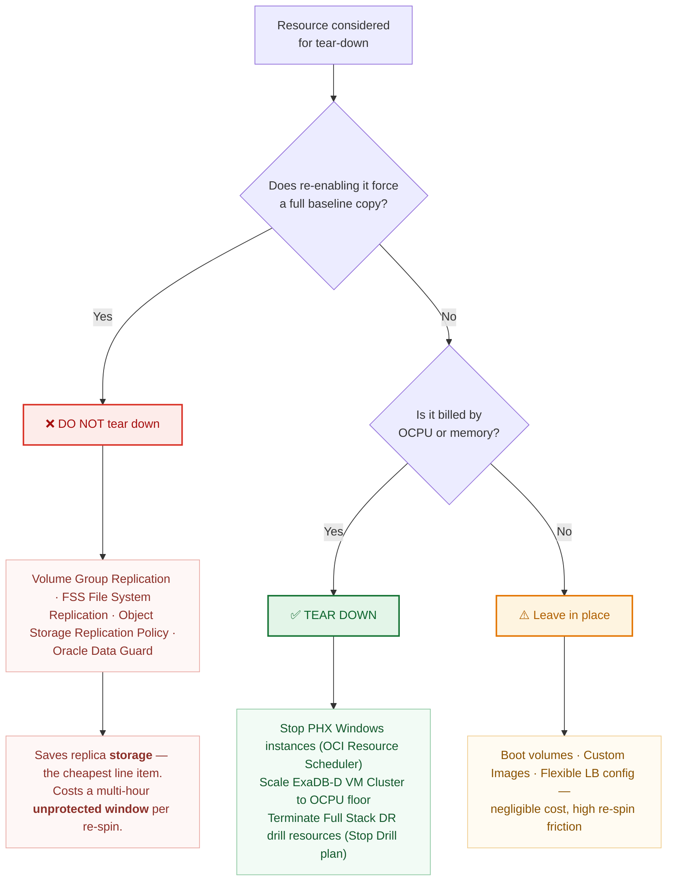

# 03 — Replication Matrix

Every protected resource mapped to its **exact Oracle product / feature name**, its failover action, and its failback cost.

> Naming convention: this document uses the vendor's own product and feature names verbatim so that every row is directly searchable in Oracle documentation and My Oracle Support. Where a feature has both a marketing name and a CLI/API name, both are given.

---

## 1. Master matrix

| # | Resource | Oracle / OCI mechanism (exact name) | CLI / API surface | Typical RPO | Failover action | Reversible without full re-baseline? |
|---|---|---|---|---|---|---|
| R1 | EBS database on Exadata | **Oracle Active Data Guard** (physical standby), managed by **Oracle Data Guard Broker** [1]; **Oracle Data Guard Fast-Start Failover (FSFO)** with **Observer** for the intra-region leg [1] | `dgmgrl` [1]; `oci db data-guard-association` [2], or the newer **Data Guard Group** CLI — `oci db database create-standby-database` / `switch-over-data-guard` / `failover-data-guard` / `reinstate-data-guard` [3] | 0 (SYNC leg) / seconds (ASYNC leg) [4] | `SWITCHOVER TO` / `FAILOVER TO` via Broker [1] | **Yes** — **Oracle Flashback Database** reinstates the former primary [1] |
| R1a | Zero-data-loss option without a second full standby | **Oracle Data Guard Far Sync** instance — requires an **Oracle Active Data Guard** license [5] | `dgmgrl` (`ADD FAR_SYNC`) [5] | 0 to the Far Sync [5] | Redo already at Far Sync; failover proceeds [5] | Yes |
| R2 | Database backup, immutable copy | **Oracle Database Autonomous Recovery Service** (Zero Data Loss Autonomous Recovery Service) protecting the **primary**, in whichever region is primary. Cross-region backup replication is not a Recovery Service feature; the documented pattern is Data Guard between regions plus a local Recovery Service in each region [6]. The ExaDB-D documentation allows automatic backups on a standby-role database in general [7], but OCI automatic backups on the standby can be enabled "only if the backup destination of the primary database is Object Storage" [12], so while the primary uses Recovery Service the Phoenix copy is a customer-scheduled RMAN backup of the standby to an Object Storage bucket *(unverified: engineering judgement)*. **Real-time redo transport** is an extra-cost option [8]; **retention lock** provides immutability [9]. | `oci recovery protected-database` [10] | Near-zero, sub-second, with real-time protection enabled [8][11] | `RMAN RESTORE` from the Phoenix RMAN copy; **enable Recovery Service on the new primary** — automatic backups are disabled on the new standby after a role change [12] | Yes — but Recovery Service retains at most 95 days [9]; long-term copies are RMAN KEEP backups in Object Storage (RB-05 §5) |
| R3 | Windows app-tier storage (boot + block) | **OCI Block Volume — Volume Group Replication** (cross-region) [13], producing a **volume group replica**; activation clones the replica into a new volume group, with all replicas activated from the same coordinated synchronization point [13] | `oci bv volume-group-replica` [14] | minutes | **Activate** the volume group replica, then attach [13] | **No** — disabling replication deletes the replica; re-enabling **starts the replication process from scratch**, with an initial sync that can take hours (stated by Oracle in the volume-resize context) [13] |
| R3a | Scheduled point-in-time copies | **OCI Block Volume Backup Policy** with cross-region backup copy [15] | `oci bv volume-backup copy` | hours [15] | `oci bv volume create --volume-backup-id` | Yes |
| R4 | Windows golden images | **OCI Compute Custom Images**, replicated to another region by **export → copy the exported object → import** — there is no single "copy image to another region" operation [16]; launched via **Instance Configurations** (Full Stack DR does **not** support compute instances attached to an **Instance Pool** [17]) | Export image to Object Storage, copy the object, import in the destination region [16] | on publish | Launch instance from image | Yes |
| R5 | Interface landing directories and file drops shared by all app nodes (EBS 12.2 on Windows has no shared application file system; `docs/01` §4.4) | **OCI File Storage service (FSS)** — **File System Replication** (cross-region), snapshot-delta based [18] | `oci fs replication` [19] | interval-driven; **minimum 15 minutes, default 60 minutes** [20] | **Delete the replication resource** (or the replication target, if the source is unreachable) to make the target file system exportable [18] | **No, once the target has been exported** — re-establishing then requires a full base copy; a target that was never exported and never snapshotted can be reused without one [20] |
| R6 | SMB shares (Option B only) | **Windows Server Storage Replica** (Microsoft feature, asynchronous replication) | `Set-SRPartnership` | seconds–minutes | Role reversal via `Set-SRPartnership` | Yes — supports reversal with delta resync *(unverified: no Microsoft documentation source was consulted for this row in this revision)* |
| R7 | Interface / batch / archive object data | **OCI Object Storage — Replication Policy** (cross-region bucket replication) [21] | `oci os replication` [22] | minutes | **Make the destination bucket writable** (documented destination-side action; works even when the source region is lost), or delete the source replication policy (source-side, permanent and unrecoverable) [21][22] | **No** — a new replication policy does **not** replicate objects that already exist in the source bucket; a bulk copy must precede the reverse policy [21] |
| R8 | External entry point | **OCI Traffic Management Steering Policies** — **Failover** policy type, with **OCI Health Checks** [23] | `oci dns steering-policy` [24] | n/a | Automatic on health-check failure, or forced | Yes |
| R9 | Load balancing | **OCI Flexible Load Balancer**, pre-provisioned per region [25] | `oci lb load-balancer` | n/a | Backend set already populated; nothing to move | Yes |
| R10 | TDE keys, wallets, secrets | **OCI Vault** (Key Management / Secrets), **cross-region key replication** — private vaults, and virtual vaults created after the replication feature launched, support it; to only **one** remote region [26] | `oci kms` / `oci vault` | near-real-time | None — keys already present in Phoenix | Yes |
| R11 | Orchestration | **OCI Full Stack Disaster Recovery** — **DR Protection Group (DRPG)** peer pair, **DR Plans** (Switchover, Failover, Start Drill, Stop Drill) [27] | `oci disaster-recovery` [28] | n/a | **DR Plan Execution** | Yes |
| R12 | In-guest execution of EBS logic | **Oracle Cloud Agent — Run Command plugin**, invoked from an FSDR **user-defined step** [29] | `oci instance-agent command` [30] | n/a | Runs a script on the Windows nodes — batch shell by default; a PowerShell script needs `#ps1` as its first line [29] | Yes |
| R13 | Scheduled start/stop of standby compute | **OCI Resource Scheduler** [31] | `oci resource-scheduler schedule` [32] | n/a | n/a (cost control, not DR) | Yes |
| R14 | Exadata elasticity | **ExaDB-D VM Cluster OCPU scaling** (online) [33] | `oci db cloud-vm-cluster update --cpu-core-count` [34] | n/a | Scale up during failover; **scaling to 0 OCPU shuts the VM cluster down and stops VM-cluster billing** (a minimum of 2 OCPU per VM — 8 ECPU per VM on X11M — stays reserved regardless) [33] | Yes |

**Product names in full, for procurement and documentation searches:**
- *Oracle Exadata Database Service on Dedicated Infrastructure* (**ExaDB-D**)
- *Oracle E-Business Suite Release 12.2* — application tier managed with **AD Online Patching (`adop`)** and **AutoConfig (`adautocfg`)**
- *Oracle Database 19c Enterprise Edition* with **Oracle Active Data Guard** option
- *Oracle Cloud Infrastructure Full Stack Disaster Recovery*
- *Oracle Database Autonomous Recovery Service*

---

## 2. The re-baseline trap — read before designing any automation

Look at the last column. **Three mechanisms are full one-way doors per event:** R3 (**Volume Group Replication**), R5 (**FSS File System Replication**), and R7 (**Object Storage Replication Policy**) — reversing any of them after a failover requires a full baseline copy, not a delta [13][18][20][21]. R2 (**Autonomous Recovery Service**) is different in kind: it needs no re-baseline, but a role change disables automatic backups on the new standby, and they must be manually re-enabled on the new primary or that region silently stops being protected [12].

Once you fail over and unlock a storage target, returning to Ashburn is **not** symmetric. You must:

1. Establish replication in the reverse direction (PHX→IAD), which performs a **full baseline copy**, not a delta [13][18][20][21]
2. Wait for that baseline to complete — hours to days depending on volume
3. Only then schedule the failback window

**This is the most commonly missed item in Exadata/EBS DR plans, and it is why failback is a project-managed event rather than a button.** `runbooks/RB-03-failback.md` treats it as such. Budget the baseline window explicitly; do not promise the business a same-day return to Ashburn.

**Oracle Data Guard (R1) is the happy exception** — with **Oracle Flashback Database** enabled, the former primary is reinstated in minutes rather than re-duplicated [1]. Sequence the failback so the database returns first and the storage tiers catch up behind it.

---

## 3. "Spin up and tear down", precisely scoped

The requirement splits into two very different things, and conflating them is expensive.

### 3a. Safe and cheap to tear down

| Resource | Mechanism used to tear down | Savings | Re-spin cost |
|---|---|---|---|
| PHX Windows app instances | **OCI Resource Scheduler** [31], or `oci compute instance action --action STOP` [35] | Full OCPU + memory charge | Seconds — `START` |
| PHX ExaDB-D OCPUs | **ExaDB-D VM Cluster OCPU scaling** (online) [33] | Substantial OCPU charge | Minutes, online |
| DR drill resources | **Full Stack DR — Stop Drill plan** [27] | Everything the drill created | Re-run **Start Drill** |
| Non-production DR copies | Terminate instances | Everything | Rebuild from **Custom Image** [16] |

### 3b. Looks tear-down-able, but is a trap

| Resource | Why not |
|---|---|
| **OCI Block Volume Volume Group Replication** | Deleting and re-enabling forces a **full baseline** of every volume in the group [13]. |
| **OCI File Storage File System Replication** | Same trap; the target unlock is destructive to the replication relationship once the target has been exported [18][20]. |
| **OCI Object Storage Replication Policy** | Creating a new policy does **not** copy objects that already existed in the source bucket — a bulk copy has to run first [21]. |
| **Oracle Data Guard** | Never tear down. Rebuilding a standby means a full duplication from the primary *(unverified: engineering judgement — the exact rebuild command was not confirmed against Oracle documentation in this revision)* — unprotected for the whole rebuild. |
| Stopped-instance boot volumes | Still billed as storage *(unverified: engineering judgement; no documentation found in this revision)*. Terminating to reclaim it destroys the pilot light. |

**Rule: tear down compute, never tear down replication.** Replica *storage* is a small fraction of the bill; replica *compute* is most of it. The scripts in `scripts/oci/` and the apply-locked Terraform under `terraform/` are built around exactly this split — see `docs/05-cost-and-teardown.md`.

---

## 4. Full Stack DR — DR Protection Group member mapping

How each matrix row is represented inside the **DR Protection Group (DRPG)**:

| Matrix row | FSDR member type | Notes |
|---|---|---|
| R1 | **Database** member, with its **Data Guard** configuration | FSDR drives `SWITCHOVER` / `FAILOVER` natively through the Broker [1][36]; Full Stack DR supports only **one** standby database of a Data Guard configuration as a DRPG member, even if the configuration has more [36] |
| R2 | *(no FSDR member type)* | **Autonomous Recovery Service** is not an FSDR member; it protects the primary and is re-enabled on the new primary after a role change [6][12] |
| R3 | **Volume Group** member | FSDR performs the volume group replica activation as part of its built-in plan groups [37] |
| R5 | **File System** member | FSDR performs the target unlock as part of its built-in plan groups [37] |
| R7 | **Object Storage Bucket** member — a **native member type**, with built-in plan groups **"Object Storage Bucket - Delete Replication (Primary)"** and **"Object Storage Bucket - Setup Reverse Replication (Standby)"** [38][37] | The destination bucket stays read-only while the policy exists, same as outside FSDR [21]. A **bulk copy of pre-existing objects still needs a user-defined step**, because neither the native member nor a new replication policy replicates what was already in the bucket [21] |
| Windows compute | **Compute Instance** member — **non-moving** | Pre-provisioned in Phoenix (own boot volume) and started by FSDR; the replicated EBS data volumes are activated and attached to it by the built-in "Volume Groups - Failover" and "Compute Instances - Attach Block Volumes" groups [37]. Activation is on the critical path; budget it (`docs/01` §4.2). |
| EBS start/stop, `cmclean.sql`, `adautocfg` | **User-defined step** → **Oracle Cloud Agent Run Command plugin** | Executes a script on Windows — it runs in a batch shell by default; a PowerShell script needs `#ps1` as its **first line** [29]. Plain-text scripts uploaded directly to the instance are limited to **4 KB**; larger scripts must be staged in Object Storage [29]. **The plugin must be enabled and RUNNING on every instance or the plan step fails** [29]. |
| R8 | *(no native member type — verified: OCI DNS / Traffic Management has no FSDR member type)* [39] | **User-defined step**, or leave to health-check-driven **Traffic Management Steering Policy**. Both require the EBS load balancer to be public-facing, because Traffic Management "is only available for public DNS" [23]; a private-only estate uses a private-zone record swap in a user-defined step instead (`docs/01` §5.2). |

Full Stack DR is a **charged service**: it bills monthly on the allocated OCPU/ECPU of compute, database, OKE, and Integration members — whether they are running or stopped. Block, file, and object storage members, and load balancer members, are not charged [40]. FSDR's **Automatic DR** feature can trigger a plan automatically on a Data Guard role change; this plan requires Automatic DR to stay **disabled**, because cross-region failover is never automatic (`checklists/dr-authority-matrix.md`) [41]. A **failover** plan execution does not clean up the old primary DR Protection Group; a **Data Guard reinstate** on the old primary is required before it is usable again [1].

**Precheck discipline:** FSDR **plan prechecks** validate member health but cannot validate *your* EBS logic [42]. `checklists/pre-failover-precheck.md` covers that gap — run it monthly, not only before a drill.

---

## References

This document is a synthesis: every statement about product behaviour or a standard is derived
from the sources below, and any statement that could not be traced to a source is marked as
unverified. Numbers restart per document. The consolidated index is `docs/references.md`.

1. *Switchover and Failover Operations.* Oracle Data Guard Broker 19c (E96245-04), Oracle, accessed 2026-09-01.
   <https://docs.oracle.com/en/database/oracle/oracle-database/19/dgbkr/using-data-guard-broker-to-manage-switchovers-failovers.html> — Supports: Broker drives `SWITCHOVER TO` / `FAILOVER TO`; FSFO with an Observer; `REINSTATE DATABASE` requires Flashback Database to have been enabled before the failover (R1, §2, §4).
2. *`oci db data-guard-association`.* OCI CLI Command Reference 3.91.0, Oracle, accessed 2026-09-01.
   <https://docs.oracle.com/en-us/iaas/tools/oci-cli/latest/oci_cli_docs/cmdref/db/data-guard-association.html> — Supports: the Data Guard Association CLI command group exists (R1).
3. *`oci db database`.* OCI CLI Command Reference 3.91.0, Oracle, accessed 2026-09-01.
   <https://docs.oracle.com/en-us/iaas/tools/oci-cli/latest/oci_cli_docs/cmdref/db/database.html> — Supports: the newer Data Guard Group CLI subcommands `create-standby-database`, `switch-over-data-guard`, `failover-data-guard`, `reinstate-data-guard` (R1).
4. *Oracle Data Guard Protection Modes.* Oracle Data Guard Concepts and Administration 19c, Oracle, no version date shown, accessed 2026-09-01.
   <https://docs.oracle.com/en/database/oracle/oracle-database/19/sbydb/oracle-data-guard-protection-modes.html> — Supports: Maximum Availability (SYNC, RPO 0) vs. Maximum Performance (ASYNC, RPO seconds) (R1).
5. *Using Far Sync Instances.* Oracle Data Guard Concepts and Administration 19c, Oracle, accessed 2026-09-01.
   <https://docs.oracle.com/en/database/oracle/oracle-database/19/sbydb/creating-oracle-data-guard-far-sync-instance.html> — Supports: Far Sync receives redo but never becomes primary; "Far sync instances are part of the Oracle Active Data Guard Far Sync feature, which requires an Oracle Active Data Guard license." (R1a).
6. *Implement Oracle Database Autonomous Recovery Service with Oracle Database@Azure.* Oracle Solutions playbook (G24007-01, January 2025), accessed 2026-09-01.
   <https://docs.oracle.com/en/solutions/implement-recovery-service-db-at-azure/index.html> — Supports: "For cross region backups, use Oracle Data Guard to replicate databases from primary to standby region and backup each region with local recovery service." (R2, §4).
7. *Manage Database Backup and Recovery on Exadata Database Service on Dedicated Infrastructure.* Oracle Cloud Infrastructure Documentation, no version shown, accessed 2026-09-01.
   <https://docs.oracle.com/en-us/iaas/exadatacloud/doc/ecs-managing-db-backup-and-recovery.html> — Supports: "You can enable the Automatic Backup feature on a database with the standby role in a Data Guard association." (R2, §4).
8. *Recovery Service Technical Architecture.* Oracle Database Autonomous Recovery Service documentation, no version shown, accessed 2026-09-01.
   <https://docs.oracle.com/en-us/iaas/recovery-service/doc/recovery-service-architecture.html> — Supports: real-time redo transport is an extra-cost option, RPO near the last sub-second; "Auto-backup replication is used for backup high-availability within a region. You can restore to any availability domain, zone, or region." (R2).
9. *Using Retention Lock to Protect Backups.* Oracle Database Autonomous Recovery Service documentation, no version shown, accessed 2026-09-01.
   <https://docs.oracle.com/en-us/iaas/recovery-service/doc/about-policy-locking.html> — Supports: retention lock prohibits modification or deletion of backups until the retention period expires (R2).
10. *`oci recovery protected-database`.* OCI CLI Command Reference 3.91.0, Oracle, accessed 2026-09-01.
    <https://docs.oracle.com/en-us/iaas/tools/oci-cli/latest/oci_cli_docs/cmdref/recovery/protected-database/get.html> — Supports: the protected-database CLI command exists (R2).
11. *About Oracle Database Autonomous Recovery Service.* Oracle documentation, no version shown, accessed 2026-09-01.
    <https://docs.oracle.com/en-us/iaas/recovery-service/doc/about-recovery-service.html> — Supports: "real-time protection of the database, enabling recovery to within less than a second" (R2).
12. *Backup and Restore from a Standby Database in a Data Guard Environment.* OCI release note, August 24, 2023, accessed 2026-09-01.
    <https://docs.oracle.com/en-us/iaas/releasenotes/changes/19e890da-7b15-4d55-a0b3-28058930a8f8/> — Supports: after switchover or failover, backups are disabled on the new standby / new disabled standby (R2, §2).
13. *Block Volume Replication.* Oracle Cloud Infrastructure Documentation, © 2026, accessed 2026-09-01.
    <https://docs.oracle.com/en-us/iaas/Content/Block/Concepts/volumereplication.htm> — Supports: cross-region volume group replication; activation clones the replica from the same coordinated synchronization point; disabling replication deletes the replica, and re-enabling "starts the replication process from scratch" with an initial sync that "can take hours" (stated in the resize context) (R3, §2, §3b).
14. *`oci bv volume-group-replica`.* OCI CLI Command Reference 3.91.0, Oracle, accessed 2026-09-01.
    <https://docs.oracle.com/en-us/iaas/tools/oci-cli/latest/oci_cli_docs/cmdref/bv/volume-group-replica/get.html> — Supports: the volume-group-replica CLI command exists (R3).
15. *Backup Policies.* Oracle Cloud Infrastructure Documentation, © 2026, accessed 2026-09-01.
    <https://docs.oracle.com/en-us/iaas/Content/Block/Tasks/schedulingvolumebackups.htm> — Supports: user-defined backup policies can copy scheduled volume backups to another region; "can take up to 24 hours" (R3a).
16. *Importing and Exporting Custom Images.* Oracle Cloud Infrastructure Documentation, © 2026, accessed 2026-09-01.
    <https://docs.oracle.com/en-us/iaas/Content/Compute/Tasks/imageimportexport.htm> — Supports: replicating a custom image to another region is export → object copy → import; there is no single "copy to another region" operation (R4, §3a).
17. *Add a Moving Instance to a Disaster Recovery Protection Group.* OCI Full Stack DR documentation, © 2026, accessed 2026-09-01.
    <https://docs.oracle.com/en-us/iaas/disaster-recovery/doc/add-compute-instance.html> — Supports: "Full Stack DR does not support the compute instances that are attached to an instance pool." (R4).
18. *File System Replication.* Oracle Cloud Infrastructure Documentation, © 2026, accessed 2026-09-01.
    <https://docs.oracle.com/en-us/iaas/Content/File/Tasks/FSreplication.htm> — Supports: cross-region, snapshot-delta File System Replication; the target file system is read-only while replication exists; deleting the replication (or the replication target) is what makes the target exportable (R5, §2, §3b).
19. *`oci fs replication`.* OCI CLI Command Reference 3.91.0, Oracle, accessed 2026-09-01.
    <https://docs.oracle.com/en-us/iaas/tools/oci-cli/latest/oci_cli_docs/cmdref/fs/replication/delete.html> — Supports: the fs replication CLI command group exists (R5).
20. *Creating a Replication.* Oracle Cloud Infrastructure File Storage documentation, © 2026, accessed 2026-09-01.
    <https://docs.oracle.com/en-us/iaas/Content/File/Tasks/fsreplication-creating-a-replication.htm> — Supports: "The minimum replication interval is 15 minutes"; default is 60 minutes if unspecified; a target that was never exported and never had snapshots created or deleted "can avoid a full base copy" when reused (R5).
21. *Object Storage Replication.* Oracle Cloud Infrastructure Documentation, © 2026, accessed 2026-09-01.
    <https://docs.oracle.com/en-us/iaas/Content/Object/Tasks/usingreplication.htm> — Supports: the destination bucket is read-only while the policy exists; "Objects uploaded to a source bucket before policy creation aren't replicated"; make the destination writable, or delete the source policy permanently (R7, §2, §3b, §4).
22. *`oci os replication`.* OCI CLI Command Reference 3.91.0, Oracle, accessed 2026-09-01.
    <https://docs.oracle.com/en-us/iaas/tools/oci-cli/latest/oci_cli_docs/cmdref/os/replication/get-replication-policy.html> — Supports: the os replication CLI command group, including `make-bucket-writable` (R7).
23. *Overview of Traffic Management.* Oracle Cloud Infrastructure Documentation, © 2026, accessed 2026-09-01.
    <https://docs.oracle.com/en-us/iaas/Content/TrafficManagement/Concepts/overview.htm> — Supports: the FAILOVER steering policy type used with OCI Health Checks (R8).
24. *`oci dns steering-policy update`.* OCI CLI Command Reference 3.91.0, Oracle, accessed 2026-09-01.
    <https://docs.oracle.com/en-us/iaas/tools/oci-cli/latest/oci_cli_docs/cmdref/dns/steering-policy/update.html> — Supports: the steering-policy CLI command exists (R8).
25. *Add a Load Balancer or a Network Load Balancer to a Disaster Recovery Protection Group.* OCI Full Stack DR documentation, © 2026, accessed 2026-09-01.
    <https://docs.oracle.com/en-us/iaas/disaster-recovery/doc/add-load-balancer.html> — Supports: OCI Load Balancer / Network Load Balancer as a protected resource (R9).
26. *Replicating Vaults and Keys.* Oracle Cloud Infrastructure Documentation, © 2026, accessed 2026-09-01.
    <https://docs.oracle.com/en-us/iaas/Content/KeyManagement/Tasks/replicatingvaults.htm> — Supports: "all private vaults support cross region replication"; virtual vaults created before the feature launched cannot be replicated; replication is to only one remote region (R10).
27. *Types of Disaster Recovery Plans.* OCI Full Stack Disaster Recovery documentation, © 2026, accessed 2026-09-01.
    <https://docs.oracle.com/en-us/iaas/disaster-recovery/doc/dr-plans-type.html> — Supports: Switchover, Failover, Start Drill, Stop Drill are the four plan types (R11, §3a).
28. *`oci disaster-recovery dr-plan-execution`.* OCI CLI Command Reference 3.91.0, Oracle, accessed 2026-09-01.
    <https://docs.oracle.com/en-us/iaas/tools/oci-cli/latest/oci_cli_docs/cmdref/disaster-recovery/dr-plan-execution.html> — Supports: the disaster-recovery CLI command group exists (R11).
29. *Running Commands on an Instance.* Oracle Cloud Infrastructure Documentation, © 2026, accessed 2026-09-01.
    <https://docs.oracle.com/en-us/iaas/Content/Compute/Tasks/runningcommands.htm> — Supports: "On Windows instances, the script runs in a batch shell by default. To run the script with PowerShell, use #ps1 as the first line of the script."; plain-text script limit 4 KB; the Run Command plugin must be enabled and running (R12, §4).
30. *`oci instance-agent plugin get`.* OCI CLI Command Reference 3.91.0, Oracle, accessed 2026-09-01.
    <https://docs.oracle.com/en-us/iaas/tools/oci-cli/latest/oci_cli_docs/cmdref/instance-agent/plugin/get.html> — Supports: the instance-agent plugin CLI command exists (R12).
31. *About Resource Scheduler.* Oracle Cloud Infrastructure Documentation, © 2026, accessed 2026-09-01.
    <https://docs.oracle.com/en-us/iaas/Content/resource-scheduler/concepts/resourcescheduleroverview-about.htm> — Supports: Resource Scheduler automatically stops and starts resources on a schedule (R13, §3a).
32. *`oci resource-scheduler schedule`.* OCI CLI Command Reference 3.91.0, Oracle, accessed 2026-09-01.
    <https://docs.oracle.com/en-us/iaas/tools/oci-cli/latest/oci_cli_docs/cmdref/resource-scheduler/schedule.html> — Supports: the resource-scheduler schedule CLI command group exists (R13).
33. *Manage VM Clusters.* Exadata Database Service on Dedicated Infrastructure documentation, no version shown, accessed 2026-09-01.
    <https://docs.oracle.com/en-us/iaas/exadatacloud/doc/manage-vm-clusters.html> — Supports: OCPU/ECPU scaling is online; "setting the number of OCPUs... to zero will shut down the VM Cluster and eliminate any billing for that VM Cluster"; minimum 2 OCPU per VM, 8 ECPU per VM on X11M, is reserved regardless (R14, §3a).
34. *`oci db cloud-vm-cluster update`.* OCI CLI Command Reference 3.91.0, Oracle, accessed 2026-09-01.
    <https://docs.oracle.com/en-us/iaas/tools/oci-cli/latest/oci_cli_docs/cmdref/db/cloud-vm-cluster/update.html> — Supports: `cloud-vm-cluster` (not `vm-cluster`, which is Cloud@Customer) is the correct CLI group for ExaDB-D OCPU scaling (R14).
35. *`oci compute instance action`.* OCI CLI Command Reference 3.91.0, Oracle, accessed 2026-09-01.
    <https://docs.oracle.com/en-us/iaas/tools/oci-cli/latest/oci_cli_docs/cmdref/compute/instance/action.html> — Supports: `--action STOP` / `START` are valid instance actions (§3a).
36. *Preparing Oracle Databases for Full Stack Disaster Recovery.* OCI Full Stack DR documentation, © 2026, accessed 2026-09-01.
    <https://docs.oracle.com/en-us/iaas/disaster-recovery/doc/prepare-database-disaster-recovery.html> — Supports: "Data Guard allows you to configure multiple standby database. However, Full Stack DR only supports one of these standby databases." (§4).
37. *Default Order of DR Plan Groups.* OCI Full Stack DR documentation, © 2026, accessed 2026-09-01.
    <https://docs.oracle.com/en-us/iaas/disaster-recovery/doc/Order-of-dr-plan-groups.html> — Supports: built-in plan groups for Volume Groups, File Systems, and Object Storage Bucket, including "Object Storage Bucket - Delete Replication (Primary)" and "Object Storage Bucket - Setup Reverse Replication (Standby)" (§4).
38. *Add Members to a Disaster Recovery Protection Group.* OCI Full Stack DR documentation, © 2026, accessed 2026-09-01.
    <https://docs.oracle.com/en-us/iaas/disaster-recovery/doc/add-members-protection-group.html> — Supports: Object Storage Bucket is a native DRPG member type, one of eleven (§4).
39. *How Full Stack Disaster Recovery Works.* OCI Full Stack DR documentation, © 2026, accessed 2026-09-01.
    <https://docs.oracle.com/en-us/iaas/disaster-recovery/doc/how-disaster-recovery-works.html> — Supports: the supported-resource list contains no DNS / Traffic Management entry (§4).
40. *Full Stack DR Billing Details.* OCI Full Stack DR documentation, © 2026, accessed 2026-09-01.
    <https://docs.oracle.com/en-us/iaas/disaster-recovery/doc/billing-details.html> — Supports: FSDR bills monthly on allocated OCPU/ECPU of compute, database, OKE, and Integration members whether running or stopped; storage, networking, and load balancer members are not charged (§4).
41. *Configure Automatic DR Plan Execution.* OCI Full Stack DR documentation, © 2026, accessed 2026-09-01.
    <https://docs.oracle.com/en-us/iaas/disaster-recovery/doc/configure-automaticdr.html> — Supports: Full Stack DR can trigger a plan automatically on a Data Guard role change (§4).
42. *Prechecks Performed by Full Stack Disaster Recovery.* OCI Full Stack DR documentation, © 2026, accessed 2026-09-01.
    <https://docs.oracle.com/en-us/iaas/disaster-recovery/doc/prechecks-disaster-recovery.html> — Supports: plan prechecks validate DR Protection Group and member configuration, not application-level readiness (§4).

### Unverified statements

The following statements are engineering judgement with no supporting documentation found in this revision:

- R6 Windows Server Storage Replica reversal with delta resync — no Microsoft documentation source was consulted.
- Rebuilding an Oracle Data Guard standby requires the exact `RMAN DUPLICATE ... FOR STANDBY` syntax ("Spin up and tear down" §3b).
- Stopped-instance boot volumes are still billed as storage ("Spin up and tear down" §3b).

[1]: https://docs.oracle.com/en/database/oracle/oracle-database/19/dgbkr/using-data-guard-broker-to-manage-switchovers-failovers.html "Switchover and Failover Operations — Oracle Data Guard Broker 19c"
[2]: https://docs.oracle.com/en-us/iaas/tools/oci-cli/latest/oci_cli_docs/cmdref/db/data-guard-association.html "oci db data-guard-association — OCI CLI Command Reference"
[3]: https://docs.oracle.com/en-us/iaas/tools/oci-cli/latest/oci_cli_docs/cmdref/db/database.html "oci db database — OCI CLI Command Reference"
[4]: https://docs.oracle.com/en/database/oracle/oracle-database/19/sbydb/oracle-data-guard-protection-modes.html "Oracle Data Guard Protection Modes — Oracle"
[5]: https://docs.oracle.com/en/database/oracle/oracle-database/19/sbydb/creating-oracle-data-guard-far-sync-instance.html "Using Far Sync Instances — Oracle"
[6]: https://docs.oracle.com/en/solutions/implement-recovery-service-db-at-azure/index.html "Implement Oracle Database Autonomous Recovery Service with Oracle Database@Azure — Oracle"
[7]: https://docs.oracle.com/en-us/iaas/exadatacloud/doc/ecs-managing-db-backup-and-recovery.html "Manage Database Backup and Recovery on ExaDB-D — Oracle"
[8]: https://docs.oracle.com/en-us/iaas/recovery-service/doc/recovery-service-architecture.html "Recovery Service Technical Architecture — Oracle"
[9]: https://docs.oracle.com/en-us/iaas/recovery-service/doc/about-policy-locking.html "Using Retention Lock to Protect Backups — Oracle"
[10]: https://docs.oracle.com/en-us/iaas/tools/oci-cli/latest/oci_cli_docs/cmdref/recovery/protected-database/get.html "oci recovery protected-database get — OCI CLI Command Reference"
[11]: https://docs.oracle.com/en-us/iaas/recovery-service/doc/about-recovery-service.html "About Oracle Database Autonomous Recovery Service — Oracle"
[12]: https://docs.oracle.com/en-us/iaas/releasenotes/changes/19e890da-7b15-4d55-a0b3-28058930a8f8/ "Backup and Restore from a Standby Database in a Data Guard Environment — OCI release note"
[13]: https://docs.oracle.com/en-us/iaas/Content/Block/Concepts/volumereplication.htm "Block Volume Replication — Oracle"
[14]: https://docs.oracle.com/en-us/iaas/tools/oci-cli/latest/oci_cli_docs/cmdref/bv/volume-group-replica/get.html "oci bv volume-group-replica get — OCI CLI Command Reference"
[15]: https://docs.oracle.com/en-us/iaas/Content/Block/Tasks/schedulingvolumebackups.htm "Backup Policies — Oracle"
[16]: https://docs.oracle.com/en-us/iaas/Content/Compute/Tasks/imageimportexport.htm "Importing and Exporting Custom Images — Oracle"
[17]: https://docs.oracle.com/en-us/iaas/disaster-recovery/doc/add-compute-instance.html "Add a Moving Instance to a Disaster Recovery Protection Group — Oracle"
[18]: https://docs.oracle.com/en-us/iaas/Content/File/Tasks/FSreplication.htm "File System Replication — Oracle"
[19]: https://docs.oracle.com/en-us/iaas/tools/oci-cli/latest/oci_cli_docs/cmdref/fs/replication/delete.html "oci fs replication delete — OCI CLI Command Reference"
[20]: https://docs.oracle.com/en-us/iaas/Content/File/Tasks/fsreplication-creating-a-replication.htm "Creating a Replication — OCI File Storage"
[21]: https://docs.oracle.com/en-us/iaas/Content/Object/Tasks/usingreplication.htm "Object Storage Replication — Oracle"
[22]: https://docs.oracle.com/en-us/iaas/tools/oci-cli/latest/oci_cli_docs/cmdref/os/replication/get-replication-policy.html "oci os replication get-replication-policy — OCI CLI Command Reference"
[23]: https://docs.oracle.com/en-us/iaas/Content/TrafficManagement/Concepts/overview.htm "Overview of Traffic Management — Oracle"
[24]: https://docs.oracle.com/en-us/iaas/tools/oci-cli/latest/oci_cli_docs/cmdref/dns/steering-policy/update.html "oci dns steering-policy update — OCI CLI Command Reference"
[25]: https://docs.oracle.com/en-us/iaas/disaster-recovery/doc/add-load-balancer.html "Add a Load Balancer or a Network Load Balancer to a Disaster Recovery Protection Group — Oracle"
[26]: https://docs.oracle.com/en-us/iaas/Content/KeyManagement/Tasks/replicatingvaults.htm "Replicating Vaults and Keys — Oracle"
[27]: https://docs.oracle.com/en-us/iaas/disaster-recovery/doc/dr-plans-type.html "Types of Disaster Recovery Plans — OCI Full Stack DR"
[28]: https://docs.oracle.com/en-us/iaas/tools/oci-cli/latest/oci_cli_docs/cmdref/disaster-recovery/dr-plan-execution.html "oci disaster-recovery dr-plan-execution — OCI CLI Command Reference"
[29]: https://docs.oracle.com/en-us/iaas/Content/Compute/Tasks/runningcommands.htm "Running Commands on an Instance — Oracle"
[30]: https://docs.oracle.com/en-us/iaas/tools/oci-cli/latest/oci_cli_docs/cmdref/instance-agent/plugin/get.html "oci instance-agent plugin get — OCI CLI Command Reference"
[31]: https://docs.oracle.com/en-us/iaas/Content/resource-scheduler/concepts/resourcescheduleroverview-about.htm "About Resource Scheduler — Oracle"
[32]: https://docs.oracle.com/en-us/iaas/tools/oci-cli/latest/oci_cli_docs/cmdref/resource-scheduler/schedule.html "oci resource-scheduler schedule — OCI CLI Command Reference"
[33]: https://docs.oracle.com/en-us/iaas/exadatacloud/doc/manage-vm-clusters.html "Manage VM Clusters — Oracle"
[34]: https://docs.oracle.com/en-us/iaas/tools/oci-cli/latest/oci_cli_docs/cmdref/db/cloud-vm-cluster/update.html "oci db cloud-vm-cluster update — OCI CLI Command Reference"
[35]: https://docs.oracle.com/en-us/iaas/tools/oci-cli/latest/oci_cli_docs/cmdref/compute/instance/action.html "oci compute instance action — OCI CLI Command Reference"
[36]: https://docs.oracle.com/en-us/iaas/disaster-recovery/doc/prepare-database-disaster-recovery.html "Preparing Oracle Databases for Full Stack Disaster Recovery — Oracle"
[37]: https://docs.oracle.com/en-us/iaas/disaster-recovery/doc/Order-of-dr-plan-groups.html "Default Order of DR Plan Groups — Oracle"
[38]: https://docs.oracle.com/en-us/iaas/disaster-recovery/doc/add-members-protection-group.html "Add Members to a Disaster Recovery Protection Group — Oracle"
[39]: https://docs.oracle.com/en-us/iaas/disaster-recovery/doc/how-disaster-recovery-works.html "How Full Stack Disaster Recovery Works — Oracle"
[40]: https://docs.oracle.com/en-us/iaas/disaster-recovery/doc/billing-details.html "Full Stack DR Billing Details — Oracle"
[41]: https://docs.oracle.com/en-us/iaas/disaster-recovery/doc/configure-automaticdr.html "Configure Automatic DR Plan Execution — Oracle"
[42]: https://docs.oracle.com/en-us/iaas/disaster-recovery/doc/prechecks-disaster-recovery.html "Prechecks Performed by Full Stack Disaster Recovery — Oracle"
