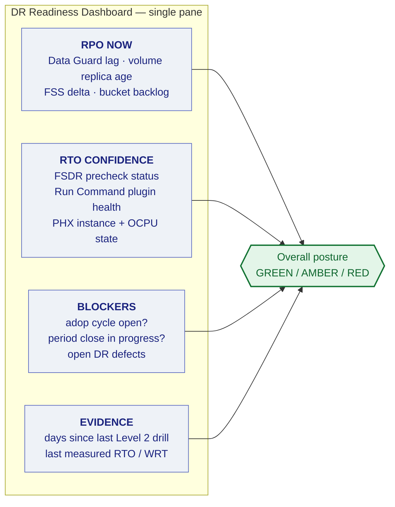

# 04 — Monitoring, Alerting, and RPO Attestation

A DR estate that is not monitored is not a DR estate — it is an assumption. This section defines what must be watched, what the thresholds are, and how you prove RPO compliance to an auditor.

---

## 1. What breaks silently

These are the failure modes that do not announce themselves. Each has an alarm below.

| Silent failure | Consequence | Detection |
|---|---|---|
| **Oracle Data Guard** apply stopped, transport still running | Standby falls arbitrarily far behind; the console still looks "connected" | Apply lag alarm |
| **Volume Group Replication** silently stalled | Replica frozen at an old point-in-time; discovered only at failover | Replica timestamp age alarm |
| **FSS File System Replication** interval missed repeatedly | Files hours or days stale | Recovery-point-delta alarm |
| **Oracle Cloud Agent Run Command plugin** stopped on a Windows node | Every Full Stack DR user-defined step fails mid-plan | Plugin health check |
| **Autonomous Recovery Service** protection still pointing at the old primary after a role change | **No backups are being taken at all** | Protected-database status check |
| Fast Recovery Area filling | Apply stalls; drills fail | FRA utilisation alarm |
| Phoenix ExaDB-D scaled to 0 OCPU by a cost-cutting change | Redo apply stopped; Tier 1 silently became Tier 3 | OCPU floor alarm |
| Configuration drift between regions | Failover succeeds, application misbehaves | Weekly drift report |

---

## 2. Alarm definitions

Implemented with **OCI Monitoring** alarms → **OCI Notifications** topics. Definitions as code in `terraform/modules/monitoring/`.

| Alarm | Metric source | Warning | Critical | Routes to |
|---|---|---|---|---|
| DG apply lag (PHX) | `dgmgrl` / OCI DB metrics | > 5 min | > 15 min | DBA on-call |
| DG transport lag (PHX) | as above | > 2 min | > 10 min | DBA on-call |
| DG apply lag (IAD2, SYNC leg) | as above | any lag | > 60 s | DBA on-call, page |
| DG configuration status | Broker `show configuration` | WARNING | ERROR | DBA on-call, page |
| Volume group replica age | **OCI Block Volume** replication metrics | > 30 min | > 2 hr | Infra on-call |
| FSS recovery point delta | **OCI File Storage** replication metrics | > 1.5× interval | > 3× interval | Infra on-call |
| Object Storage replication backlog | **Object Storage** replication status | any failure | sustained failure | Infra on-call |
| Run Command plugin health | Instance agent plugin status | not RUNNING | not RUNNING 15 min | Infra on-call |
| ARS protected DB status | **Autonomous Recovery Service** metrics | non-healthy | no backup in 26 hr | DBA on-call, page |
| FRA utilisation | DB metrics | > 75% | > 85% | DBA on-call |
| PHX ExaDB-D OCPU below floor | Compute/DB metrics | below configured floor | — | Infra on-call + FinOps |
| FSDR plan precheck failure | FSDR events | any | any | DR coordinator |
| Traffic Management health check | **OCI Health Checks** | 1 failure | 3 consecutive | Infra on-call, page |

**Alarm on the absence of signal, not only on bad values.** A metric that stops arriving must alarm — several failure modes above manifest as silence rather than a bad number.

---

## 3. The DR health dashboard

One page, answering one question: *if we had to fail over right now, what would we lose and how long would it take?*



**The `adop` and period-close indicators belong on the DR dashboard**, not only in the EBS team's tooling. Both are hard blockers on a clean failover (`RB-02` §7a, `docs/02-mtd-tiers.md` §6), and the person deciding to declare a disaster needs to see them at that moment.

---

## 4. RPO attestation

Auditors will ask you to *prove* the RPO, not assert it. Generate monthly:

```bash
./scripts/oci/generate-rpo-attestation.sh --month 2026-08 --out evidence/
```

The report contains, per protected resource:

- Measured lag distribution — p50, p95, p99, max
- Time spent outside the tier's RPO threshold, as a percentage
- Every replication interruption with duration and root cause
- Exceptions with remediation status

**Report against the tier target, and report breaches honestly.** A report showing three hours outside RPO with an explanation is credible and actionable. One showing perfect compliance every month is not believed by anyone who has run infrastructure, and it removes the evidence you need to justify investment.

---

## 5. Drift detection

Weekly, automated:

```bash
./scripts/oci/detect-drift.sh --report evidence/drift-$(date +%Y-%m-%d).md
```

Compares Ashburn and Phoenix across:

- Terraform plan diff — infrastructure drift
- OS patch level, Oracle Cloud Agent version, JRE/Forms client versions
- EBS patch level (`adop -status`, `AD_BUGS`)
- `FND_NODES` contents versus expected hostnames
- NSG and firewall rule differences
- Custom image age — flag if the Phoenix image is more than 30 days behind

Drift is the quiet killer: everything is green, replication is healthy, and the failover produces an application that does not work. Treat drift findings as defects with owners and due dates, not as informational output.
