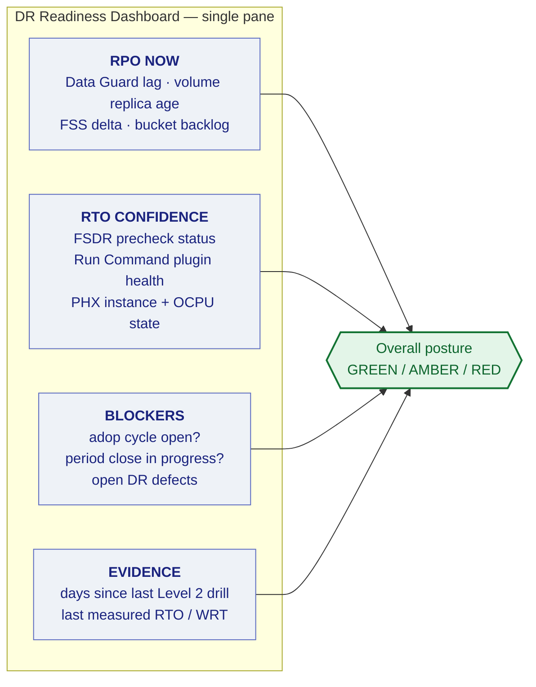

# 04 — Monitoring, Alerting, and RPO Attestation

A DR estate that is not monitored is not a DR estate — it is an assumption. This section defines what must be watched, what the thresholds are, and how you prove RPO compliance to an auditor.

---

## 1. What breaks silently

These are the failure modes that do not announce themselves. Each has an alarm below.

| Silent failure | Consequence | Detection |
|---|---|---|
| **Oracle Data Guard** apply stopped, transport still running | Standby falls arbitrarily far behind; the console still looks "connected" | Apply lag alarm — `ApplyLag` metric [1] |
| **Oracle Data Guard** configuration falls UNSYNCHRONIZED under Maximum Availability — an AD-2 network fault stalls each commit for `NetTimeout` seconds, then the primary proceeds unprotected [14][15] | RPO 0 stops being true, and fast-start failover cannot occur while the target standby is unsynchronized [16] — the local automatic-failover story silently stops working exactly in the double-fault case Tier 0 exists to cover | Configuration status alarm — Broker `show configuration` synchronized state |
| **Volume Group Replication** silently stalled | Replica frozen at an old point-in-time; discovered only at failover | Replica timestamp age alarm — `VolumeReplicationSecondsSinceLastSync` [2] |
| **FSS File System Replication** interval missed repeatedly | Files hours or days stale | Recovery-point-delta alarm — `ReplicationRecoveryPointAge` [3] |
| **Oracle Cloud Agent Run Command plugin** stopped on a Windows node | Every Full Stack DR user-defined step fails mid-plan | Plugin health check [4] |
| **Autonomous Recovery Service** protection not yet enabled on the new primary after a role change *(operational consequence; the release note documents only that backups are disabled on the new standby / new Disabled Standby)* [5] | No backups are being taken on the region that is now primary until someone completes the manual re-enable step (`docs/05-cost-and-teardown.md` §4) | Protected-database status check [10] |
| Fast Recovery Area filling | Apply stalls; drills fail | FRA utilisation alarm *(unverified: engineering judgement; no documentation found in this revision)* |
| Phoenix ExaDB-D scaled to 0 OCPU by a cost-cutting change | Redo apply stopped; Tier 1 silently became Tier 3 — scaling to 0 OCPU shuts the VM cluster down [6] | OCPU floor alarm — `OcpusAllocated` metric [7] |
| Configuration drift between regions | Failover succeeds, application misbehaves | Weekly drift report |

---

## 2. Alarm definitions

Implemented with **OCI Monitoring** alarms → **OCI Notifications** topics. Definitions as code are planned in `terraform/modules/monitoring/` (not yet in this repository; see README §Status).

**Data Guard lag metrics require Database Management Diagnostics & Management to be enabled on the database.** They are emitted in the `oracle_oci_database` namespace, resource group `oracle_dataguard` — **not** the base `oci_database` namespace that ships without Diagnostics & Management [1].

**`TransportLag` is the RPO signal; `ApplyLag` is the RTO signal.** Data loss at a
cross-region failover is bounded by redo already received but not yet applied — the
transport gap — since a complete failover applies all accumulated redo before the role
changes; how far the apply process has caught up governs how long that failover takes, not
how much data is at risk.

| Alarm | Metric source | Warning | Critical | Routes to |
|---|---|---|---|---|
| DG apply lag (PHX) — RTO signal | `oracle_oci_database` / `oracle_dataguard` — `ApplyLag` [1] | > 5 min | > 15 min | DBA on-call |
| DG transport lag (PHX) — RPO signal | `oracle_oci_database` / `oracle_dataguard` — `TransportLag` [1] | > 15 s | > 30 s | DBA on-call, page |
| DG apply lag (IAD2, SYNC leg) | `oracle_oci_database` / `oracle_dataguard` — `ApplyLag` [1] | any lag | > 60 s | DBA on-call, page |
| DG configuration status | Broker `show configuration` (`dgmgrl`) | WARNING | ERROR | DBA on-call, page |
| DG configuration UNSYNCHRONIZED (fast-start failover not possible) [16] | Broker `show configuration` synchronized state | any | UNSYNCHRONIZED | DBA on-call, page |
| DG apply lag rising while transport lag stays flat (apply bottleneck signature) [14] | derived from `ApplyLag` and `TransportLag` [1] | sustained 10 min *(unverified: engineering judgement — threshold, not the signature itself)* | sustained 30 min *(unverified: engineering judgement)* | DBA on-call |
| Volume group replica age | `oci_blockstore` — `VolumeReplicationSecondsSinceLastSync` [2] | > 30 min | > 2 hr | Infra on-call |
| FSS recovery point delta | `oci_filestorage` — `ReplicationRecoveryPointAge` [3] | > 1.5× interval | > 3× interval | Infra on-call |
| Object Storage replication backlog | **No Monitoring metric exists** [8] — poll `oci os replication get-replication-policy` status [9] | any non-ACTIVE | sustained non-ACTIVE | Infra on-call |
| Run Command plugin health | `oci instance-agent plugin get` status [4] | not RUNNING | not RUNNING 15 min | Infra on-call |
| ARS protected DB status | `oci recovery protected-database get` status [10] | non-healthy | no backup in 26 hr | DBA on-call, page |
| FRA utilisation | DB metrics | > 75% | > 85% | DBA on-call |
| PHX ExaDB-D OCPU below floor | `oci_database_cluster` — `OcpusAllocated` [7] | below configured floor | — | Infra on-call + FinOps |
| FSDR plan precheck failure | FSDR plan prechecks (pass/fail) [11] | any | any | DR coordinator |
| Traffic Management health check | **OCI Health Checks** [12] | 1 failure | 3 consecutive | Infra on-call, page |

**Alarm on the absence of signal, not only on bad values.** A metric that stops arriving must alarm — several failure modes above manifest as silence rather than a bad number.

---

## 3. The DR health dashboard

One page, answering one question: *if we had to fail over right now, what would we lose and how long would it take?*



**The `adop` and period-close indicators belong on the DR dashboard**, not only in the EBS team's tooling. Both are hard blockers on a clean failover (`RB-02` §7a, `docs/02-mtd-tiers.md` §6), and the person deciding to declare a disaster needs to see them at that moment. `adop -status` is the documented way to check for an open online-patching cycle [13].

---

## 4. RPO attestation

Auditors will ask you to *prove* the RPO, not assert it. Generate monthly:

```bash
./scripts/oci/generate-rpo-attestation.sh --month 2026-08 --out evidence/
```

The report contains, per protected resource:

- Measured lag distribution — p50, p95, p99, max
- Time spent outside the tier's RPO threshold, as a percentage
- Every replication interruption with duration and root cause
- Exceptions with remediation status

`generate-rpo-attestation.sh` reads the metric names in §2 from `DR_RPO_METRICS`
(`oracle_oci_database/ApplyLag`, `oracle_oci_database/TransportLag`,
`oci_blockstore/VolumeReplicationSecondsSinceLastSync`, `oci_filestorage/ReplicationRecoveryPointAge`)
[1][2][3]; Object Storage has no native replication metric and is checked by polling replication
policy status instead [8][9]. **Report `TransportLag` against the RPO target and `ApplyLag`
against the RTO target** (§2) — attesting RPO compliance from `ApplyLag` alone conflates the
two and can report a database as compliant while its data-loss exposure is well past target.

**Report against the tier target, and report breaches honestly.** A report showing three hours outside RPO with an explanation is credible and actionable. One showing perfect compliance every month is not believed by anyone who has run infrastructure, and it removes the evidence you need to justify investment.

---

## 5. Drift detection

Weekly, automated:

```bash
./scripts/oci/detect-drift.sh --report evidence/drift-$(date +%Y-%m-%d).md
```

Compares Ashburn and Phoenix across:

- Terraform plan diff — infrastructure drift
- OS patch level, Oracle Cloud Agent version, JRE/Forms client versions
- EBS patch level (`adop -status` [13], `AD_BUGS`)
- `FND_NODES` contents versus expected hostnames
- NSG and firewall rule differences
- Custom image age — flag if the Phoenix image is more than 30 days behind

Drift is the quiet killer: everything is green, replication is healthy, and the failover produces an application that does not work. Treat drift findings as defects with owners and due dates, not as informational output.

---

## References

This document is a synthesis: every statement about product behaviour or a standard is derived
from the sources below, and any statement that could not be traced to a source is marked as
unverified. Numbers restart per document. The consolidated index is `docs/references.md`.

1. *Oracle Cloud Database Metrics.* Database Management documentation, Oracle Cloud Infrastructure, no version shown, accessed 2026-09-01.
   <https://docs.oracle.com/en-us/iaas/database-management/doc/oracle-cloud-database-metrics.html> — Supports: `ApplyLag` and `TransportLag` are emitted in the `oracle_oci_database` namespace, resource group `oracle_dataguard`, by Database Management Diagnostics & Management, not by the base `oci_database` namespace (§1, §2, §4).
2. *Block Volume Metrics Reference.* Oracle Cloud Infrastructure Documentation, © 2026, accessed 2026-09-01.
   <https://docs.oracle.com/en-us/iaas/Content/Block/References/volumemetrics-reference.htm> — Supports: `VolumeReplicationSecondsSinceLastSync` in namespace `oci_blockstore`, per replica (§1, §2, §4).
3. *File System Metrics.* Oracle Cloud Infrastructure Documentation, © 2026, accessed 2026-09-01.
   <https://docs.oracle.com/en-us/iaas/Content/File/Reference/filemetrics.htm> — Supports: `ReplicationRecoveryPointAge` in namespace `oci_filestorage`, described as "how much older the data on the target file system is than the source file system... Monitor this metric to ensure that the data on the target file system isn't older than your requirements allow (RPO)" (§1, §2, §4).
4. *`oci instance-agent plugin get`.* OCI CLI Command Reference 3.91.0, Oracle, accessed 2026-09-01.
   <https://docs.oracle.com/en-us/iaas/tools/oci-cli/latest/oci_cli_docs/cmdref/instance-agent/plugin/get.html> — Supports: plugin status can be queried per instance (§1, §2).
5. *Backup and Restore from a Standby Database in a Data Guard Environment.* OCI release note, August 24, 2023, accessed 2026-09-01.
   <https://docs.oracle.com/en-us/iaas/releasenotes/changes/19e890da-7b15-4d55-a0b3-28058930a8f8/> — Supports: after switchover or failover, automatic backups are disabled on the new standby / new Disabled Standby database; the release note does not state that the new primary's backups are disabled or when they are re-enabled (§1).
6. *Manage VM Clusters.* Exadata Database Service on Dedicated Infrastructure documentation, no version shown, accessed 2026-09-01.
   <https://docs.oracle.com/en-us/iaas/exadatacloud/doc/manage-vm-clusters.html> — Supports: "setting the number of OCPUs (ECPUs for X11M) to zero will shut down the VM Cluster and eliminate any billing for that VM Cluster" (§1).
7. *Metrics for Oracle Exadata Database Service on Dedicated Infrastructure in the Monitoring Service.* Oracle Cloud Infrastructure Documentation, © 2026, accessed 2026-09-01.
   <https://docs.oracle.com/en-us/iaas/exadatacloud/doc/metrics-for-exadata-database-service-on-dedicated-infrastructure-in-the-monitoring-service.html> — Supports: `OcpusAllocated` metric in the `oci_database_cluster` namespace (§1, §2).
8. *Object Storage Metrics.* Oracle Cloud Infrastructure Documentation, © 2026, accessed 2026-09-01.
   <https://docs.oracle.com/en-us/iaas/Content/Object/Reference/objectstoragemetrics.htm> — Supports: no replication metric exists in the `oci_objectstorage` namespace (§2, §4).
9. *`oci os replication get-replication-policy`.* OCI CLI Command Reference 3.91.0, Oracle, accessed 2026-09-01.
   <https://docs.oracle.com/en-us/iaas/tools/oci-cli/latest/oci_cli_docs/cmdref/os/replication/get-replication-policy.html> — Supports: replication policy status is read from the policy resource, not Monitoring (§2, §4).
10. *`oci recovery protected-database get`.* OCI CLI Command Reference 3.91.0, Oracle, accessed 2026-09-01.
    <https://docs.oracle.com/en-us/iaas/tools/oci-cli/latest/oci_cli_docs/cmdref/recovery/protected-database/get.html> — Supports: protected-database status is queryable via this CLI command (§2).
11. *Prechecks Performed by Full Stack Disaster Recovery.* OCI Full Stack DR documentation, © 2026, accessed 2026-09-01.
    <https://docs.oracle.com/en-us/iaas/disaster-recovery/doc/prechecks-disaster-recovery.html> — Supports: "Prechecks are validations performed by Full Stack Disaster Recovery for resources such as DR Protection Groups, DR Plans, and DR Plan Executions." (§2).
12. *Overview of Traffic Management.* Oracle Cloud Infrastructure Documentation, © 2026, accessed 2026-09-01.
    <https://docs.oracle.com/en-us/iaas/Content/TrafficManagement/Concepts/overview.htm> — Supports: OCI Health Checks evaluate answer health for FAILOVER steering policies (§2).
13. *Oracle E-Business Suite Maintenance Guide, Release 12.2 — Patching Procedures.* Oracle documentation, accessed 2026-09-01.
    <https://docs.oracle.com/cd/E26401_01/doc.122/e22954/T202991T531065.htm> — Supports: "you can use the adop -status command to verify that no patching cycle is currently active" (§3, §5).
14. *High Availability Overview and Best Practices.* Oracle Database 19c (F23691-56, July 14 2026), accessed 2026-09-01.
    <https://docs.oracle.com/en/database/oracle/oracle-database/19/haovw/high-availability-overview-and-best-practices.pdf> — Supports: "Maximum Availability will wait a maximum of NET_TIMEOUT seconds for an acknowledgment from any of the standby databases, after which it will signal commit success to the application and move to the next transaction."; "Oracle recommends that the primary and standby database systems are symmetric... redo apply performance also benefits greatly from symmetric primary and standby databases" (§1, §2).
15. *Redo Transport Services.* Oracle Data Guard Concepts and Administration 19c, accessed 2026-09-01.
    <https://docs.oracle.com/en/database/oracle/oracle-database/19/sbydb/oracle-data-guard-redo-transport-services.html> — Supports: "If an acknowledgement is not received within NET_TIMEOUT seconds, the redo transport connection is terminated and an error is logged." (§1).
16. *Switchover and Failover Operations.* Oracle Data Guard Broker 19c, accessed 2026-09-01.
    <https://docs.oracle.com/en/database/oracle/oracle-database/19/dgbkr/using-data-guard-broker-to-manage-switchovers-failovers.html> — Supports: fast-start failover cannot occur "if the protection mode is maximum availability or maximum protection and the target standby database was not synchronized with the primary database at the time the primary database failed" (§1, §2).

### Unverified statements

- The 10-minute / 30-minute thresholds for the "apply lag rising while transport lag flat"
  alarm are an engineering estimate; the HA guide documents the bottleneck signature, not a
  specific threshold (§2).
- The FRA utilisation alarm thresholds (75% / 85%) are engineering judgement; no Oracle
  documentation consulted for this revision specifies them (§1, §2).

[1]: https://docs.oracle.com/en-us/iaas/database-management/doc/oracle-cloud-database-metrics.html "Oracle Cloud Database Metrics — Database Management"
[2]: https://docs.oracle.com/en-us/iaas/Content/Block/References/volumemetrics-reference.htm "Block Volume Metrics Reference — Oracle"
[3]: https://docs.oracle.com/en-us/iaas/Content/File/Reference/filemetrics.htm "File System Metrics — Oracle"
[4]: https://docs.oracle.com/en-us/iaas/tools/oci-cli/latest/oci_cli_docs/cmdref/instance-agent/plugin/get.html "oci instance-agent plugin get — OCI CLI Command Reference"
[5]: https://docs.oracle.com/en-us/iaas/releasenotes/changes/19e890da-7b15-4d55-a0b3-28058930a8f8/ "Backup and Restore from a Standby Database in a Data Guard Environment — OCI release note"
[6]: https://docs.oracle.com/en-us/iaas/exadatacloud/doc/manage-vm-clusters.html "Manage VM Clusters — Oracle"
[7]: https://docs.oracle.com/en-us/iaas/exadatacloud/doc/metrics-for-exadata-database-service-on-dedicated-infrastructure-in-the-monitoring-service.html "Metrics for ExaDB-D in the Monitoring Service — Oracle"
[8]: https://docs.oracle.com/en-us/iaas/Content/Object/Reference/objectstoragemetrics.htm "Object Storage Metrics — Oracle"
[9]: https://docs.oracle.com/en-us/iaas/tools/oci-cli/latest/oci_cli_docs/cmdref/os/replication/get-replication-policy.html "oci os replication get-replication-policy — OCI CLI Command Reference"
[10]: https://docs.oracle.com/en-us/iaas/tools/oci-cli/latest/oci_cli_docs/cmdref/recovery/protected-database/get.html "oci recovery protected-database get — OCI CLI Command Reference"
[11]: https://docs.oracle.com/en-us/iaas/disaster-recovery/doc/prechecks-disaster-recovery.html "Prechecks Performed by Full Stack Disaster Recovery — Oracle"
[12]: https://docs.oracle.com/en-us/iaas/Content/TrafficManagement/Concepts/overview.htm "Overview of Traffic Management — Oracle"
[13]: https://docs.oracle.com/cd/E26401_01/doc.122/e22954/T202991T531065.htm "Oracle E-Business Suite Maintenance Guide, Release 12.2 — Patching Procedures"
[14]: https://docs.oracle.com/en/database/oracle/oracle-database/19/haovw/high-availability-overview-and-best-practices.pdf "High Availability Overview and Best Practices — Oracle Database 19c"
[15]: https://docs.oracle.com/en/database/oracle/oracle-database/19/sbydb/oracle-data-guard-redo-transport-services.html "Redo Transport Services — Oracle Data Guard Concepts and Administration 19c"
[16]: https://docs.oracle.com/en/database/oracle/oracle-database/19/dgbkr/using-data-guard-broker-to-manage-switchovers-failovers.html "Switchover and Failover Operations — Oracle Data Guard Broker 19c"
