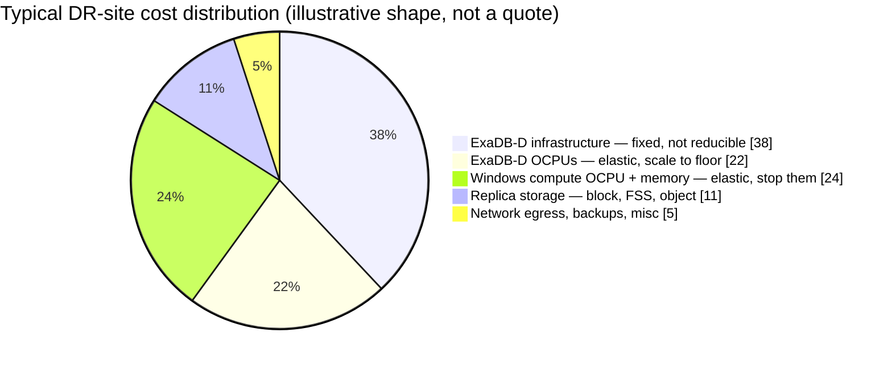

# 05 — Cost Model and Tear-Down Economics

> **No prices appear in this document.** OCI list pricing, your Universal Credits discount, BYOL position, and support contract all change the answer materially. What this gives you is the *structure* of the bill and where the elastic money actually is — fill in your own rates in §4.

---

## 1. Where the money is

The single most important fact for tear-down planning:



**~46% of the bill is elastic** (the ExaDB-D OCPU and Windows compute slices, 22% + 24%) and is reclaimed by *stopping compute*. **~11% is replica storage**, which is what people are tempted to reclaim by deleting replication — the smallest slice, bought at the price of an unprotected re-baseline window. *(unverified: engineering judgement; no documentation found in this revision — illustrative cost shape, not a vendor-published breakdown.)*

That asymmetry is the entire economic argument of this plan: **tear down compute, never tear down replication** (`docs/03-replication-matrix.md` §3).

---

## 2. The Exadata floor — the constraint to plan around

**ExaDB-D bills as infrastructure (fixed, by rack configuration) plus OCPUs.** Consequences:

- There is **no zero-cost standby Exadata** *(unverified: Oracle documentation confirms the OCPU charge is eliminated at 0 OCPU [1]; whether the underlying Exadata infrastructure charge also continues at 0 OCPU was not found in the sources consulted for this revision)*.
- OCPUs scale **online, in minutes**, so the standby can sit at a floor and burst during failover [1]. This is the main database-side lever and it is real.
- **Scaling to 0 OCPU shuts the VM cluster down** and stops redo apply along with it [1]. It converts Tier 1 into Tier 3 while every document still claims a 5-minute RPO. `set-dr-posture.sh` refuses this.

**The uncomfortable trade-off, stated plainly:** the only way to avoid the Exadata floor is to provision no standby Exadata and accept provisioning one during the disaster. That adds hours to RTO and carries capacity risk in a regional event — precisely when Phoenix is busiest and everyone else is doing the same thing. This plan recommends **keeping a standing Phoenix Exadata standby at minimum OCPU and tiering the application stack instead**, because that is where the elastic money is without a corresponding risk transfer.

If budget forces a non-Exadata standby, re-check assumption **A5** (Hybrid Columnar Compression) in `docs/01-architecture.md` first. HCC is licensed for Exadata, Oracle ZFS Storage Appliance, and FS1 storage [2]; other storage "deliver[s] the same space savings as on Oracle Exadata storage, but do not deliver the same level of query performance" [3]. Whether HCC-compressed data becomes **unreadable** (rather than merely slower) on unsupported storage was not confirmed in Oracle documentation *(unverified: engineering judgement; no documentation found in this revision)* — treat it as a risk to validate with Oracle Support before committing to a non-Exadata standby, not as a settled fact either way.

---

## 3. Posture cost comparison

Relative to full production cost. **Illustrative shape — model your own.**

| Posture | PHX Windows compute | PHX ExaDB-D | Replication | Approx. relative cost | Meets |
|---|---|---|---|---|---|
| **HOT** | Running | Production OCPU | All active | ~90–100% | Tier 0 |
| **WARM** *(steady state)* | **Stopped** | **OCPU floor** | All active | ~45–60% | Tier 1, degrades to Tier 0 in minutes |
| **DRILL** | Drill instances only, temporary | Snapshot Standby | All active | WARM + drill duration | Testing |
| **Naive "save money"** | Terminated | 0 OCPU | **Deleted** | ~10% | **Nothing — this is not DR** |

The last row is what happens when tear-down is applied without the distinction in `docs/03-replication-matrix.md` §3. It looks like a 4× saving on a spreadsheet. It is a decision to not have disaster recovery, and it should be labelled that way if anyone proposes it.

---

## 4. Fill in your own numbers

Template in `checklists/cost-model-template.md`. Line items to price:

**Fixed (not reducible while DR exists)**
- ExaDB-D Phoenix infrastructure — by rack configuration
- Exadata storage servers / ASM capacity
- Minimum OCPU floor to keep redo apply running [1]
- Block volume replica capacity (boot + data, all nodes)
- FSS provisioned capacity in Phoenix
- Object Storage replica capacity
- Autonomous Recovery Service protected-database capacity **in each region** — there is no cross-region backup-copy feature; Ashburn and Phoenix each run their own subscription, and the documented cross-region pattern is Data Guard between regions plus a local Recovery Service in each region [4][5] (`docs/03-replication-matrix.md` R2)
- Autonomous Recovery Service real-time redo transport — an extra-cost option in each region's subscription [4]
- OCI Vault, DNS, Health Checks — negligible but list them

**Elastic (reclaimed in WARM)**
- Windows compute OCPU + memory, per node
- ExaDB-D OCPUs above the floor [1]

**Event-driven**
- Cross-region egress during baselines — **budget explicitly for failback**, where every storage tier re-baselines (`RB-03`). Oracle's published price list carries the first 10 TB/month of outbound data transfer free, with a priced tier above that; treat any claim that egress has been eliminated entirely as unconfirmed [6]
- Drill compute, per drill
- **Full Stack Disaster Recovery**: billed monthly on the allocated OCPU/ECPU of compute, database, OKE, and Integration members — whether running or stopped. No charge for block, file, or object storage members, or for load balancer members [7]

**Licensing — check before you build**
- BYOL versus license-included for the standby database
- **Oracle Active Data Guard** licensing on the standby — required for real-time query, automatic block repair, and Far Sync [2]; on Base Database Service, Active Data Guard additionally requires **Enterprise Edition Extreme Performance** [8]
- **Oracle Advanced Compression** option — required if Data Guard redo transport compression (`RedoCompression = ENABLE`) is used; it is not included in the base Data Guard or Active Data Guard entitlement [2] (`scripts/dataguard/tnsnames-tuning.md` §4)
- Windows Server licensing in OCI for the standby nodes
- EBS application licensing for a DR instance — confirm your entitlement covers a standby that is periodically opened read-write for drills

> Licensing is the line item most often discovered late. Get written confirmation from your Oracle account team covering the standby database, Active Data Guard, Advanced Compression, and the drill pattern in RB-04 (Snapshot Standby opened read-write quarterly) **before** the build, not after the first audit.

---

## 5. Automating the posture

```bash
# Scheduled: hold WARM outside business hours and on weekends
oci resource-scheduler schedule create ...   # terraform/modules/scheduler/ is planned; see README §Status

# Manual: elevate ahead of a known threat window
./scripts/oci/set-dr-posture.sh --posture hot --reason "NHC track, ticket CHG0012345"

# Return to steady state
./scripts/oci/set-dr-posture.sh --posture warm
```

Every posture change is logged to `evidence/posture-log.md` with reason and change reference. Two purposes: FinOps can attribute spend, and an auditor can see the estate was in a defensible posture at any given date.

---

## 6. What not to optimise

Three things that look like savings and are not:

1. **Replica storage.** ~11% of the bill *(unverified: illustrative cost shape, not a vendor-published figure)*, and deleting it costs a multi-hour unprotected window on every re-spin (`docs/03-replication-matrix.md` §2).
2. **Drill frequency.** Drills are cheap — a Snapshot Standby drill receives redo the whole time and only stops applying it, so it adds no re-baseline; it costs only the drill's own compute duration [9]. An untested DR plan is a more expensive risk than any line item here.
3. **The second Ashburn standby (`EBSPROD_IAD2`).** It is what delivers RPO 0 and automatic local failover, and it handles the far more likely failure — a single AD or rack event, not a regional loss. Cutting it to save money means the common failure now requires a cross-region failover with all the re-baseline consequences in `RB-03`. If it must be cut, the **Far Sync** option (`docs/01-architecture.md` §3) preserves zero-data-loss at lower cost — take that before dropping the local leg entirely [10].

---

## References

This document is a synthesis: every statement about product behaviour or a standard is derived
from the sources below, and any statement that could not be traced to a source is marked as
unverified. Numbers restart per document. The consolidated index is `docs/references.md`.

1. *Manage VM Clusters.* Exadata Database Service on Dedicated Infrastructure documentation, no version shown, accessed 2026-09-01.
   <https://docs.oracle.com/en-us/iaas/exadatacloud/doc/manage-vm-clusters.html> — Supports: OCPU/ECPU scaling is online; "setting the number of OCPUs (ECPUs for X11M) to zero will shut down the VM Cluster and eliminate any billing for that VM Cluster" (§2, §4, §6).
2. *Database Licensing Information User Manual 19c.* Oracle, no version date shown, accessed 2026-09-01.
   <https://docs.oracle.com/en/database/oracle/oracle-database/19/dblic/Licensing-Information.html> — Supports: Hybrid Columnar Compression is licensed on Exadata, ZFS, and FS1 storage; RedoCompression requires the Oracle Advanced Compression option (§2, §4).
3. *Tables and Table Clusters.* Oracle Database Concepts 19c, accessed 2026-09-01.
   <https://docs.oracle.com/en/database/oracle/oracle-database/19/cncpt/tables-and-table-clusters.html> — Supports: "Other Oracle storage systems support Hybrid Columnar Compression, and deliver the same space savings as on Oracle Exadata storage, but do not deliver the same level of query performance." (§2).
4. *Recovery Service Technical Architecture.* Oracle Database Autonomous Recovery Service documentation, no version shown, accessed 2026-09-01.
   <https://docs.oracle.com/en-us/iaas/recovery-service/doc/recovery-service-architecture.html> — Supports: real-time redo transport is an extra-cost option; "Auto-backup replication is used for backup high-availability within a region." (§4).
5. *Implement Oracle Database Autonomous Recovery Service with Oracle Database@Azure.* Oracle Solutions playbook (G24007-01, January 2025), accessed 2026-09-01.
   <https://docs.oracle.com/en/solutions/implement-recovery-service-db-at-azure/index.html> — Supports: "For cross region backups, use Oracle Data Guard to replicate databases from primary to standby region and backup each region with local recovery service." (§4).
6. *Cloud Price List.* Oracle, © 2026, accessed 2026-09-01.
   <https://www.oracle.com/cloud/networking/pricing/> — Supports: outbound data transfer carries a free tier for the first 10 TB/month, with a priced tier above it, contrary to claims that OCI has eliminated egress charges entirely (§4).
7. *Full Stack DR Billing Details.* OCI Full Stack DR documentation, © 2026, accessed 2026-09-01.
   <https://docs.oracle.com/en-us/iaas/disaster-recovery/doc/billing-details.html> — Supports: FSDR bills monthly on allocated OCPU/ECPU of compute, database, OKE, and Integration members whether running or stopped; no charge for storage or load balancer members (§4).
8. *About Oracle Data Guard (Base Database Service).* Oracle Cloud Infrastructure Documentation, no version shown, accessed 2026-09-01.
   <https://docs.oracle.com/en-us/iaas/base-database/doc/use-oracle-data-guard-db-system.html> — Supports: "Active Data Guard requires Enterprise Edition Extreme Performance." (§4).
9. *Managing Physical and Snapshot Standby Databases.* Oracle Data Guard Concepts and Administration 19c, Oracle, accessed 2026-09-01.
    <https://docs.oracle.com/en/database/oracle/oracle-database/19/sbydb/managing-oracle-data-guard-physical-standby-databases.html> — Supports: "Redo data will continue to be received by the database while it is operating as a snapshot standby database, but it will not be applied until the snapshot standby is converted back into a physical standby database." — i.e. a Snapshot Standby drill does not require re-baselining redo transport (§6).
10. *Using Far Sync Instances.* Oracle Data Guard Concepts and Administration 19c, Oracle, accessed 2026-09-01.
    <https://docs.oracle.com/en/database/oracle/oracle-database/19/sbydb/creating-oracle-data-guard-far-sync-instance.html> — Supports: Far Sync provides zero-data-loss redo protection without a second full standby database (§6).

[1]: https://docs.oracle.com/en-us/iaas/exadatacloud/doc/manage-vm-clusters.html "Manage VM Clusters — Oracle"
[2]: https://docs.oracle.com/en/database/oracle/oracle-database/19/dblic/Licensing-Information.html "Database Licensing Information User Manual 19c — Oracle"
[3]: https://docs.oracle.com/en/database/oracle/oracle-database/19/cncpt/tables-and-table-clusters.html "Tables and Table Clusters — Oracle Database Concepts 19c"
[4]: https://docs.oracle.com/en-us/iaas/recovery-service/doc/recovery-service-architecture.html "Recovery Service Technical Architecture — Oracle"
[5]: https://docs.oracle.com/en/solutions/implement-recovery-service-db-at-azure/index.html "Implement Oracle Database Autonomous Recovery Service with Oracle Database@Azure — Oracle"
[6]: https://www.oracle.com/cloud/networking/pricing/ "Cloud Price List — Oracle"
[7]: https://docs.oracle.com/en-us/iaas/disaster-recovery/doc/billing-details.html "Full Stack DR Billing Details — Oracle"
[8]: https://docs.oracle.com/en-us/iaas/base-database/doc/use-oracle-data-guard-db-system.html "About Oracle Data Guard (Base Database Service) — Oracle"
[9]: https://docs.oracle.com/en/database/oracle/oracle-database/19/sbydb/managing-oracle-data-guard-physical-standby-databases.html "Managing Physical and Snapshot Standby Databases — Oracle"
[10]: https://docs.oracle.com/en/database/oracle/oracle-database/19/sbydb/creating-oracle-data-guard-far-sync-instance.html "Using Far Sync Instances — Oracle"
