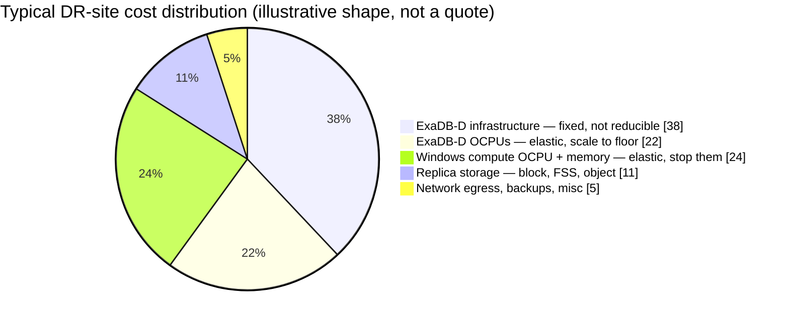

# 05 — Cost Model and Tear-Down Economics

> **No prices appear in this document.** OCI list pricing, your Universal Credits discount, BYOL position, and support contract all change the answer materially. What this gives you is the *structure* of the bill and where the elastic money actually is — fill in your own rates in §4.

---

## 1. Where the money is

The single most important fact for tear-down planning:



**~46% of the bill is elastic** (the two orange-to-warm slices) and is reclaimed by *stopping compute*. **~11% is replica storage**, which is what people are tempted to reclaim by deleting replication — the smallest slice, bought at the price of an unprotected re-baseline window.

That asymmetry is the entire economic argument of this plan: **tear down compute, never tear down replication** (`docs/03-replication-matrix.md` §3).

---

## 2. The Exadata floor — the constraint to plan around

**ExaDB-D bills as infrastructure (fixed, by rack configuration) plus OCPUs.** Consequences:

- There is **no zero-cost standby Exadata.** The infrastructure charge accrues regardless of activity.
- OCPUs scale **online, in minutes**, so the standby can sit at a floor and burst during failover. This is the main database-side lever and it is real.
- **Scaling to 0 OCPU stops redo apply.** It converts Tier 1 into Tier 3 while every document still claims a 5-minute RPO. `set-dr-posture.sh` refuses this.

**The uncomfortable trade-off, stated plainly:** the only way to avoid the Exadata floor is to provision no standby Exadata and accept provisioning one during the disaster. That adds hours to RTO and carries capacity risk in a regional event — precisely when Phoenix is busiest and everyone else is doing the same thing. This plan recommends **keeping a standing Phoenix Exadata standby at minimum OCPU and tiering the application stack instead**, because that is where the elastic money is without a corresponding risk transfer.

If budget forces a non-Exadata standby, re-check assumption **A5** (Hybrid Columnar Compression) in `docs/01-architecture.md` first — HCC segments cannot be queried on non-Exadata storage, which may make it a hard blocker rather than a trade-off.

---

## 3. Posture cost comparison

Relative to full production cost. **Illustrative shape — model your own.**

| Posture | PHX Windows compute | PHX ExaDB-D | Replication | Approx. relative cost | Meets |
|---|---|---|---|---|---|
| **HOT** | Running | Production OCPU | All active | ~90–100% | Tier 0 |
| **WARM** *(steady state)* | **Stopped** | **OCPU floor** | All active | ~45–60% | Tier 1, degrades to Tier 0 in minutes |
| **DRILL** | Drill instances only, temporary | Snapshot Standby | All active | WARM + drill duration | Testing |
| **Naive "save money"** | Terminated | 0 OCPU | **Deleted** | ~10% | **Nothing — this is not DR** |

The last row is what happens when tear-down is applied without the distinction in `docs/03-replication-matrix.md` §3. It looks like a 4× saving on a spreadsheet. It is a decision to not have disaster recovery, and it should be labelled that way if anyone proposes it.

---

## 4. Fill in your own numbers

Template in `checklists/cost-model-template.md`. Line items to price:

**Fixed (not reducible while DR exists)**
- ExaDB-D Phoenix infrastructure — by rack configuration
- Exadata storage servers / ASM capacity
- Minimum OCPU floor to keep redo apply running
- Block volume replica capacity (boot + data, all nodes)
- FSS provisioned capacity in Phoenix
- Object Storage replica capacity
- Autonomous Recovery Service protected-database capacity + cross-region copy
- OCI Vault, DNS, Health Checks — negligible but list them

**Elastic (reclaimed in WARM)**
- Windows compute OCPU + memory, per node
- ExaDB-D OCPUs above the floor

**Event-driven**
- Cross-region egress during baselines — **budget explicitly for failback**, where every storage tier re-baselines (`RB-03`)
- Drill compute, per drill
- Full Stack DR: no per-execution charge; verify current terms for your tenancy

**Licensing — check before you build**
- BYOL versus license-included for the standby database
- **Oracle Active Data Guard** licensing on the standby
- Windows Server licensing in OCI for the standby nodes
- EBS application licensing for a DR instance — confirm your entitlement covers a standby that is periodically opened read-write for drills

> Licensing is the line item most often discovered late. Get written confirmation from your Oracle account team covering the standby database, Active Data Guard, and the drill pattern in RB-04 (Snapshot Standby opened read-write quarterly) **before** the build, not after the first audit.

---

## 5. Automating the posture

```bash
# Scheduled: hold WARM outside business hours and on weekends
oci resource-scheduler schedule create ...   # see terraform/modules/scheduler/

# Manual: elevate ahead of a known threat window
./scripts/oci/set-dr-posture.sh --posture hot --reason "NHC track, ticket CHG0012345"

# Return to steady state
./scripts/oci/set-dr-posture.sh --posture warm
```

Every posture change is logged to `evidence/posture-log.md` with reason and change reference. Two purposes: FinOps can attribute spend, and an auditor can see the estate was in a defensible posture at any given date.

---

## 6. What not to optimise

Three things that look like savings and are not:

1. **Replica storage.** ~11% of the bill, and deleting it costs a multi-hour unprotected window on every re-spin.
2. **Drill frequency.** Drills are cheap — Snapshot Standby drills add only the drill's own compute duration. An untested DR plan is a more expensive risk than any line item here.
3. **The second Ashburn standby (`EBSPROD_IAD2`).** It is what delivers RPO 0 and automatic local failover, and it handles the far more likely failure — a single AD or rack event, not a regional loss. Cutting it to save money means the common failure now requires a cross-region failover with all the re-baseline consequences in `RB-03`. If it must be cut, the **Far Sync** option (`docs/01-architecture.md` §3) preserves zero-data-loss at lower cost — take that before dropping the local leg entirely.
