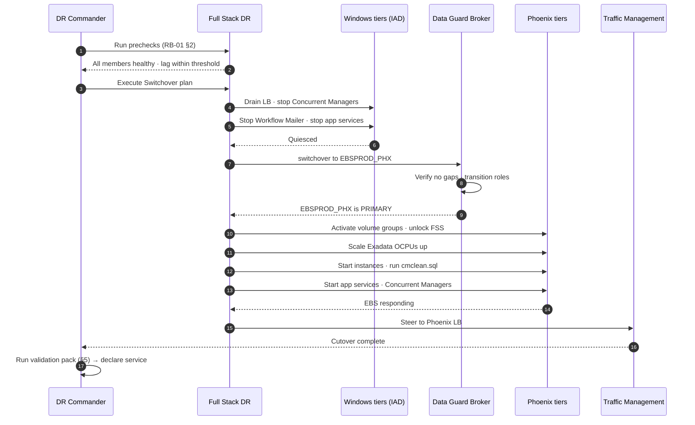

# RB-01 — Planned Switchover: Ashburn → Phoenix

**Type:** Planned, zero-data-loss. **Expected duration:** 45–90 min. **Approval:** Change Advisory Board.
**Use when:** DR exercise with real production, planned Ashburn maintenance, or pre-emptive evacuation (e.g. forecast regional event).

> This is the **graceful** path — the database is healthy and reachable. If the primary is gone, use `RB-02-failover.md` instead. Switchover preserves the old primary as a standby automatically; failover does not.

---

## Sequence



---

## 1. Pre-flight (T-24 h)

- [ ] Change approved; business notified of the outage window
- [ ] **No `adop` online-patching cycle open.** Verify: `adop -status`. If a cycle is open, complete or abort it *before* the window — do not switch over mid-cycle.
- [ ] **Not in period close**, or Finance has explicitly signed off
- [ ] Data Guard lag < 60 s and no gaps: `scripts/dataguard/dg-health.sh`
- [ ] All replication healthy: `scripts/oci/check-replication-health.sh`
- [ ] Oracle Cloud Agent **Run Command plugin** running on every PHX Windows instance — this is the #1 cause of plan-step failure
- [ ] Latest volume group replica timestamp within tolerance
- [ ] Rollback decision-maker identified and available for the whole window

## 2. Prechecks (T-1 h)

```bash
# Data Guard configuration health
dgmgrl / "show configuration verbose"
dgmgrl / "validate database EBSPROD_PHX"     # must report "Ready for Switchover: Yes"

# OCI-side replication + member health
./scripts/oci/check-replication-health.sh --region us-ashburn-1 --peer us-phoenix-1
```

Run the FSDR **plan prechecks** from the console or CLI. Every precheck must pass. Do not proceed on a warning you have not read and understood.

## 3. Execution

Execute the FSDR **Switchover** plan. It performs the sequence above. Monitor plan-step progress; the plan halts on a failed step rather than continuing.

**Manual fallback** if FSDR is unavailable — run in this order, do not reorder:

```bash
# 1. Quiesce the application tier (IAD) — Concurrent Managers FIRST
powershell -File scripts/windows/Stop-EBSAppTier.ps1 -Node ALL -Drain

# 2. Switch the database
dgmgrl sys/****@EBSPROD_IAD "switchover to EBSPROD_PHX"

# 3. Bring up Phoenix storage, then compute, then EBS
./scripts/oci/activate-volume-group.sh --vg ebs-app-vg --region us-phoenix-1
./scripts/oci/fss-failover.sh --fs ebs-shared --region us-phoenix-1
./scripts/oci/scale-exadata-ocpu.sh --cluster EBSPROD_PHX --ocpu-per-node 16
powershell -File scripts/windows/Start-EBSAppTier.ps1 -Node ALL -RunCmClean

# 4. Steer traffic
./scripts/oci/steer-traffic.sh --target phoenix
```

## 4. Concurrent Manager handling

Always run `cmclean.sql` before starting Concurrent Managers in the new primary. Stale `FND_CONCURRENT_QUEUES` / ICM rows from the old region will otherwise prevent managers from starting, and the failure mode is confusing.

```sql
-- scripts/ebs/cmclean.sql   (obtain the current version from My Oracle Support Doc ID 134007.1)
-- Run as APPS, with all managers DOWN, then COMMIT.
```

**Do not** run `FND_CONC_CLONE.SETUP_CLEAN` in a switchover — hostnames are preserved by design (`docs/01-architecture.md` §5.1), so `FND_NODES` is already correct. Running it forces a full AutoConfig cycle you do not need and turns a 60-minute switchover into a 4-hour one.

## 5. Validation pack

| # | Check | Pass criterion |
|---|---|---|
| V1 | `AppsLocalLogin.jsp` loads, test user logs in | HTTP 200, session established |
| V2 | Forms session opens (a real transaction form) | Form renders and commits a test record |
| V3 | Concurrent Managers | All target managers `ACTUAL = TARGET` |
| V4 | Submit "Active Users" concurrent request | Completes Normal |
| V5 | Workflow Mailer | Status running, test notification delivered |
| V6 | Inbound interface directory reachable and writable | Test file round-trips |
| V7 | Integration endpoints (SOA/ISG) | Health endpoint responds |
| V8 | Reverse Data Guard: `EBSPROD_IAD` now a standby, applying | Broker shows SUCCESS, lag decreasing |
| V9 | BI / visualization tier reconnected | Report renders |

Record results in `evidence/` with a timestamp. This is your audit artifact.

## 6. Post-switchover

- [ ] Confirm `EBSPROD_IAD` is receiving and applying redo as a standby
- [ ] Re-establish **reverse** replication for volume groups, FSS, and buckets (PHX→IAD). **This triggers full baselines** — see `docs/03-replication-matrix.md` §2. Start it immediately; it runs for hours.
- [ ] Scale IAD Exadata OCPUs down to the standby floor
- [ ] Stop IAD Windows instances (they are now the pilot light)
- [ ] Update the FSDR DRPG roles so Phoenix is primary
- [ ] Communicate new steady state; set a failback date (see RB-03)

## 7. Rollback

Before the database switchover completes, rollback is trivial — abort the plan and restart the IAD app tier. **After** the switchover, "rollback" *is* a second switchover back to Ashburn: follow RB-01 in reverse. There is no fast undo. Make the go/no-go decision at step 3, not step 5.
