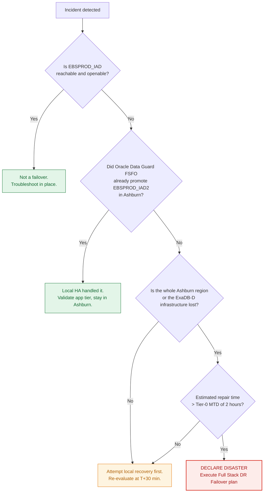
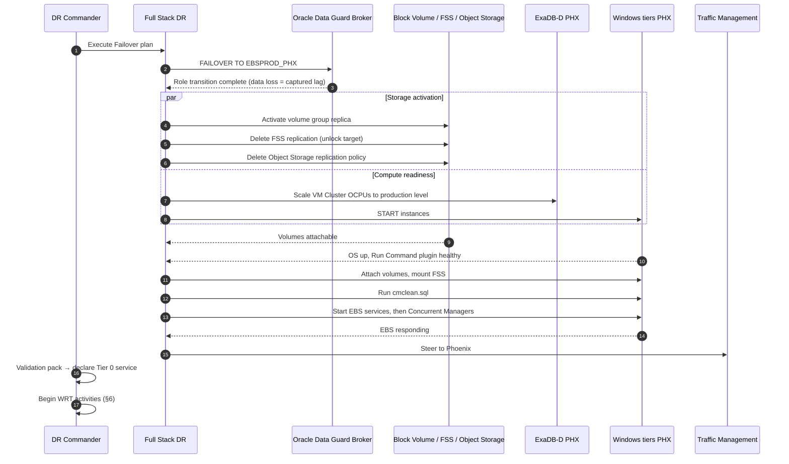

# RB-02 — Unplanned Failover: Ashburn → Phoenix

**Type:** Unplanned, data loss possible. **Expected duration:** 60–120 min to Tier-0 service.
**Authority to invoke:** DR Commander, per the delegation in `checklists/dr-authority-matrix.md`. Do not wait for full CAB.

> **This is a one-way door.** **Oracle Data Guard `FAILOVER`** ends the old primary's role. With **Oracle Flashback Database** enabled you can reinstate it as a standby afterwards — without Flashback you rebuild it with `RMAN DUPLICATE ... FOR STANDBY`. Confirm Flashback is on *now*, not during the incident.

---

## 0. Declare or don't — the 10-minute gate



**Do not skip the gate.** The most expensive DR outcome is an unnecessary cross-region failover, because the return trip (RB-03) costs full baseline copies of every storage tier.

---

## 1. Capture forensics first (5 min, parallelisable)

Before promoting anything, capture what you can — it is gone once roles change:

```bash
./scripts/dataguard/capture-lag-snapshot.sh      # transport + apply lag at moment of loss
./scripts/oci/capture-replication-state.sh       # volume group / FSS / bucket replica timestamps
```

This produces the **data-loss statement** Finance will require. Store it in `evidence/`.

## 2. Execution sequence



## 3. Database failover

Via the FSDR **Failover** plan, or manually:

```bash
dgmgrl sys/****@EBSPROD_PHX
DGMGRL> failover to EBSPROD_PHX;
DGMGRL> show configuration;
```

If the Broker cannot reach the old primary it will complete the failover anyway — expected in a regional loss. Record the reported apply point; that is your actual RPO for this event.

## 4. Storage activation — the steps people forget

These are **not** automatic and each is a one-way door (`docs/03-replication-matrix.md` §2):

```bash
# Block Volume: activate the volume group replica into a usable volume group
./scripts/oci/activate-volume-group.sh --vg-replica ebs-app-vg-replica --region us-phoenix-1

# FSS: delete the File System Replication resource to unlock the target for write
./scripts/oci/fss-failover.sh --fs ebs-shared --region us-phoenix-1 --confirm

# Object Storage: delete the Replication Policy so the destination bucket accepts writes
./scripts/oci/objectstore-failover.sh --bucket ebs-interfaces-phx --confirm
```

Each script refuses to run without `--confirm` and writes an entry to `evidence/`. That is deliberate — these actions destroy the replication relationship.

## 5. EBS application tier bring-up

Order matters:

1. **Attach and mount storage** — verify `fs1`, `fs2`, and `fs_ne` are all present before touching EBS
2. **`cmclean.sql`** as APPS with all managers down, then `COMMIT` (My Oracle Support Doc ID 134007.1)
3. **Start EBS services** — `adstrtal` equivalent via `scripts/windows/Start-EBSAppTier.ps1`
4. **Start Concurrent Managers** last, after web/forms is confirmed healthy
5. **Verify `FND_NODES`** matches the running hostnames. With the identical-hostname design (`docs/01-architecture.md` §5.1) it will — if it does not, you have drifted from the design and must run the AutoConfig branch in §7.

## 6. Work Recovery Time activities (start immediately, run in parallel with §5)

These are what actually get Finance to sign off. Owner: EBS functional lead.

- [ ] Reconcile the **in-flight concurrent request list** captured by the scheduled job against what completed; re-submit per the idempotency register
- [ ] **Replay inbound interface files** from the replicated Object Storage bucket for the window between the last replica and the incident
- [ ] Identify **outbound files generated but not transmitted**; re-transmit from the ledger
- [ ] Warn users of the possible **Workflow Mailer duplicate-notification window**
- [ ] Run the **reconciliation report pack**; obtain Finance sign-off
- [ ] Publish the **data-loss statement** from §1

## 7. Contingency branches

**7a. `adop` cycle was open at failure.** The standby has an inconsistent patch edition.

```bash
adop phase=abort
adop phase=fs_clone      # re-synchronise the patch filesystem from the run filesystem
```
Do this *after* service is restored, not during the outage — EBS runs fine on the run edition alone. Patching capability returns once `fs_clone` completes.

**7b. Hostnames could not be preserved** (design drift, or a forced rebuild into different names):

```sql
-- as APPS, app tier down
EXEC FND_CONC_CLONE.SETUP_CLEAN;
COMMIT;
```
Then AutoConfig on the DB tier, then on **every** app tier node. **Adds 3–5 hours.** Escalate the MTD breach to the business immediately — do not absorb it silently.

**7c. Volume group replica is corrupt or too stale.** Fall back to **OCI Compute Custom Images** + the most recent **cross-region volume backup copy**, and rebuild the node. Slower, but independent of the replication path.

**7d. Data loss exceeds the Tier-0 RPO.** Stop. Do not start Concurrent Managers. Convene Finance before any batch processing runs against a database that is missing committed transactions — automated processing on incomplete data is far harder to unwind than a longer outage.

## 8. Immediately after service is declared

- [ ] **Start reverse replication** (PHX→IAD) for all storage tiers. Full baselines — hours to days. Start now, not at failback planning time.
- [ ] **Reinstate `EBSPROD_IAD`** as a standby once Ashburn returns: `DGMGRL> reinstate database EBSPROD_IAD;` (requires Flashback Database)
- [ ] Re-point **Oracle Database Autonomous Recovery Service** protection to the new primary — **backups are not running until you do this**
- [ ] Swap the FSDR DRPG roles
- [ ] Schedule the RB-03 failback planning session
