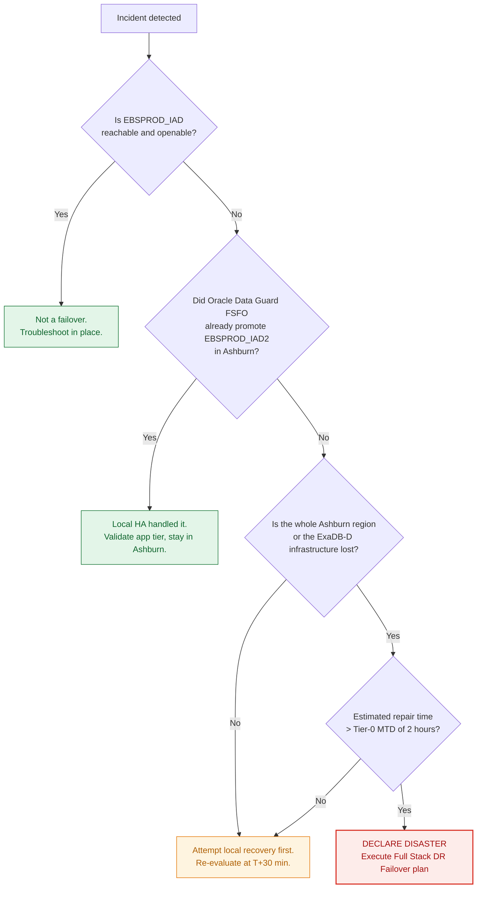
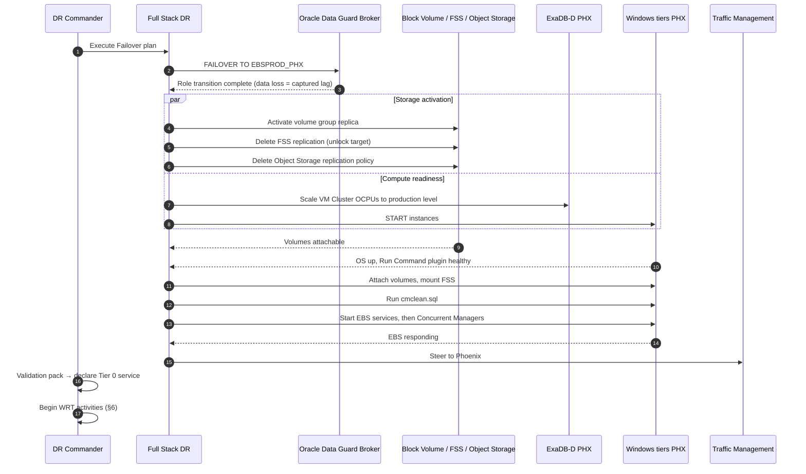

# RB-02 — Unplanned Failover: Ashburn → Phoenix

**Type:** Unplanned, data loss possible. **Expected duration:** target ≤ 60 min to Tier-0 technical availability (the Tier 0 cross-region RTO, `docs/02-mtd-tiers.md` §2); rehearsed range 60–120 min until drills prove otherwise, and any drill above 60 min is a tier finding *(unverified: engineering judgement; no documentation found in this revision)*.
**Authority to invoke:** DR Commander, per the delegation in `checklists/dr-authority-matrix.md`. Do not wait for full CAB.

> **This is a one-way door.** A Full Stack DR failover plan brings up the standby region without attempting to shut down the primary [1], and afterwards the old primary shows a Disabled Standby role [2]. With **Oracle Flashback Database** enabled beforehand, the Broker can reinstate it as a viable standby for the new primary [3]; without Flashback, rebuilding it is instead a full `RMAN DUPLICATE ... FOR STANDBY` *(unverified: engineering judgement; no documentation found in this revision)*. Confirm Flashback is on *now*, not during the incident.

---

## 0. Declare or don't — the 10-minute gate



**Do not skip the gate.** The most expensive DR outcome is an unnecessary cross-region failover, because the return trip (RB-03) costs full baseline copies of every storage tier.

**Q2** asks whether **Oracle Data Guard Fast-Start Failover (FSFO)** already handled it locally. FSFO runs an observer, on a host separate from the primary and standby, that can promote a named target standby without waiting for this runbook [4] — that target is `EBSPROD_IAD2` in Ashburn, not Phoenix, so a successful local FSFO promotion means you are not in a cross-region scenario at all.

---

## 1. Capture forensics first (5 min, parallelisable)

Before promoting anything, capture what you can — it is gone once roles change:

```bash
./scripts/dataguard/capture-lag-snapshot.sh      # transport + apply lag at moment of loss
./scripts/oci/capture-replication-state.sh       # volume group / FSS / bucket replica timestamps
```

This produces the **data-loss statement** Finance will require. Store it in `evidence/`.

## 2. Execution sequence



## 3. Database failover

Via the FSDR **Failover** plan — an unplanned transition that brings up the standby without attempting to shut down the primary [1] — or manually:

```bash
dgmgrl sys/****@EBSPROD_PHX
DGMGRL> failover to EBSPROD_PHX;
DGMGRL> show configuration;
```

The DGMGRL command-line scenarios for role transitions, including failover, are documented in the Broker guide [5]. If the Broker cannot reach the old primary it will complete the failover anyway — expected in a regional loss *(unverified: engineering judgement; no documentation found in this revision)*. Record the reported apply point; that is your actual RPO for this event *(unverified: engineering judgement; no documentation found in this revision)*.

## 4. Storage activation — the steps people forget

These are **not** automatic and each is a one-way door (`docs/03-replication-matrix.md` §2):

```bash
# Block Volume: activating the replica creates a new volume group by cloning it
./scripts/oci/activate-volume-group.sh --vg-replica <replica-ocid> --region us-phoenix-1 --confirm

# FSS: the target is read-only while the replication resource exists;
# deleting it (or the replication target if the source is gone) makes it exportable
./scripts/oci/fss-failover.sh --replication <replication-ocid> --region us-phoenix-1 --confirm

# Object Storage: make the DESTINATION bucket writable (works when Ashburn is gone); the
# --source-* arguments make it also delete the source policy, best-effort
./scripts/oci/objectstore-failover.sh --bucket ebs-interfaces-phx --region us-phoenix-1 \
    --source-bucket ebs-interfaces --policy <policy-id> --source-region us-ashburn-1 --confirm
```

**All three refuse to run without `--confirm`, default their OCIDs and region from `terraform/dr-resources.env`, and write to `evidence/storage-failover-log.md`.**

That is deliberate — these actions destroy the replication relationship. Activating the volume group replica creates a new volume group by cloning it, and all replicas activate from the same coordinated synchronization point [6][7]. The FSS target is read-only while the replication resource exists; deleting it (or the replication target if the source is gone) makes it exportable [8][9]. Making the Object Storage destination bucket writable is the documented destination-side action and works even when the source region is unreachable [10].

**Object Storage Bucket is itself a native Full Stack DR protection-group member type** [11], with built-in plan groups — "Object Storage Bucket - Delete Replication (Primary)" and "Object Storage Bucket - Setup Reverse Replication (Standby)" — that perform this step automatically inside an FSDR Failover plan [12]; `objectstore-failover.sh` is the manual fallback. Deleting the source replication policy is permanent [10] and is best-effort here because it fails harmlessly when Ashburn is unreachable; if it did not run, delete it explicitly in RB-03 §2 before creating the reverse policy.

## 5. EBS application tier bring-up

Order matters:

1. **Attach and mount storage** — verify `fs1`, `fs2`, and `fs_ne` are all present before touching EBS
2. **`cmclean.sql`** as APPS with all managers down, then `COMMIT` (applicability note below).
3. **Start EBS services** — `adstrtal.cmd` / `adcmctl.cmd` on Windows [16] via `scripts/windows/Start-EBSAppTier.ps1`
4. **Start Concurrent Managers** last, after web/forms is confirmed healthy
5. **Verify `FND_NODES`** matches the running hostnames. With the identical-hostname design (`docs/01-architecture.md` §5.1) it will — if it does not, you have drifted from the design and must run the AutoConfig branch in §7.

> **cmclean applicability note.** Its My Oracle Support note 134007.1 [13] is publicly described as valid for Applications releases 10.7 to 12.1.3 [14], and Oracle's EBS 12.2 business-continuity material contains no cmclean step [15]. Confirm applicability to your 12.2 release with Oracle Support before relying on it.

## 6. Work Recovery Time activities (start immediately, run in parallel with §5)

These are what actually get Finance to sign off. Owner: EBS functional lead.

- [ ] Reconcile the **in-flight concurrent request list** captured by the scheduled job against what completed; re-submit per the idempotency register
- [ ] **Replay inbound interface files** from the replicated Object Storage bucket for the window between the last replica and the incident
- [ ] Identify **outbound files generated but not transmitted**; re-transmit from the ledger
- [ ] Warn users of the possible **Workflow Mailer duplicate-notification window**
- [ ] Run the **reconciliation report pack**; obtain Finance sign-off
- [ ] Publish the **data-loss statement** from §1

## 7. Contingency branches

### 7a. `adop` cycle was open at failure

 The standby has an inconsistent patch edition.

```bash
adop phase=abort
adop phase=fs_clone      # re-synchronise the patch filesystem from the run filesystem
```
`adop -status` verifies no cycle is active, `adop phase=abort` aborts one, and `fs_clone` recreates the patch edition file system as an exact copy of the run edition file system [17]. Do this *after* service is restored, not during the outage — EBS runs fine on the run edition alone. Patching capability returns once `fs_clone` completes.

### 7b. Hostnames could not be preserved

 (design drift, or a forced rebuild into different names):

```sql
-- as APPS, app tier down
EXEC FND_CONC_CLONE.SETUP_CLEAN;
COMMIT;
```
Then AutoConfig on the DB tier, then on **every** app tier node. Oracle's documented sequence is: clean out `FND_NODES` with `fnd_conc_clone.setup_clean`, run AutoConfig on the database node(s), then AutoConfig on the middle tier for both run and patch file systems [15]. **Adds 3–5 hours** *(unverified: engineering judgement; no documentation found in this revision)*. Escalate the MTD breach to the business immediately — do not absorb it silently.

### 7c. Volume group replica is corrupt or too stale

 Fall back to **OCI Compute Custom Images** + the most recent **cross-region volume backup copy** — user-defined backup policies can copy volume backups to another region on a schedule [18] — and rebuild the node. Slower, but independent of the replication path.

### 7d. Data loss exceeds the Tier-0 RPO

 Stop. Do not start Concurrent Managers. Convene Finance before any batch processing runs against a database that is missing committed transactions — automated processing on incomplete data is far harder to unwind than a longer outage.

## 8. Immediately after service is declared

- [ ] **Start reverse replication** (PHX→IAD) for all storage tiers. Full baselines — hours to days. Start now, not at failback planning time. For Object Storage specifically: a new policy does not replicate objects already in the source bucket [10] — bulk-copy the bucket contents first (`docs/03-replication-matrix.md` §2).
- [ ] **Reinstate `EBSPROD_IAD`** as a standby once Ashburn returns: `DGMGRL> reinstate database EBSPROD_IAD;` — requires Flashback Database to have been enabled on the database prior to the failover, with sufficient flashback logs retained [3]
- [ ] **Re-enable automatic backups on the new primary.** After a role change, Autonomous Recovery Service backup and restore are disabled on the new standby [19]; a standby-role database can itself have automatic backups enabled [20], so each region keeps its own local Recovery Service protection [21] — **backups are not running on the new primary until you re-enable them**
- [ ] **Swap the FSDR DRPG roles and reconcile the old primary.** A failover plan execution does not clean up resources in the primary DR protection group or configure it for a reverse transition [2] — this must be done explicitly.
- [ ] Schedule the RB-03 failback planning session

## References

This document is a synthesis: every statement about product behaviour or a standard is derived
from the sources below, and any statement that could not be traced to a source is marked as
unverified. Numbers restart per document. The consolidated index is `docs/references.md`.

1. *Types of Disaster Recovery Plans.* Oracle Cloud Infrastructure Documentation, © 2026, accessed 2026-09-01. <https://docs.oracle.com/en-us/iaas/disaster-recovery/doc/dr-plans-type.html> — Supports: a failover plan brings up the standby without attempting to shut down the primary (header, §3).
2. *Resetting DR Configuration After a Failover.* Oracle Cloud Infrastructure Documentation, © 2026, accessed 2026-09-01. <https://docs.oracle.com/en-us/iaas/disaster-recovery/doc/resetting-dr-configuration.html> — Supports: after a failover the old primary shows a Disabled Standby role; a failover plan execution does not clean up resources in the primary DR protection group or prepare it for a reverse transition (header, §8).
3. *Switchover and Failover Operations.* Oracle Data Guard Broker 19c, E96245-04, accessed 2026-09-01. <https://docs.oracle.com/en/database/oracle/oracle-database/19/dgbkr/using-data-guard-broker-to-manage-switchovers-failovers.html> — Supports: reinstate requires Flashback Database to have been enabled on the database prior to the failover, with sufficient flashback logs (header, §8).
4. *Oracle Data Guard Broker Properties.* Oracle Data Guard Broker 19c, E96245-04, accessed 2026-09-01. <https://docs.oracle.com/en/database/oracle/oracle-database/19/dgbkr/oracle-data-guard-broker-properties.html> — Supports: the FastStartFailoverTarget property names the standby an observer can promote in a fast-start failover situation (§0).
5. *Scenarios Using the DGMGRL Command-Line Interface.* Oracle Data Guard Broker 19c, E96245-04, accessed 2026-09-01. <https://docs.oracle.com/en/database/oracle/oracle-database/19/dgbkr/examples-using-data-guard-broker-DGMGRL-utility.html> — Supports: DGMGRL command-line scenarios for role transitions, including failover (§3).
6. *Activating a Volume Group Replica.* Oracle Cloud Infrastructure Documentation, © 2026, accessed 2026-09-01. <https://docs.oracle.com/en-us/iaas/Content/Block/Tasks/create-activate-replica-bv-volume-group.htm> — Supports: activating a replica creates a new volume group, the same as creating a clone (§4).
7. *Replicating Volume Groups.* Oracle Cloud Infrastructure Documentation, © 2026, accessed 2026-09-01. <https://docs.oracle.com/en-us/iaas/Content/Block/Concepts/volumegroupreplication.htm> — Supports: all replicas are activated from the same coordinated synchronization point (§4).
8. *File System Replication.* Oracle Cloud Infrastructure Documentation, © 2026, accessed 2026-09-01. <https://docs.oracle.com/en-us/iaas/Content/File/Tasks/FSreplication.htm> — Supports: the target file system is read-only while the replication resource exists (§4).
9. *Deleting a Replication Target.* Oracle Cloud Infrastructure Documentation, © 2026, accessed 2026-09-01. <https://docs.oracle.com/en-us/iaas/Content/File/Tasks/delete-replication-target.htm> — Supports: deleting the replication target makes the target file system exportable when the source is unavailable (§4).
10. *Object Storage Replication.* Oracle Cloud Infrastructure Documentation, © 2026, accessed 2026-09-01. <https://docs.oracle.com/en-us/iaas/Content/Object/Tasks/usingreplication.htm> — Supports: making the destination bucket writable is the documented destination-side action and works when the source is unreachable; deleting the source policy is permanent; objects uploaded before policy creation aren't replicated (§4, §8).
11. *Add Members to a Disaster Recovery Protection Group.* Oracle Cloud Infrastructure Documentation, © 2026, accessed 2026-09-01. <https://docs.oracle.com/en-us/iaas/disaster-recovery/doc/add-members-protection-group.html> — Supports: Object Storage Bucket is a native DR Protection Group member type (§4).
12. *Default Order of DR Plan Groups.* Oracle Cloud Infrastructure Documentation, © 2026, accessed 2026-09-01. <https://docs.oracle.com/en-us/iaas/disaster-recovery/doc/Order-of-dr-plan-groups.html> — Supports: built-in "Object Storage Bucket - Delete Replication (Primary)" and "Object Storage Bucket - Setup Reverse Replication (Standby)" plan groups (§4).
13. *Concurrent Processing - CMCLEAN.SQL - Non Destructive Script to Clean Concurrent Manager Tables* (My Oracle Support Doc ID 134007.1). Unverifiable by URL: login-gated (My Oracle Support). Title corroborated only by [14] (§5).
14. *Be Warned: cmclean.sql Is Dangerous!* Maris Elsins, Pythian blog, 2013-07-18, accessed 2026-09-01. <https://www.pythian.com/blog/be-warned-cmclean-sql-is-dangerous/> — Supports: corroborates the title of note 134007.1 only, and states the note "is valid for Applications versions 10.7 to 12.1.3" (§5).
15. *E-Business Suite Release 12.2 Maximum Availability Architecture.* Oracle White Paper, January 2018, section 8.2.5, accessed 2026-09-01. <https://www.oracle.com/technetwork/database/availability/ebs-122-maa-whitepaper-4258573.pdf> — Supports: the paper contains no cmclean step; its documented post-transition sequence is `fnd_conc_clone.setup_clean` to clean `FND_NODES`, then AutoConfig on the database node(s), then AutoConfig on the middle tier for both run and patch file systems (§5, §7b).
16. *Starting and Stopping Application Tier Services.* Oracle E-Business Suite Maintenance Guide, Release 12.2, no version shown, accessed 2026-09-01. <https://docs.oracle.com/cd/E26401_01/doc.122/e22954/T202991T530133.htm> — Supports: `adstrtal.cmd`, `adcmctl.cmd` on Windows (§5).
17. *Patching Procedures.* Oracle E-Business Suite Maintenance Guide, Release 12.2, no version shown, accessed 2026-09-01. <https://docs.oracle.com/cd/E26401_01/doc.122/e22954/T202991T531065.htm> — Supports: `adop -status` verifies no cycle is active, `adop phase=abort` aborts one, `fs_clone` recreates the patch edition file system as an exact copy of the run edition (§7a).
18. *Backup Policies.* Oracle Cloud Infrastructure Documentation, © 2026, accessed 2026-09-01. <https://docs.oracle.com/en-us/iaas/Content/Block/Tasks/schedulingvolumebackups.htm> — Supports: user-defined backup policies can copy volume backups to another region on a schedule (§7c).
19. *Backup and Restore from a Standby Database in a Data Guard Environment.* Oracle Cloud Infrastructure release note, August 24, 2023, accessed 2026-09-01. <https://docs.oracle.com/en-us/iaas/releasenotes/changes/19e890da-7b15-4d55-a0b3-28058930a8f8/> — Supports: with Autonomous Recovery Service as the destination, "upon switchover, backup and restore will be disabled on the new standby database" (§8).
20. *Manage Database Backup and Recovery on Exadata Database Service on Dedicated Infrastructure.* Oracle Cloud Infrastructure Documentation, no version shown, accessed 2026-09-01. <https://docs.oracle.com/en-us/iaas/exadatacloud/doc/ecs-managing-db-backup-and-recovery.html> — Supports: automatic backup can be enabled on a database with the standby role (§8).
21. *Implement Oracle Database Autonomous Recovery Service with Oracle Database@Azure.* Oracle solution playbook, G24007-01, January 2025, accessed 2026-09-01. <https://docs.oracle.com/en/solutions/implement-recovery-service-db-at-azure/index.html> — Supports: for cross-region, use Data Guard between regions and back up each region with a local Recovery Service (§8).

### Unverified statements

- Header: expected duration 60–120 min to Tier-0 service — engineering estimate.
- Header: rebuilding a failed primary without Flashback Database is `RMAN DUPLICATE ... FOR STANDBY` — engineering judgement; the mechanism itself was not confirmed in a fetched page.
- §3: the Broker completes a failover even when it cannot reach the old primary — not confirmed in a fetched page.
- §3: the reported apply point at failover is the event's actual RPO — engineering judgement.
- §7b: an unnecessary hostname-rebuild cycle adds 3–5 hours — engineering estimate.

[1]: https://docs.oracle.com/en-us/iaas/disaster-recovery/doc/dr-plans-type.html "Types of Disaster Recovery Plans — Oracle"
[2]: https://docs.oracle.com/en-us/iaas/disaster-recovery/doc/resetting-dr-configuration.html "Resetting DR Configuration After a Failover — Oracle"
[3]: https://docs.oracle.com/en/database/oracle/oracle-database/19/dgbkr/using-data-guard-broker-to-manage-switchovers-failovers.html "Switchover and Failover Operations — Oracle Data Guard Broker 19c"
[4]: https://docs.oracle.com/en/database/oracle/oracle-database/19/dgbkr/oracle-data-guard-broker-properties.html "Oracle Data Guard Broker Properties — Oracle Data Guard Broker 19c"
[5]: https://docs.oracle.com/en/database/oracle/oracle-database/19/dgbkr/examples-using-data-guard-broker-DGMGRL-utility.html "Scenarios Using the DGMGRL Command-Line Interface — Oracle"
[6]: https://docs.oracle.com/en-us/iaas/Content/Block/Tasks/create-activate-replica-bv-volume-group.htm "Activating a Volume Group Replica — Oracle"
[7]: https://docs.oracle.com/en-us/iaas/Content/Block/Concepts/volumegroupreplication.htm "Replicating Volume Groups — Oracle"
[8]: https://docs.oracle.com/en-us/iaas/Content/File/Tasks/FSreplication.htm "File System Replication — Oracle"
[9]: https://docs.oracle.com/en-us/iaas/Content/File/Tasks/delete-replication-target.htm "Deleting a Replication Target — Oracle"
[10]: https://docs.oracle.com/en-us/iaas/Content/Object/Tasks/usingreplication.htm "Object Storage Replication — Oracle"
[11]: https://docs.oracle.com/en-us/iaas/disaster-recovery/doc/add-members-protection-group.html "Add Members to a Disaster Recovery Protection Group — Oracle"
[12]: https://docs.oracle.com/en-us/iaas/disaster-recovery/doc/Order-of-dr-plan-groups.html "Default Order of DR Plan Groups — Oracle"
[13]: #references "MOS Doc ID 134007.1 — unverifiable by URL (login-gated)"
[14]: https://www.pythian.com/blog/be-warned-cmclean-sql-is-dangerous/ "Be Warned: cmclean.sql Is Dangerous! — Pythian"
[15]: https://www.oracle.com/technetwork/database/availability/ebs-122-maa-whitepaper-4258573.pdf "E-Business Suite Release 12.2 Maximum Availability Architecture — Oracle, section 8.2.5"
[16]: https://docs.oracle.com/cd/E26401_01/doc.122/e22954/T202991T530133.htm "Starting and Stopping Application Tier Services — Oracle E-Business Suite Maintenance Guide 12.2"
[17]: https://docs.oracle.com/cd/E26401_01/doc.122/e22954/T202991T531065.htm "Patching Procedures — Oracle E-Business Suite Maintenance Guide 12.2"
[18]: https://docs.oracle.com/en-us/iaas/Content/Block/Tasks/schedulingvolumebackups.htm "Backup Policies — Oracle"
[19]: https://docs.oracle.com/en-us/iaas/releasenotes/changes/19e890da-7b15-4d55-a0b3-28058930a8f8/ "Backup and Restore from a Standby Database in a Data Guard Environment — OCI release note"
[20]: https://docs.oracle.com/en-us/iaas/exadatacloud/doc/ecs-managing-db-backup-and-recovery.html "Manage Database Backup and Recovery — Oracle Exadata Database Service on Dedicated Infrastructure"
[21]: https://docs.oracle.com/en/solutions/implement-recovery-service-db-at-azure/index.html "Implement Oracle Database Autonomous Recovery Service with Oracle Database@Azure — Oracle"
