# RB-03 — Failback: Phoenix → Ashburn

**Type:** Planned project, not an incident response. **Elapsed time:** days to weeks (mostly waiting on baselines). **Cutover window:** 45–90 min.

> **Failback is not "switchover in reverse."** The database reverses in minutes; the storage tiers do not. Read `docs/03-replication-matrix.md` §2 before scheduling anything.

---

## 1. Why this is a project

```mermaid
gantt
    title Failback timeline — the cutover is the small part
    dateFormat X
    axisFormat %s
    section Database
    Reinstate EBSPROD_IAD (Flashback)      :done, a1, 0, 1
    Redo catch-up + steady state           :active, a2, 1, 3
    section Block Volume
    Reverse Volume Group Replication baseline  :crit, b1, 0, 14
    Steady-state delta replication             :b2, 14, 18
    section File Storage
    Reverse FSS File System Replication baseline :crit, c1, 0, 10
    Steady-state delta replication               :c2, 10, 18
    section Object Storage
    Reverse Replication Policy re-scan         :crit, d1, 0, 6
    Steady state                               :d2, 6, 18
    section Cutover
    Readiness review + CAB                     :e1, 18, 20
    Execute RB-01 switchover to Ashburn        :milestone, e2, 20, 21
```



*Bar lengths are illustrative — substitute your measured baseline durations. The point is the shape: the database is ready almost immediately and then waits weeks for storage.*

## 2. Entry criteria — all must be true

- [ ] Ashburn region and ExaDB-D infrastructure fully restored and burned in
- [ ] `EBSPROD_IAD` **reinstated** as a healthy standby, applying redo, lag at steady state
  ```sql
  DGMGRL> reinstate database EBSPROD_IAD;
  DGMGRL> show configuration verbose;
  ```
  If Flashback Database was **not** enabled, this is instead a full `RMAN DUPLICATE TARGET DATABASE FOR STANDBY FROM ACTIVE DATABASE` — budget days and significant network transfer.
- [ ] **Reverse Volume Group Replication** (PHX→IAD) baseline **complete** and in steady-state delta
- [ ] **Reverse FSS File System Replication** baseline complete
- [ ] **Reverse Object Storage Replication Policy** established and caught up
- [ ] Ashburn Windows instances rebuilt or refreshed from current **OCI Compute Custom Images**, patched to match Phoenix
- [ ] **Oracle Database Autonomous Recovery Service** protection re-pointed and taking backups from the Phoenix primary
- [ ] Any configuration drift accrued in Phoenix during the DR period has been replicated back or re-applied — **this is the most common failback defect.** See §4.
- [ ] Full Stack DR DRPG roles reflect Phoenix-as-primary, and a Switchover plan to Ashburn exists and has passed prechecks
- [ ] Business has approved a second outage window

## 3. The cutover itself

Once entry criteria are met, **failback is RB-01 executed in the opposite direction.** Follow `runbooks/RB-01-switchover.md`, substituting Phoenix for Ashburn throughout. Do not write a separate procedure — a single, well-rehearsed switchover runbook that works both ways is safer than two divergent ones.

## 4. Drift reconciliation — the part that bites

While running in Phoenix, changes were made that must not be lost:

| Drift source | How to reconcile |
|---|---|
| EBS patches applied via `adop` during the DR period | Confirm both `fs1`/`fs2` replicated back; verify `adop -status` clean on arrival |
| Windows OS patches, agent versions, JRE/Forms client updates | Re-baseline Ashburn from a **current Phoenix Custom Image**, not the pre-disaster image |
| Profile options, printers, concurrent manager definitions | Held in the database — carried automatically by Data Guard ✅ |
| Local file changes outside replicated volumes (a real risk on Windows: `C:\temp`, scheduled task definitions, local certs) | Audit with `scripts/windows/Compare-NodeDrift.ps1` and re-apply manually |
| Firewall rules, NSG changes made under incident pressure | Diff against Terraform state; re-apply through code, not by hand |
| Integration endpoint URLs hard-coded by partners during the incident | Contact each partner **before** cutover; a partner still pointing at Phoenix after failback is an outage you caused |

**Rule: nothing goes back to Ashburn that was not re-applied through Terraform or captured in an image.** Manual incident-window changes that live only in someone's memory are how the second outage happens.

## 5. Exit criteria

- [ ] Full RB-01 validation pack (V1–V9) passes in Ashburn
- [ ] `EBSPROD_PHX` back to Active Data Guard standby, applying, lag normal
- [ ] Forward replication (IAD→PHX) re-established for **all** storage tiers and baselines complete — **you are not protected until this finishes**; state the unprotected window explicitly to the business
- [ ] Phoenix compute returned to pilot-light posture (`scripts/oci/set-dr-posture.sh --posture warm`)
- [ ] ExaDB-D Phoenix VM Cluster scaled back to the OCPU floor
- [ ] Post-incident review completed; MTD tier targets in `docs/02-mtd-tiers.md` updated with **measured** RTO and WRT from the real event
