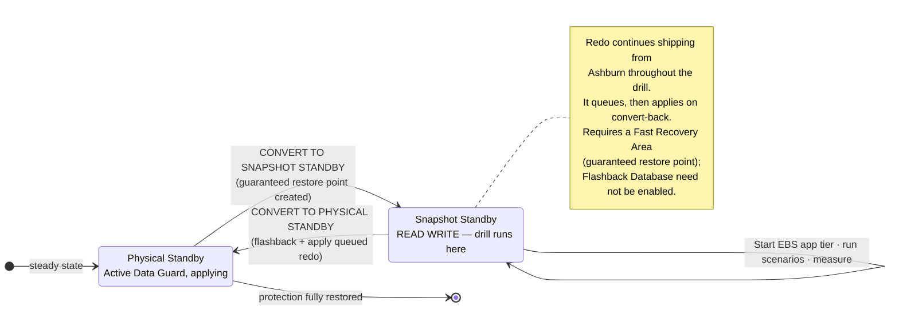

# RB-04 — Non-Disruptive DR Drill

**Type:** Rehearsal. **Production impact:** none when done as specified. **Cadence:** quarterly minimum; monthly for Tier 0.
**Purpose:** measure real RTO and WRT, prove the runbooks, and generate audit evidence — without failing over production.

---

## 1. Three levels of drill

Escalate through them. Do not attempt Level 3 until Levels 1 and 2 are routine.

| Level | Name | Mechanism | Production impact | Proves |
|---|---|---|---|---|
| **1** | Component test | **Full Stack DR plan prechecks** + `scripts/oci/check-replication-health.sh` | None | Replication is healthy, prechecks pass, Run Command plugin alive, and — new as of October 2025 — that the built-in ExaDB-D drill plan group actually converts the database and mounts storage as expected (§2 note) |
| **2** | **Snapshot Standby drill** | **Oracle Data Guard Snapshot Standby** + **Full Stack DR Start Drill / Stop Drill plans** [3] | None | Full EBS stack opens read-write in Phoenix, app tier starts, transactions commit |
| **3** | Live switchover | `RB-01-switchover.md` against real production | Planned outage | Everything, including DNS, users, and partner integrations |

A Start Drill plan creates a replica of the production stack in the standby DR protection group without interrupting production, and a Stop Drill plan removes that replica [3]. Oracle's own MAA guidance for EBS on OCI recommends using a snapshot standby for exactly this kind of DR-site testing [4].

**What the ExaDB-D drill plan group actually does is not documented.** Full Stack DR's October 2025 release added built-in drill plan groups for ExaDB-D and ExaDB-C@C [7], but the release note states only that support exists, not what steps the group runs. **Level 1 must verify this empirically** the first time it is run — capture the plan execution log (§5) and confirm it performs (or does not perform) the database conversion, so Level 2 is not the first time anyone finds out.

**If a drill is already in progress when an incident hits** (`DrillInProgress`), run **Stop Drill** before anything else — Switchover and Failover plans, and their prechecks, are refused while a DR Protection Group is in that state (`RB-02-failover.md` §0) [3].

**Level 2 is the workhorse.** It is the one that gives you a real, measured MTD without an outage.

---

## 2. Level 2 — the Snapshot Standby drill

### How it works

**Oracle Data Guard Snapshot Standby** converts the Phoenix physical standby into a fully read-write database. A physical standby must have a Fast Recovery Area configured to convert, because a guaranteed restore point is created during the conversion and guaranteed restore points require an FRA [2] — Flashback Database itself does not need to be enabled for this [1]. You run a complete EBS DR rehearsal against it — real logins, real transactions, real concurrent requests. Redo data continues to be received from the primary while it operates as a snapshot standby, but it is not applied until the snapshot standby is converted back into a physical standby [1][2]. When finished, it converts back to a physical standby and **automatically applies all the redo that accumulated during the drill**, after discarding all local updates made during the drill [1]. Nothing is lost, and DR protection is continuous throughout: redo keeps shipping from Ashburn the entire time, it simply queues rather than applying.



### Procedure

**T-7 days**
- [ ] Book the drill window and the participants — **including the EBS functional and Finance representatives.** A drill without them measures RTO only and leaves WRT unmeasured, which is the number you most need.
- [ ] Confirm Fast Recovery Area has space for the drill's redo accumulation — the FRA is what the guaranteed restore point needs, not Flashback Database [1][2]. **This is the usual failure.** Size it for the full drill duration plus margin; a full FRA during a drill will stall apply and can affect the real DR posture.
- [ ] Publish the scenario script (§3) — but withhold the injected surprise (§4) from the responders.

**T-0 — convert and drill**

```bash
# 1. Convert Phoenix to a read-write snapshot standby through the OCI control plane —
#    NOT raw DGMGRL. A DGMGRL-only conversion changes the database role without telling
#    Full Stack DR or the Data Guard Group, so prechecks and drill plans keep looking at
#    a role the control plane never saw change.
oci db database convert-standby-database-type --database-id <phx-database-ocid> \
    --standby-conversion-type SNAPSHOT --wait-for-state AVAILABLE
```
```sql
DGMGRL> show database EBSPROD_PHX;   -- expect: SNAPSHOT STANDBY
```
`oci db database convert-standby-database-type` "Performs transition from standby database into a snapshot standby and vice versa," with `--standby-conversion-type` accepting `PHYSICAL` or `SNAPSHOT` [8]. Under the hood this is the same operation the Broker's DGMGRL command-line scenarios describe for converting a physical standby to a snapshot standby and back [2] — use the CLI form so the Data Guard Group and FSDR prechecks stay coherent with what actually happened.

```bash
# 2. Bring up the drill app tier via the Full Stack DR Start Drill plan,
#    or manually against drill-only instances:
./scripts/oci/set-dr-posture.sh --posture drill --reason "RB-04 Level 2 drill <date>"   # region comes from the config
powershell -File scripts/windows/Start-EBSAppTier.ps1 -Node ALL -RunCmClean -DrillMode
```

**Drill instances have distinct physical names** (`DRILLWEB01`, `DRILLCM01`, …) so they do not collide with the pilot-light instances — but EBS resolves the design's **logical** hostnames (`docs/01-architecture.md` §5.1), not physical ones, so the drill instances only work if a **drill-only resolution view** maps those same logical names to the drill instances' addresses. Without that view, EBS on the drill nodes fails the `FND_NODES` check the same way an unpreserved logical name does elsewhere in this plan (`RB-02-failover.md` §5, §7b), and the drill silently falls back to the multi-hour `SETUP_CLEAN` + AutoConfig branch instead of the 20–40 minute Level 2 the estimate assumes. Confirm the drill-only view resolves before every drill, not just the first one.

- [ ] **Start the clock.** Record every timestamp in `evidence/drill-YYYY-MM-DD/timing.md` using `checklists/drill-timing-sheet.md`.
- [ ] Execute the scenario script (§3)
- [ ] Execute the WRT activities from `RB-02-failover.md` §6 — this is the whole point
- [ ] **Stop the clock** at Finance sign-off, not at login. That elapsed time is your real MTD.

**T+drill — convert back**

```bash
./scripts/oci/set-dr-posture.sh --posture warm

# Convert back through the control plane, same reasoning as T-0 step 1
oci db database convert-standby-database-type --database-id <phx-database-ocid> \
    --standby-conversion-type PHYSICAL --wait-for-state AVAILABLE
```
```sql
DGMGRL> show configuration;   -- confirm apply resumes and lag returns to normal
```

- [ ] **Verify lag returns to steady state before declaring the drill closed.** Until it does, your cross-region RPO is degraded.

### Isolation — mandatory

The drill database is a real EBS instance with real data. Before starting the app tier in drill mode, `Start-EBSAppTier.ps1 -DrillMode` enforces what it can verify by query, and the rest is a named manual check with an owner — do not treat an unverifiable control as satisfied just because the script did not object:

- **Workflow Mailer disabled** (verified by query) — Oracle's documented `wfmlpcln.sql` script resets the notification mailer configuration and nulls the outbound SMTP server name on the copied instance [5]. This covers only the Workflow notification mailer [5] — it does **not** touch Oracle Alert e-mail, BI Publisher delivery/bursting, XML Gateway/OTA outbound, Oracle Payments transmission, or SOA/ISG endpoints. Each of those is a separate manual check below.
- **Site-level profile banner set to "DR DRILL — NOT PRODUCTION"** (verified by query and return value) — `fnd_profile.save('SITENAME', ...)` *(internal profile name to be confirmed against the 12.2 profile options reference; the 12.1 reference does not list it — unverified)*; the script must check the function's boolean return, not just call it.
- **Outbound integration endpoints redirected to sinks** (manual — owner: EBS functional lead) — confirm XML Gateway / OTA trading-partner URLs, Oracle Payments transmission configurations, and any EDI gateway point at the drill sink before starting managers.
- **Oracle Alert e-mail and BI Publisher delivery/bursting redirected or disabled** (manual — owner: EBS functional lead) — neither is covered by `wfmlpcln.sql`.
- **SOA / Integration Services Gateway (ISG) endpoints isolated** (manual — owner: integrations lead) — these are the Tier-1 "integration endpoints" `docs/02-mtd-tiers.md` §3 lists; a drill that reaches a live partner endpoint through ISG is a real outbound transmission.
- **Printers redirected to a null queue** (manual — owner: DBA on-call) — a named `DR_DRILL_NULL` printer existing is not the same as `FND_PRINTER` / `FND_PRINTER_DRIVERS` pointing at it; confirm the mapping, not just the printer's existence.
- **Drill LB on a private listener, not registered in OCI Traffic Management** (manual — owner: network on-call).

**If `-DrillMode` cannot verify the two query-checkable controls (mailer, site banner), it aborts.** The manual checks are a signed sheet, not a script gate — the drill lead confirms each one with its named owner before T-0 and records it in the drill evidence (§5). A DR drill that transmits a real payment file is a materially worse outcome than no drill at all.

---

## 3. Scenario script

Run the same core set each time so results are comparable quarter over quarter:

| # | Scenario | Measures |
|---|---|---|
| S1 | Log in, query a customer, commit a change | Basic availability |
| S2 | Enter and book a sales order | OM transaction path |
| S3 | Submit and complete a concurrent request | CM health |
| S4 | Run the reconciliation report pack | WRT realism |
| S5 | Replay a day of inbound interface files from the replicated bucket | Interface recovery path |
| S6 | Trigger a Workflow notification (to the sink) | Workflow health |
| S7 | Render a BI/visualization report | Presentation tier |
| S8 | Verify `adop -status` is clean and `fs1`/`fs2`/`fs_ne` all present | Patching capability survives DR |

**BI tier during the drill.** `WIN-BI01` is in the always-on instance list and is never stopped by the WARM posture (`RB-05-replication-lifecycle.md` §1) — it is the "continuously proven standby" argument for Active Data Guard. During a Level 2 drill that guarantee does not hold: once Phoenix is a snapshot standby, redo is received but not applied [1], so BI reads whatever the database looked like at conversion time, not live data. Treat S7's result as "the presentation tier survives a role change," not "BI proves the standby is current" for the duration of the drill.

## 4. Inject a surprise

Every drill from the third onward, the drill lead injects **one** undisclosed complication. Rehearsing the happy path repeatedly teaches you nothing new after the second run. Suggested rotation:

- Run Command plugin disabled on one Windows node
- A volume group replica deliberately stale by six hours
- An `adop` cycle left open (exercises RB-02 §7a)
- The primary DBA is "unavailable" — tests whether the runbook works without the expert
- DNS steering fails to propagate — tests the manual override path

## 5. Evidence and improvement

Every drill produces, in `evidence/drill-YYYY-MM-DD/`:

- [ ] Timing sheet with measured **RTO** and **WRT** per tier
- [ ] Scenario pass/fail with screenshots
- [ ] FSDR plan execution log (exported from the Object Storage log bucket — every DR Protection Group must have a log bucket, and Oracle recommends a dedicated one per group [6]) — this is also where Level 1's verification of the ExaDB-D drill plan group's actual steps belongs (§1)
- [ ] Data Guard lag before, during, and after
- [ ] Defect list with owners and due dates
- [ ] Signed attestation from the business owner

**Then update `docs/02-mtd-tiers.md` with the measured numbers.** The MTD figures in that document are design targets until a drill replaces them with evidence. Committing measured numbers back is what turns this from a document into a program.

## References

This document is a synthesis: every statement about product behavior or a standard is derived
from the sources below, and any statement that could not be traced to a source is marked as
unverified. Numbers restart per document. The consolidated index is `docs/references.md`.

1. *Managing Physical and Snapshot Standby Databases.* Oracle Data Guard Concepts and Administration 19c, accessed 2026-09-01. <https://docs.oracle.com/en/database/oracle/oracle-database/19/sbydb/managing-oracle-data-guard-physical-standby-databases.html> — Supports: "It is not necessary for flashback database to be enabled"; redo received from the primary while a snapshot standby is applied on conversion back to physical standby, after discarding local updates (§How it works, §T-7, §T-0).
2. *Scenarios Using the DGMGRL Command-Line Interface.* Oracle Data Guard Broker 19c, E96245-04, accessed 2026-09-01. <https://docs.oracle.com/en/database/oracle/oracle-database/19/dgbkr/examples-using-data-guard-broker-DGMGRL-utility.html> — Supports: a physical standby must have a fast recovery area configured to convert to a snapshot standby, because a guaranteed restore point is created and guaranteed restore points require an FRA; redo continues to be received but is not applied until conversion back to physical standby; DGMGRL conversion scenarios (§How it works, §T-7, §T-0).
3. *Types of Disaster Recovery Plans.* Oracle Cloud Infrastructure Documentation, © 2026, accessed 2026-09-01. <https://docs.oracle.com/en-us/iaas/disaster-recovery/doc/dr-plans-type.html> — Supports: a Start Drill plan creates a replica of the production stack in the standby DR protection group without interrupting production; a Stop Drill plan removes that replica (§1).
4. *Maximum Availability Architecture: Oracle E-Business Suite on OCI.* Oracle, July 2025, Version 1.0, accessed 2026-09-01. <https://www.oracle.com/a/tech/docs/maaforebsonoci.pdf> — Supports: opening the standby in Snapshot Standby mode for application suite sanity testing (§1).
5. *Oracle Workflow Administrator's Guide, Release 12.2.* Part No. E22008-22, September 2024, accessed 2026-09-01. <https://docs.oracle.com/cd/E26401_01/doc.122/e22008.pdf> — Supports: "you can run a script named wfmlpcln.sql to reset the notification mailer configurations and notification mail statuses", including nulling the Outbound Email Account (SMTP) Server Name (p. 2-99) (§Isolation).
6. *Preparing Log Location for Operation Logs.* Oracle Cloud Infrastructure Documentation, © 2026, accessed 2026-09-01. <https://docs.oracle.com/en-us/iaas/disaster-recovery/doc/object-storage-for-logs.html> — Supports: every DR Protection Group must have a log bucket for its plan execution logs; Oracle recommends a dedicated one per group (§5).
7. *Full Stack Disaster Recovery — October 2025 Release Notes.* Oracle Cloud Infrastructure Documentation, accessed 2026-09-01. <https://docs.oracle.com/iaas/releasenotes/disaster-recovery/oct-2025.htm> — Supports: "Full Stack DR now supports the built-in plan groups for DR drill plans for both Exadata Database Service on Dedicated Infrastructure (ExaDB-D) and Exadata Database Service on Cloud@Customer (ExaDB-C@C)" — the note states support exists, not what the plan groups do (§1).
8. *oci db database convert-standby-database-type.* OCI CLI Command Reference 3.91.0, accessed 2026-09-01. <https://docs.oracle.com/en-us/iaas/tools/oci-cli/latest/oci_cli_docs/cmdref/db/database/convert-standby-database-type.html> — Supports: "Performs transition from standby database into a snapshot standby and vice versa"; `--standby-conversion-type` accepts `PHYSICAL` or `SNAPSHOT` (§2).

### Unverified statements

- §1: what the built-in ExaDB-D / ExaDB-C@C drill plan groups actually do — not documented in a fetched page; Level 1 must verify empirically.
- §2: `SITENAME` is the internal profile name for the Site Name profile option — rests on a search snippet only; the fetched 12.1 profile reference page does not contain the entry.
- §Isolation: manual checks (outbound endpoint redirection, Oracle Alert, BI Publisher, SOA/ISG, printer mapping, drill LB registration) are engineering judgment about what a real drill must isolate, not sourced from a single Oracle drill-isolation document.

[1]: https://docs.oracle.com/en/database/oracle/oracle-database/19/sbydb/managing-oracle-data-guard-physical-standby-databases.html "Managing Physical and Snapshot Standby Databases — Oracle Data Guard Concepts and Administration 19c"
[2]: https://docs.oracle.com/en/database/oracle/oracle-database/19/dgbkr/examples-using-data-guard-broker-DGMGRL-utility.html "Scenarios Using the DGMGRL Command-Line Interface — Oracle Data Guard Broker 19c"
[3]: https://docs.oracle.com/en-us/iaas/disaster-recovery/doc/dr-plans-type.html "Types of Disaster Recovery Plans — Oracle"
[4]: https://www.oracle.com/a/tech/docs/maaforebsonoci.pdf "Maximum Availability Architecture: Oracle E-Business Suite on OCI — Oracle"
[5]: https://docs.oracle.com/cd/E26401_01/doc.122/e22008.pdf "Oracle Workflow Administrator's Guide, Release 12.2 — Oracle"
[6]: https://docs.oracle.com/en-us/iaas/disaster-recovery/doc/object-storage-for-logs.html "Preparing Log Location for Operation Logs — Oracle"
[7]: https://docs.oracle.com/iaas/releasenotes/disaster-recovery/oct-2025.htm "Full Stack Disaster Recovery — October 2025 Release Notes — Oracle"
[8]: https://docs.oracle.com/en-us/iaas/tools/oci-cli/latest/oci_cli_docs/cmdref/db/database/convert-standby-database-type.html "oci db database convert-standby-database-type — OCI CLI 3.91.0"
