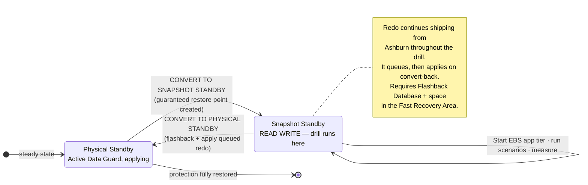

# RB-04 — Non-Disruptive DR Drill

**Type:** Rehearsal. **Production impact:** none when done as specified. **Cadence:** quarterly minimum; monthly for Tier 0.
**Purpose:** measure real RTO and WRT, prove the runbooks, and generate audit evidence — without failing over production.

---

## 1. Three levels of drill

Escalate through them. Do not attempt Level 3 until Levels 1 and 2 are routine.

| Level | Name | Mechanism | Production impact | Proves |
|---|---|---|---|---|
| **1** | Component test | **Full Stack DR plan prechecks** + `scripts/oci/check-replication-health.sh` | None | Replication is healthy, prechecks pass, Run Command plugin alive |
| **2** | **Snapshot Standby drill** | **Oracle Data Guard Snapshot Standby** + **Full Stack DR Start Drill / Stop Drill plans** | None | Full EBS stack opens read-write in Phoenix, app tier starts, transactions commit |
| **3** | Live switchover | `RB-01-switchover.md` against real production | Planned outage | Everything, including DNS, users, and partner integrations |

**Level 2 is the workhorse.** It is the one that gives you a real, measured MTD without an outage.

---

## 2. Level 2 — the Snapshot Standby drill

### How it works

**Oracle Data Guard Snapshot Standby** converts the Phoenix physical standby into a fully read-write database, backed by a guaranteed restore point. You run a complete EBS DR rehearsal against it — real logins, real transactions, real concurrent requests. When finished, it converts back to a physical standby and **automatically applies all the redo that accumulated during the drill**. Nothing is lost, and DR protection is continuous throughout: redo keeps shipping from Ashburn the entire time, it simply queues rather than applying.



### Procedure

**T-7 days**
- [ ] Book the drill window and the participants — **including the EBS functional and Finance representatives.** A drill without them measures RTO only and leaves WRT unmeasured, which is the number you most need.
- [ ] Confirm Fast Recovery Area has space for the drill's redo accumulation. **This is the usual failure.** Size it for the full drill duration plus margin; a full FRA during a drill will stall apply and can affect the real DR posture.
- [ ] Publish the scenario script (§3) — but withhold the injected surprise (§4) from the responders.

**T-0 — convert and drill**

```sql
-- 1. Convert Phoenix to a read-write snapshot standby
DGMGRL> convert database EBSPROD_PHX to snapshot standby;
DGMGRL> show database EBSPROD_PHX;   -- expect: SNAPSHOT STANDBY
```

```bash
# 2. Bring up the drill app tier via the Full Stack DR Start Drill plan,
#    or manually against drill-only instances:
./scripts/oci/set-dr-posture.sh --posture drill --region us-phoenix-1
powershell -File scripts/windows/Start-EBSAppTier.ps1 -Node ALL -RunCmClean -DrillMode
```

- [ ] **Start the clock.** Record every timestamp in `evidence/drill-<date>.md` using `checklists/drill-timing-sheet.md`.
- [ ] Execute the scenario script (§3)
- [ ] Execute the WRT activities from `RB-02-failover.md` §6 — this is the whole point
- [ ] **Stop the clock** at Finance sign-off, not at login. That elapsed time is your real MTD.

**T+drill — convert back**

```bash
./scripts/oci/set-dr-posture.sh --posture warm --region us-phoenix-1
```
```sql
DGMGRL> convert database EBSPROD_PHX to physical standby;
DGMGRL> show configuration;   -- confirm apply resumes and lag returns to normal
```

- [ ] **Verify lag returns to steady state before declaring the drill closed.** Until it does, your cross-region RPO is degraded.

### Isolation — mandatory

The drill database is a real EBS instance with real data. Before starting the app tier in drill mode, `Start-EBSAppTier.ps1 -DrillMode` enforces:

- Workflow Mailer **disabled** — otherwise it emails real customers and suppliers
- Outbound integration endpoints **redirected to sinks** — no EDI, no payment files, no bank transmissions
- Printers **redirected to a null queue**
- Site-level profile banner set to **"DR DRILL — NOT PRODUCTION"**
- Drill LB on a private listener, not registered in **OCI Traffic Management**

**If `-DrillMode` cannot verify all five, it aborts.** A DR drill that transmits a real payment file is a materially worse outcome than no drill at all.

---

## 3. Scenario script

Run the same core set each time so results are comparable quarter over quarter:

| # | Scenario | Measures |
|---|---|---|
| S1 | Log in, query a customer, commit a change | Basic availability |
| S2 | Enter and book a sales order | OM transaction path |
| S3 | Submit and complete a concurrent request | CM health |
| S4 | Run the reconciliation report pack | WRT realism |
| S5 | Replay a day of inbound interface files from the replicated bucket | Interface recovery path |
| S6 | Trigger a Workflow notification (to the sink) | Workflow health |
| S7 | Render a BI/visualization report | Presentation tier |
| S8 | Verify `adop -status` is clean and `fs1`/`fs2`/`fs_ne` all present | Patching capability survives DR |

## 4. Inject a surprise

Every drill from the third onward, the drill lead injects **one** undisclosed complication. Rehearsing the happy path repeatedly teaches you nothing new after the second run. Suggested rotation:

- Run Command plugin disabled on one Windows node
- A volume group replica deliberately stale by six hours
- An `adop` cycle left open (exercises RB-02 §7a)
- The primary DBA is "unavailable" — tests whether the runbook works without the expert
- DNS steering fails to propagate — tests the manual override path

## 5. Evidence and improvement

Every drill produces, in `evidence/drill-<date>/`:

- [ ] Timing sheet with measured **RTO** and **WRT** per tier
- [ ] Scenario pass/fail with screenshots
- [ ] FSDR plan execution log (exported from the Object Storage log bucket)
- [ ] Data Guard lag before, during, and after
- [ ] Defect list with owners and due dates
- [ ] Signed attestation from the business owner

**Then update `docs/02-mtd-tiers.md` with the measured numbers.** The MTD figures in that document are design targets until a drill replaces them with evidence. Committing measured numbers back is what turns this from a document into a program.
