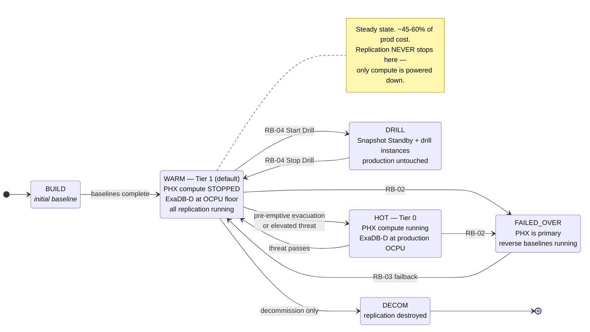

# RB-05 — Replication Lifecycle: Spin-Up and Tear-Down

Covers the four lifecycle operations: **initial build**, **posture change** (the routine cost lever), **drill environment spin-up/tear-down**, and **full decommission**.

> Read `docs/03-replication-matrix.md` §3 first. The governing rule: **tear down compute, never tear down replication.** Everything below is built around that split.

---

## 1. The four postures

The whole DR estate runs in one of four named postures, switched with a single script or a Terraform variable.



**`WARM` is the steady state.** `HOT` exists for the days when you have warning — a hurricane track, a announced regional maintenance, a heightened threat. Moving WARM→HOT takes minutes and costs money only while it lasts. That is the elasticity the design is built to give you.

```bash
./scripts/oci/set-dr-posture.sh --posture warm     # steady state
./scripts/oci/set-dr-posture.sh --posture hot      # elevated readiness
./scripts/oci/set-dr-posture.sh --posture drill    # RB-04 Level 2
```

---

## 2. Initial build (spin-up)

Order is load-bearing. Each phase depends on the previous one.

### Phase 1 — Foundation
- [ ] Phoenix compartments, IAM policies, dynamic groups (including the **Full Stack DR** service dynamic group)
- [ ] VCN `10.20.0.0/16`, subnets, NSGs, route tables
- [ ] **DRG** in both regions + **Remote Peering Connection**; verify routing both ways
- [ ] **Measure and record RTT** → `evidence/latency-baseline.md`. Every RPO claim in `docs/02-mtd-tiers.md` depends on this number.
- [ ] **OCI Private DNS** zones with region-scoped views implementing the identical-hostname design (`docs/01-architecture.md` §5.1)
- [ ] **OCI Vault** with cross-region key replication — **before** any TDE-encrypted data moves

### Phase 2 — Database
- [ ] Provision the Phoenix **ExaDB-D** VM Cluster
- [ ] Enable **Oracle Flashback Database** on the primary if not already on
- [ ] Create the **Data Guard Association** (console/CLI) or `RMAN DUPLICATE ... FOR STANDBY`
- [ ] Configure **Oracle Data Guard Broker**, set protection modes per `docs/01-architecture.md` §3
- [ ] Apply redo transport tuning (`scripts/dataguard/tnsnames-tuning.md`) — **do this before** measuring lag, or you will size the network from bad data
- [ ] Enable **Oracle Active Data Guard** real-time apply
- [ ] Deploy the **FSFO Observer** in Ashburn AD-3, targeting the local standby only
- [ ] Register with **Oracle Database Autonomous Recovery Service**; enable real-time redo transport, cross-region backup copy, and retention lock

### Phase 3 — Storage replication (start early — baselines are long)
- [ ] Group each Windows node's boot + data volumes into a **Volume Group**; enable **Volume Group Replication** to Phoenix
- [ ] Create Phoenix file systems; establish **FSS File System Replication**
- [ ] Create Phoenix buckets; establish **Object Storage Replication Policies**
- [ ] **Record baseline completion times** — they are your failback estimate in RB-03

### Phase 4 — Compute and application
- [ ] Publish **OCI Compute Custom Images** from the Ashburn nodes; **Copy Image to Another Region**
- [ ] Launch Phoenix Windows instances with the **same hostnames**; join domain
- [ ] Enable and verify the **Oracle Cloud Agent Run Command plugin** on every instance
- [ ] Clone the EBS app tier per My Oracle Support **Doc ID 1963472.1** ("Business Continuity for Oracle E-Business Suite Release 12.2 … Physical Standby Database")
- [ ] Verify `fs1`, `fs2`, **and** `fs_ne` all present
- [ ] Provision the Phoenix **OCI Flexible Load Balancer** with backend sets populated
- [ ] `STOP` the instances → this is the pilot light

### Phase 5 — Orchestration
- [ ] Create **DR Protection Groups** in both regions; associate as peers
- [ ] Add all members (`docs/03-replication-matrix.md` §4)
- [ ] Build **user-defined steps** for EBS start/stop, `cmclean.sql`, isolation enforcement
- [ ] Generate **Switchover**, **Failover**, **Start Drill**, **Stop Drill** plans
- [ ] Run **plan prechecks** until every one passes
- [ ] Configure **OCI Traffic Management Steering Policy** + **OCI Health Checks**
- [ ] Wire **OCI Monitoring** alarms → **OCI Notifications** (`docs/04-monitoring.md`)

### Phase 6 — Prove it
- [ ] RB-04 Level 1 drill
- [ ] RB-04 Level 2 drill — **the build is not complete until a Level 2 drill passes**
- [ ] Record measured RTO/WRT; update `docs/02-mtd-tiers.md`
- [ ] Business owner signs the tier attestation

---

## 3. Routine tear-down — the cost lever

**What the automation actually does** in `set-dr-posture.sh --posture warm`:

| Action | Mechanism | Effect |
|---|---|---|
| Stop Phoenix Windows instances | `oci compute instance action --action STOP`, scheduled via **OCI Resource Scheduler** | Removes OCPU + memory charges; boot volumes retained |
| Scale Phoenix ExaDB-D to floor | **ExaDB-D VM Cluster OCPU scaling** (online) | Removes most OCPU charge; **redo apply keeps running** |
| Leave every replication resource untouched | — | Protection continuous |

**What it deliberately does *not* do**, and why:

| Tempting action | Why it is refused |
|---|---|
| Delete **Volume Group Replication** | Re-enable = full baseline. Saves the cheapest line item; costs a multi-hour unprotected window. |
| Delete **FSS File System Replication** | Same, plus it destroys the replication relationship. |
| Delete **Object Storage Replication Policy** | Re-enable re-scans the whole bucket. |
| Scale ExaDB-D to **0 OCPU** | Stops redo apply. Silently converts Tier 1 into Tier 3 while the documentation still claims 5-minute RPO. |
| Terminate stopped instances | Destroys the pilot light; rebuild moves RTO from minutes to hours. |

`set-dr-posture.sh` refuses these outright. If someone genuinely needs to destroy replication, that is §5 (decommission) and it requires explicit sign-off.

**Realistic saving:** WARM versus HOT is roughly the difference between ~45–60% and ~90–100% of production cost (`docs/02-mtd-tiers.md` §2). The saving comes almost entirely from compute. Model your own numbers in `docs/05-cost-and-teardown.md` — the percentages here are the shape of the answer, not a quote.

---

## 4. Drill environment spin-up and tear-down

Fully covered in `RB-04-dr-drill.md`. Mechanism summary:

| | Spin-up | Tear-down |
|---|---|---|
| Database | `CONVERT DATABASE ... TO SNAPSHOT STANDBY` | `CONVERT DATABASE ... TO PHYSICAL STANDBY` — queued redo applies automatically |
| Compute | **Full Stack DR Start Drill** plan | **Stop Drill** plan |
| Cost | Only for the drill's duration | Returns to WARM |
| Production impact | **None** | **None** |

This is the only place in the plan where "spin up and tear down" is genuinely free of a re-baseline penalty — which is exactly why drills should be frequent.

---

## 5. Full decommission

Only for retiring the DR site or the application. **Requires written sign-off from the business owner and the risk function** — you are deliberately removing protection.

Order matters: destroy orchestration first so nothing tries to fail over into a half-dismantled estate.

```bash
./scripts/oci/decommission-dr.sh --confirm-unprotected --approver "<name>" --ticket "<change-ref>"
```

1. Delete Full Stack DR **DR Plans**, then the **DR Protection Groups**
2. Remove the **OCI Traffic Management Steering Policy** and health checks
3. Terminate Phoenix Windows instances and their volumes
4. Delete **Volume Group Replication**, **FSS File System Replication**, **Object Storage Replication Policies**
5. Remove the **Data Guard Association**; drop the Phoenix standby
6. Retain **Autonomous Recovery Service** backups per the records-retention schedule — **do not delete backups with the infrastructure.** This is the step that gets skipped and later regretted.
7. Delete the Phoenix ExaDB-D VM Cluster and infrastructure
8. Archive all `evidence/` to long-term retention before removing anything

The script logs every step with the approver and change reference for audit.
