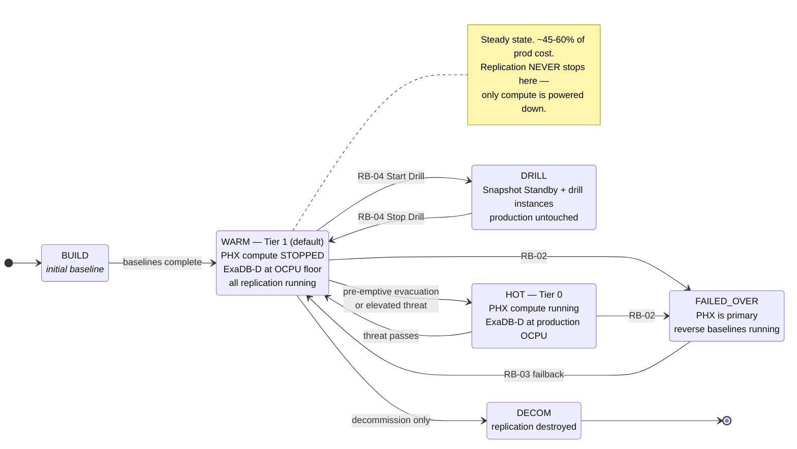

# RB-05 — Replication Lifecycle: Spin-Up and Tear-Down

Covers the four lifecycle operations: **initial build**, **posture change** (the routine cost lever), **drill environment spin-up/tear-down**, and **full decommission**.

> Read `docs/03-replication-matrix.md` §3 first. The governing rule: **tear down compute, never tear down replication.** Everything below is built around that split.

---

## 1. The four postures

The whole DR estate runs in one of four named postures, switched with a single script or a Terraform variable.



**`WARM` is the steady state.** `HOT` exists for the days when you have warning — a hurricane track, a announced regional maintenance, a heightened threat. Moving WARM→HOT takes minutes and costs money only while it lasts. That is the elasticity the design is built to give you.

```bash
./scripts/oci/set-dr-posture.sh --posture warm     # steady state
./scripts/oci/set-dr-posture.sh --posture hot --reason "<threat, ticket>"     # elevated readiness
./scripts/oci/set-dr-posture.sh --posture drill --reason "RB-04 <date>"      # RB-04 Level 2
```

---

## 2. Initial build (spin-up)

Order is load-bearing. Each phase depends on the previous one.

### Phase 1 — Foundation
- [ ] Phoenix compartments, IAM policies, dynamic groups (including the **Full Stack DR** service dynamic group)
- [ ] VCN `10.20.0.0/16`, subnets, NSGs, route tables
- [ ] **DRG** in both regions + **Remote Peering Connection**; verify routing both ways
- [ ] **Measure and record RTT** → `evidence/latency-baseline.md`. Every RPO claim in `docs/02-mtd-tiers.md` depends on this number. Oracle states that Ashburn–Phoenix latency exceeds 50 ms RTT [1]; treat any "~60–70 ms" figure elsewhere in this plan as representative only, not an Oracle-published number, and measure your own.
- [ ] **OCI Private DNS** zones with region-scoped views implementing the identical-hostname design (`docs/01-architecture.md` §5.1)
- [ ] **OCI Vault** with cross-region key replication — **before** any TDE-encrypted data moves. Private vaults, and virtual vaults created after the cross-region replication feature launched, support replication to exactly one remote region; virtual vaults created before the feature launched cannot be replicated [2].

### Phase 2 — Database
- [ ] Provision the Phoenix **ExaDB-D** VM Cluster
- [ ] Enable **Oracle Flashback Database** on both the primary and the standby if not already on — reinstating a failed primary as a standby after a failover succeeds only if Flashback Database was enabled on it beforehand, with sufficient flashback logs retained; Oracle recommends enabling it on every database for exactly this reason [3]
- [ ] Create the Data Guard configuration (console/CLI) or `RMAN DUPLICATE ... FOR STANDBY` — the Data Guard Association model is being replaced by the **Data Guard Group** model from February 2026, and new configurations created from the Console automatically use it [4]
- [ ] Configure **Oracle Data Guard Broker** — Oracle's EBS guidance recommends it to simplify Data Guard administration [5] — set protection modes (Maximum Availability = SYNC, Maximum Performance = ASYNC) per `docs/01-architecture.md` §3 [6]
- [ ] Apply redo transport tuning (`scripts/dataguard/tnsnames-tuning.md`) — **do this before** measuring lag, or you will size the network from bad data
- [ ] Enable **Oracle Active Data Guard** real-time apply — real-time query, automatic block repair and the other ADG features require an Active Data Guard licence [7]; on Base Database Service, ADG requires Enterprise Edition Extreme Performance [8]
- [ ] Deploy the **FSFO Observer** in Ashburn AD-3, targeting the local standby only — as a best practice the observer should be at a third site or, failing that, co-located with the standby rather than the primary or application tier [9]
- [ ] Register **Oracle Database Autonomous Recovery Service** in **both regions** — Ashburn protects the primary and Phoenix protects the Phoenix standby (automatic backups are supported on a standby-role database [10]); backups replicate across availability domains within each region and can be restored to any region [11], but there is no cross-region backup-copy feature. The documented pattern for cross-region protection is Data Guard between regions plus a local Recovery Service in each region [12]. On each subscription, enable real-time redo transport — an extra-cost option [11] — and retention lock (minimum 14-day delay before the retention period locks permanently, maximum 95-day retention) [13]

### Phase 3 — Storage replication (start early — baselines are long)
- [ ] Group each Windows node's boot + data volumes into a **Volume Group**; enable **Volume Group Replication** to Phoenix — Block Volume replication supports replicating a volume or volume group to a different destination region [14]
- [ ] Create Phoenix file systems; establish **FSS File System Replication** — File Storage supports the NFSv3 protocol only [15]
- [ ] Create Phoenix buckets; establish **Object Storage Replication Policies** — after the policy is created the destination bucket is read-only, updated only by replication from the source [16]
- [ ] **Record baseline completion times** — they are your failback estimate in RB-03

### Phase 4 — Compute and application
- [ ] Publish **OCI Compute Custom Images** from the Ashburn nodes. There is no single cross-region copy operation: export the image to an Object Storage bucket in the source region, copy the object to a bucket in Phoenix, then import it there [17]
- [ ] Launch Phoenix Windows instances with the **same hostnames**; join domain
- [ ] Enable and verify the **Oracle Cloud Agent Run Command plugin** on every instance — Full Stack DR user-defined steps run only through Run Command or Oracle Functions [18], and the plugin must be enabled and running on the instance [19]
- [ ] Clone the EBS app tier per the Oracle Database 19c business-continuity note, My Oracle Support **Doc ID 2617787.1** ("Business Continuity for Oracle E-Business Suite Release 12.2 on Oracle Database 19c Using Physical Host Names") [20][31] — not Doc ID 1963472.1, which is the equivalent note for the older 12c (12.1.0.2) database release [21][32]
- [ ] Verify `fs1`, `fs2`, **and** `fs_ne` all present
- [ ] Provision the Phoenix **OCI Flexible Load Balancer** with backend sets populated
- [ ] `STOP` the instances → this is the pilot light

### Phase 5 — Orchestration
- [ ] Create **DR Protection Groups** in both regions; associate as peers. Each DR Protection Group requires its own dedicated Object Storage bucket — Standard tier, no retention policy, used for nothing but that group's plan execution logs [22]
- [ ] Add all members (`docs/03-replication-matrix.md` §4). **Object Storage Bucket is itself a native DR Protection Group member type** [23], with built-in plan groups that handle its replication lifecycle automatically; it does not need a user-defined step
- [ ] Build **user-defined steps**, which run only via the Oracle Cloud Agent Run Command plugin or Oracle Functions [18], for EBS start/stop, `cmclean.sql`, isolation enforcement
- [ ] Generate **Switchover**, **Failover**, **Start Drill**, **Stop Drill** plans — the four Full Stack DR plan types [24]
- [ ] **Leave Automatic DR disabled.** Full Stack DR can trigger a plan automatically when a Data Guard member changes role [25], but this design requires a human decision before any cross-region transition — never automatic
- [ ] **Confirm only one standby is added per Data Guard member.** Data Guard itself allows multiple standby databases, but Full Stack DR supports only one of them per protection group [26]
- [ ] Run **plan prechecks** until every one passes
- [ ] Configure **OCI Traffic Management Steering Policy** + **OCI Health Checks**
- [ ] Wire **OCI Monitoring** alarms → **OCI Notifications** (`docs/04-monitoring.md`)

### Phase 6 — Prove it
- [ ] RB-04 Level 1 drill
- [ ] RB-04 Level 2 drill — **the build is not complete until a Level 2 drill passes**
- [ ] Record measured RTO/WRT; update `docs/02-mtd-tiers.md`
- [ ] Business owner signs the tier attestation

---

## 3. Routine tear-down — the cost lever

**What the automation actually does** in `set-dr-posture.sh --posture warm`:

| Action | Mechanism | Effect |
|---|---|---|
| Stop Phoenix Windows instances | `oci compute instance action --action STOP` [27], scheduled via **OCI Resource Scheduler** [28] | Removes OCPU + memory charges; boot volumes retained |
| Scale Phoenix ExaDB-D to floor | **ExaDB-D VM Cluster OCPU scaling** (online) [29] | Removes most OCPU charge; **redo apply keeps running** because the floor (2 OCPU per VM, 8 ECPU per VM on X11M) keeps the VM cluster up [29] |
| Leave every replication resource untouched | — | Protection continuous |

**What it deliberately does *not* do**, and why:

| Tempting action | Why it is refused |
|---|---|
| Delete **Volume Group Replication** | Re-enable = full baseline. Saves the cheapest line item; costs a multi-hour unprotected window. |
| Delete **FSS File System Replication** | Same, plus it destroys the replication relationship. |
| Delete **Object Storage Replication Policy** | A new policy replicates only objects uploaded after it is created; everything already in the bucket must be bulk-copied first, and a deleted policy cannot be recovered [16]. |
| Scale ExaDB-D to **0 OCPU** | Setting OCPU to zero shuts down the entire VM Cluster and stops billing for it, not just redo apply — the hypervisor still reserves the minimum 2 OCPU per VM (8 ECPU per VM on X11M), unusable by any other VM, even while shut down [29]. Silently converts Tier 1 into Tier 3 while the documentation still claims 5-minute RPO. |
| Terminate stopped instances | Destroys the pilot light; rebuild moves RTO from minutes to hours. |

`set-dr-posture.sh` refuses these outright. If someone genuinely needs to destroy replication, that is §5 (decommission) and it requires explicit sign-off.

**Realistic saving:** WARM versus HOT is roughly the difference between ~45–60% and ~90–100% of production cost (`docs/02-mtd-tiers.md` §2). The saving comes almost entirely from compute. Model your own numbers in `docs/05-cost-and-teardown.md` — the percentages here are the shape of the answer, not a quote.

---

## 4. Drill environment spin-up and tear-down

Fully covered in `RB-04-dr-drill.md`. Mechanism summary:

| | Spin-up | Tear-down |
|---|---|---|
| Database | `CONVERT DATABASE ... TO SNAPSHOT STANDBY` — requires a Fast Recovery Area for the guaranteed restore point; Flashback Database need not be enabled [30] | `CONVERT DATABASE ... TO PHYSICAL STANDBY` — queued redo applies automatically, after discarding local drill updates [30] |
| Compute | **Full Stack DR Start Drill** plan — generates a replica of the production stack in the standby protection group without interrupting production [24] | **Stop Drill** plan — removes that replica [24] |
| Cost | Only for the drill's duration | Returns to WARM |
| Production impact | **None** | **None** |

This is the only place in the plan where "spin up and tear down" is genuinely free of a re-baseline penalty — which is exactly why drills should be frequent.

---

## 5. Full decommission

Only for retiring the DR site or the application. **Requires written sign-off from the business owner and the risk function** — you are deliberately removing protection.

Order matters: destroy orchestration first so nothing tries to fail over into a half-dismantled estate.

```bash
./scripts/oci/decommission-dr.sh --confirm-unprotected --approver "<name>" --ticket "<change-ref>"
```

1. Delete Full Stack DR **DR Plans**, then the **DR Protection Groups**
2. Remove the **OCI Traffic Management Steering Policy** and health checks
3. Terminate Phoenix Windows instances and their volumes
4. Delete **Volume Group Replication**, **FSS File System Replication**, **Object Storage Replication Policies**
5. Remove the Data Guard configuration; drop the Phoenix standby — note that the Data Guard Association model is being replaced by the Data Guard Group model from February 2026 [4]
6. Retain **Autonomous Recovery Service** backups in **both regions** per the records-retention schedule — **do not delete backups with the infrastructure.** This is the step that gets skipped and later regretted.
7. Delete the Phoenix ExaDB-D VM Cluster and infrastructure
8. Archive all `evidence/` to long-term retention before removing anything

The script logs every step with the approver and change reference for audit.

## References

This document is a synthesis: every statement about product behaviour or a standard is derived
from the sources below, and any statement that could not be traced to a source is marked as
unverified. Numbers restart per document. The consolidated index is `docs/references.md`.

1. *Set Up FMW Stretched Clusters.* Oracle solution playbook, G49655-02, March 2026, accessed 2026-09-01. <https://docs.oracle.com/en/solutions/fmw-stretched-clusters/set-fmw-stretched-clusters1.html> — Supports: "the latency between these regions exceeds 50 ms RTT" for Ashburn and Phoenix (Phase 1).
2. *Replicating Vaults and Keys.* Oracle Cloud Infrastructure Documentation, © 2026, accessed 2026-09-01. <https://docs.oracle.com/en-us/iaas/Content/KeyManagement/Tasks/replicatingvaults.htm> — Supports: all private vaults support cross-region replication; virtual vaults created before the feature launched cannot be replicated; a vault replicates to a replica in another region (Phase 1).
3. *Switchover and Failover Operations.* Oracle Data Guard Broker 19c, E96245-04, accessed 2026-09-01. <https://docs.oracle.com/en/database/oracle/oracle-database/19/dgbkr/using-data-guard-broker-to-manage-switchovers-failovers.html> — Supports: reinstate succeeds only if Flashback Database was enabled prior to the failover with sufficient flashback logs; Oracle recommends enabling it on every database (Phase 2).
4. *Use Oracle Data Guard with Exadata Cloud Infrastructure.* Oracle Cloud Infrastructure Documentation, no version shown, accessed 2026-09-01. <https://docs.oracle.com/en-us/iaas/exadatacloud/doc/using-data-guard-with-exacc.html> — Supports: from February 2026 the Data Guard Association model is replaced by the Data Guard Group model, and new Console configurations use it automatically (Phase 2, §5).
5. *E-Business Suite Release 12.2 Maximum Availability Architecture.* Oracle White Paper, January 2018, accessed 2026-09-01. <https://www.oracle.com/technetwork/database/availability/ebs-122-maa-whitepaper-4258573.pdf> — Supports: "Use Data Guard Broker to simplify Data Guard administration" (Phase 2).
6. *Oracle Data Guard Protection Modes.* Oracle Data Guard Concepts and Administration 19c, accessed 2026-09-01. <https://docs.oracle.com/en/database/oracle/oracle-database/19/sbydb/oracle-data-guard-protection-modes.html> — Supports: Maximum Availability transport is synchronous, Maximum Performance is asynchronous (Phase 2).
7. *Managing Physical and Snapshot Standby Databases.* Oracle Data Guard Concepts and Administration 19c, accessed 2026-09-01. <https://docs.oracle.com/en/database/oracle/oracle-database/19/sbydb/managing-oracle-data-guard-physical-standby-databases.html> — Supports: real-time query and automatic block repair require an Oracle Active Data Guard license (Phase 2).
8. *About Oracle Data Guard.* Oracle Base Database Service Documentation, no version shown, accessed 2026-09-01. <https://docs.oracle.com/en-us/iaas/base-database/doc/use-oracle-data-guard-db-system.html> — Supports: "Active Data Guard requires Enterprise Edition Extreme Performance" (Phase 2).
9. *High Availability Overview and Best Practices.* Oracle Database 19c, F23691-56, July 14 2026, accessed 2026-09-01. <https://docs.oracle.com/en/database/oracle/oracle-database/19/haovw/high-availability-overview-and-best-practices.pdf> — Supports: the observer should ideally be at a third site, or otherwise at the standby location, never with the primary or application tier (Phase 2).
10. *Manage Database Backup and Recovery on Exadata Database Service on Dedicated Infrastructure.* Oracle Cloud Infrastructure Documentation, no version shown, accessed 2026-09-01. <https://docs.oracle.com/en-us/iaas/exadatacloud/doc/ecs-managing-db-backup-and-recovery.html> — Supports: automatic backup can be enabled on a database with the standby role in a Data Guard association (Phase 2).
11. *Recovery Service Technical Architecture.* Oracle Cloud Infrastructure Documentation, no version shown, accessed 2026-09-01. <https://docs.oracle.com/en-us/iaas/recovery-service/doc/recovery-service-architecture.html> — Supports: real-time protection is an extra-cost option; auto-backup replication is for high availability within a region, restorable to any availability domain, zone, or region (Phase 2).
12. *Implement Oracle Database Autonomous Recovery Service with Oracle Database@Azure.* Oracle solution playbook, G24007-01, January 2025, accessed 2026-09-01. <https://docs.oracle.com/en/solutions/implement-recovery-service-db-at-azure/index.html> — Supports: for cross-region backups, use Data Guard between regions and back up each region with a local Recovery Service (Phase 2).
13. *Using Retention Lock to Protect Backups.* Oracle Cloud Infrastructure Documentation, no version shown, accessed 2026-09-01. <https://docs.oracle.com/en-us/iaas/recovery-service/doc/about-policy-locking.html> — Supports: minimum 14-day delay to permanently lock a retention period; maximum 95-day retention (Phase 2).
14. *Block Volume Replication.* Oracle Cloud Infrastructure Documentation, © 2026, accessed 2026-09-01. <https://docs.oracle.com/en-us/iaas/Content/Block/Concepts/volumereplication.htm> — Supports: Block Volume replication supports replicating a volume or volume group to another region (Phase 3).
15. *Overview of File Storage.* Oracle Cloud Infrastructure Documentation, © 2026, accessed 2026-09-01. <https://docs.oracle.com/en-us/iaas/Content/File/Concepts/filestorageoverview.htm> — Supports: File Storage supports the NFSv3 protocol (Phase 3).
16. *Object Storage Replication.* Oracle Cloud Infrastructure Documentation, © 2026, accessed 2026-09-01. <https://docs.oracle.com/en-us/iaas/Content/Object/Tasks/usingreplication.htm> — Supports: after the replication policy is created, the destination bucket is read-only, updated only by replication from the source (Phase 3).
17. *Importing and Exporting Custom Images.* Oracle Cloud Infrastructure Documentation, © 2026, accessed 2026-09-01. <https://docs.oracle.com/en-us/iaas/Content/Compute/Tasks/imageimportexport.htm> — Supports: cross-region image replication is export to Object Storage, copy the object, then import — not a single operation (Phase 4).
18. *Add User-Defined Plan Groups and Steps.* Oracle Cloud Infrastructure Documentation, © 2026, accessed 2026-09-01. <https://docs.oracle.com/en-us/iaas/disaster-recovery/doc/add-user-defined-plan-groups.html> — Supports: user-defined steps run only via Oracle Cloud Agent Run Command or Oracle Functions (Phase 4, Phase 5).
19. *Running Commands on an Instance.* Oracle Cloud Infrastructure Documentation, © 2026, accessed 2026-09-01. <https://docs.oracle.com/en-us/iaas/Content/Compute/Tasks/runningcommands.htm> — Supports: the Run Command plugin must be enabled on the instance and plugins must be running (Phase 4).
20. *Business Continuity for Oracle E-Business Suite Release 12.2 on Oracle Database 19c Using Physical Host Names* (My Oracle Support Doc ID 2617787.1). Unverifiable by URL: login-gated (My Oracle Support). Title corroborated only by [31] (Phase 4).
21. *Business Continuity for Oracle E-Business Suite Release 12.2 Using Oracle 12c (12.1.0.2) Physical Standby Database* (My Oracle Support Doc ID 1963472.1). Unverifiable by URL: login-gated (My Oracle Support). Title corroborated only by [32] (Phase 4).
22. *Preparing Log Location for Operation Logs.* Oracle Cloud Infrastructure Documentation, © 2026, accessed 2026-09-01. <https://docs.oracle.com/en-us/iaas/disaster-recovery/doc/object-storage-for-logs.html> — Supports: use a separate dedicated Standard-tier bucket per DR Protection Group, with no replication and no retention policy, reserved for that group's logs (Phase 5).
23. *Add Members to a Disaster Recovery Protection Group.* Oracle Cloud Infrastructure Documentation, © 2026, accessed 2026-09-01. <https://docs.oracle.com/en-us/iaas/disaster-recovery/doc/add-members-protection-group.html> — Supports: Object Storage Bucket is a native DR Protection Group member type (Phase 5).
24. *Types of Disaster Recovery Plans.* Oracle Cloud Infrastructure Documentation, © 2026, accessed 2026-09-01. <https://docs.oracle.com/en-us/iaas/disaster-recovery/doc/dr-plans-type.html> — Supports: the four Full Stack DR plan types — Switchover, Failover, Start Drill, Stop Drill — and their definitions (Phase 5, §4).
25. *Configure Automatic DR Plan Execution.* Oracle Cloud Infrastructure Documentation, © 2026, accessed 2026-09-01. <https://docs.oracle.com/en-us/iaas/disaster-recovery/doc/configure-automaticdr.html> — Supports: Full Stack DR can trigger a plan automatically when a Data Guard member changes role (Phase 5).
26. *Preparing Oracle Databases for Full Stack Disaster Recovery.* Oracle Cloud Infrastructure Documentation, © 2026, accessed 2026-09-01. <https://docs.oracle.com/en-us/iaas/disaster-recovery/doc/prepare-database-disaster-recovery.html> — Supports: "Data Guard allows you to configure multiple standby database. However, Full Stack DR only supports one of these standby databases" (Phase 5).
27. *oci compute instance action.* OCI CLI Command Reference 3.91.0, accessed 2026-09-01. <https://docs.oracle.com/en-us/iaas/tools/oci-cli/latest/oci_cli_docs/cmdref/compute/instance/action.html> — Supports: `--action STOP` / `START` (§3).
28. *Resource Scheduler.* Oracle Cloud Infrastructure Documentation, © 2026, accessed 2026-09-01. <https://docs.oracle.com/en-us/iaas/Content/resource-scheduler/home.htm> — Supports: schedules automatically stop and restart Compute instances (§3).
29. *Manage VM Clusters.* Oracle Exadata Database Service on Dedicated Infrastructure, no version shown, accessed 2026-09-01. <https://docs.oracle.com/en-us/iaas/exadatacloud/doc/manage-vm-clusters.html> — Supports: OCPU scaling is online; setting OCPUs to zero shuts down the VM Cluster and stops its billing, but the hypervisor still reserves the minimum 2 OCPU per VM (8 ECPU per VM on X11M) (§3).
30. *Managing Physical and Snapshot Standby Databases.* Oracle Data Guard Concepts and Administration 19c, accessed 2026-09-01. <https://docs.oracle.com/en/database/oracle/oracle-database/19/sbydb/managing-oracle-data-guard-physical-standby-databases.html> — Supports: a snapshot standby needs a Fast Recovery Area for the guaranteed restore point, not Flashback Database enabled; redo received during the drill is applied on conversion back to physical standby, after discarding local updates (§4).
31. *Collection of EBS upgrade information for Oracle Database 19c and 26ai.* Mike Dietrich (Oracle), personal blog, 2020-06-30, accessed 2026-09-01. <https://mikedietrichde.com/2020/06/30/collection-of-ebs-upgrade-information-for-oracle-database-19c/> — Supports: corroborates the title "2617787.1 - Business Continuity for Oracle E-Business Suite Release 12.2 on Oracle Database 19c Using Physical Host Names" only (Phase 4).
32. *R12.2 Informatin documents.* Oracle Apps DBA stuff blog, 2015-10-16, accessed 2026-09-01. <http://appsdbastuff.blogspot.com/2015/10/r122-informatin-documents.html> — Supports: corroborates the title "1963472.1 - Business Continuity for Oracle E-Business Suite Release 12.2 Using Oracle 12c (12.1.0.2) Physical Standby Database" only (Phase 4).

[1]: https://docs.oracle.com/en/solutions/fmw-stretched-clusters/set-fmw-stretched-clusters1.html "Set Up FMW Stretched Clusters — Oracle"
[2]: https://docs.oracle.com/en-us/iaas/Content/KeyManagement/Tasks/replicatingvaults.htm "Replicating Vaults and Keys — Oracle"
[3]: https://docs.oracle.com/en/database/oracle/oracle-database/19/dgbkr/using-data-guard-broker-to-manage-switchovers-failovers.html "Switchover and Failover Operations — Oracle Data Guard Broker 19c"
[4]: https://docs.oracle.com/en-us/iaas/exadatacloud/doc/using-data-guard-with-exacc.html "Use Oracle Data Guard with Exadata Cloud Infrastructure — Oracle"
[5]: https://www.oracle.com/technetwork/database/availability/ebs-122-maa-whitepaper-4258573.pdf "E-Business Suite Release 12.2 Maximum Availability Architecture — Oracle"
[6]: https://docs.oracle.com/en/database/oracle/oracle-database/19/sbydb/oracle-data-guard-protection-modes.html "Oracle Data Guard Protection Modes — Oracle Data Guard Concepts and Administration 19c"
[7]: https://docs.oracle.com/en/database/oracle/oracle-database/19/sbydb/managing-oracle-data-guard-physical-standby-databases.html "Managing Physical and Snapshot Standby Databases — Oracle Data Guard Concepts and Administration 19c"
[8]: https://docs.oracle.com/en-us/iaas/base-database/doc/use-oracle-data-guard-db-system.html "About Oracle Data Guard — Oracle Base Database Service"
[9]: https://docs.oracle.com/en/database/oracle/oracle-database/19/haovw/high-availability-overview-and-best-practices.pdf "High Availability Overview and Best Practices — Oracle Database 19c"
[10]: https://docs.oracle.com/en-us/iaas/exadatacloud/doc/ecs-managing-db-backup-and-recovery.html "Manage Database Backup and Recovery — Oracle Exadata Database Service on Dedicated Infrastructure"
[11]: https://docs.oracle.com/en-us/iaas/recovery-service/doc/recovery-service-architecture.html "Recovery Service Technical Architecture — Oracle"
[12]: https://docs.oracle.com/en/solutions/implement-recovery-service-db-at-azure/index.html "Implement Oracle Database Autonomous Recovery Service with Oracle Database@Azure — Oracle"
[13]: https://docs.oracle.com/en-us/iaas/recovery-service/doc/about-policy-locking.html "Using Retention Lock to Protect Backups — Oracle"
[14]: https://docs.oracle.com/en-us/iaas/Content/Block/Concepts/volumereplication.htm "Block Volume Replication — Oracle"
[15]: https://docs.oracle.com/en-us/iaas/Content/File/Concepts/filestorageoverview.htm "Overview of File Storage — Oracle"
[16]: https://docs.oracle.com/en-us/iaas/Content/Object/Tasks/usingreplication.htm "Object Storage Replication — Oracle"
[17]: https://docs.oracle.com/en-us/iaas/Content/Compute/Tasks/imageimportexport.htm "Importing and Exporting Custom Images — Oracle"
[18]: https://docs.oracle.com/en-us/iaas/disaster-recovery/doc/add-user-defined-plan-groups.html "Add User-Defined Plan Groups and Steps — Oracle"
[19]: https://docs.oracle.com/en-us/iaas/Content/Compute/Tasks/runningcommands.htm "Running Commands on an Instance — Oracle"
[20]: #references "MOS Doc ID 2617787.1 — unverifiable by URL (login-gated)"
[21]: #references "MOS Doc ID 1963472.1 — unverifiable by URL (login-gated)"
[22]: https://docs.oracle.com/en-us/iaas/disaster-recovery/doc/object-storage-for-logs.html "Preparing Log Location for Operation Logs — Oracle"
[23]: https://docs.oracle.com/en-us/iaas/disaster-recovery/doc/add-members-protection-group.html "Add Members to a Disaster Recovery Protection Group — Oracle"
[24]: https://docs.oracle.com/en-us/iaas/disaster-recovery/doc/dr-plans-type.html "Types of Disaster Recovery Plans — Oracle"
[25]: https://docs.oracle.com/en-us/iaas/disaster-recovery/doc/configure-automaticdr.html "Configure Automatic DR Plan Execution — Oracle"
[26]: https://docs.oracle.com/en-us/iaas/disaster-recovery/doc/prepare-database-disaster-recovery.html "Preparing Oracle Databases for Full Stack Disaster Recovery — Oracle"
[27]: https://docs.oracle.com/en-us/iaas/tools/oci-cli/latest/oci_cli_docs/cmdref/compute/instance/action.html "oci compute instance action — OCI CLI 3.91.0"
[28]: https://docs.oracle.com/en-us/iaas/Content/resource-scheduler/home.htm "Resource Scheduler — Oracle"
[29]: https://docs.oracle.com/en-us/iaas/exadatacloud/doc/manage-vm-clusters.html "Manage VM Clusters — Oracle Exadata Database Service on Dedicated Infrastructure"
[30]: https://docs.oracle.com/en/database/oracle/oracle-database/19/sbydb/managing-oracle-data-guard-physical-standby-databases.html "Managing Physical and Snapshot Standby Databases — Oracle Data Guard Concepts and Administration 19c"
[31]: https://mikedietrichde.com/2020/06/30/collection-of-ebs-upgrade-information-for-oracle-database-19c/ "Collection of EBS upgrade information for Oracle Database 19c and 26ai — Mike Dietrich"
[32]: http://appsdbastuff.blogspot.com/2015/10/r122-informatin-documents.html "R12.2 Informatin documents — Oracle Apps DBA stuff"
